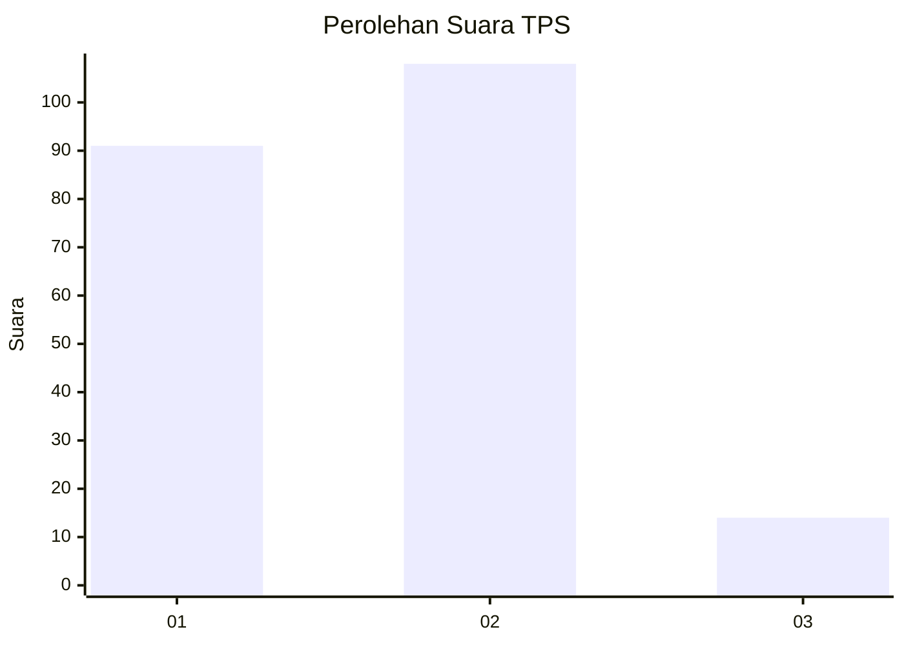
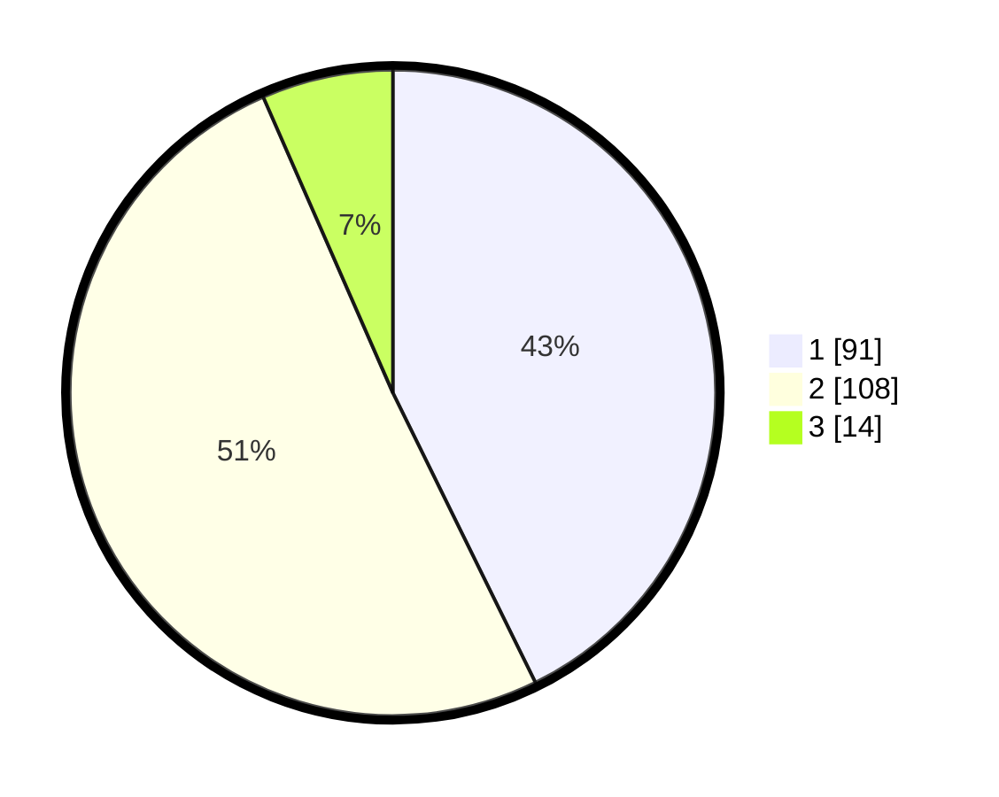

# Hasil

## Grafik

## Tabel

| No. | Nama Paslon    | Suara | Suara (raw) | Persentase |
|:--- |:-------------- | -----:| -----------:| ----------:|
| 1   | ANIES MUHAIMIN | 91    | [91][p-1]   | 42,72      |
| 2   | PRABOWO GIBRAN | 108   | [108][p-2]  | 50,70      |
| 3   | GANJAR MAHFUD  | 14    | [14][p-3]   | 6,57       |

[p-1]: https://github.com/gigit-pemilu/pemilu-2024-73-sulawesi-selatan/blob/main/pilpres/hitung-suara/sub/73-sulawesi-selatan/sub/01-kepulauan-selayar/sub/01-benteng/sub/1001-benteng-utara/sub/001-tps/sub/paslon-1.txt
[p-2]: https://github.com/gigit-pemilu/pemilu-2024-73-sulawesi-selatan/blob/main/pilpres/hitung-suara/sub/73-sulawesi-selatan/sub/01-kepulauan-selayar/sub/01-benteng/sub/1001-benteng-utara/sub/001-tps/sub/paslon-2.txt
[p-3]: https://github.com/gigit-pemilu/pemilu-2024-73-sulawesi-selatan/blob/main/pilpres/hitung-suara/sub/73-sulawesi-selatan/sub/01-kepulauan-selayar/sub/01-benteng/sub/1001-benteng-utara/sub/001-tps/sub/paslon-3.txt

## Foto C Plano

https://sirekap-obj-formc.kpu.go.id/d307/pemilu/ppwp/73/01/01/10/01/7301011001001-20240216-151757--04ff1e4d-84d2-4540-b4d9-d0df96189bf5.jpg

https://sirekap-obj-formc.kpu.go.id/d307/pemilu/ppwp/73/01/01/10/01/7301011001001-20240216-151758--7b19f363-9f2b-49b2-98fe-2f47ec8aca84.jpg

https://sirekap-obj-formc.kpu.go.id/d307/pemilu/ppwp/73/01/01/10/01/7301011001001-20240216-151757--61144d29-c2d0-4d56-941b-6ad583cdf273.jpg

## Metadata

| Key        | Value               |
| ---------- | ------------------- |
| Time Stamp | 2024-02-16 21:01:00 |

## DATA PEMILIH TETAP

Jumlah pemilih dalam DPT: **274**.
 * L: **133**.
 * P: **141**.

## DATA PENGGUNA HAK PILIH

Jumlah pengguna hak pilih dalam DPT: **217**.
 * L: **109**.
 * P: **108**.

Jumlah pengguna hak pilih dalam DPTb: **4**.
 * L: **1**.
 * P: **3**.

Jumlah pengguna hak pilih dalam DPK: **0**.
 * L: **0**.
 * P: **0**.

Jumlah pengguna hak pilih: **221**.
 * L: **110**.
 * P: **111**.

## JUMLAH SUARA SAH DAN TIDAK SAH

JUMLAH SELURUH SUARA SAH: **213**.

JUMLAH SUARA TIDAK SAH: **8**.

JUMLAH SELURUH SUARA SAH DAN SUARA TIDAK SAH: **221**.

