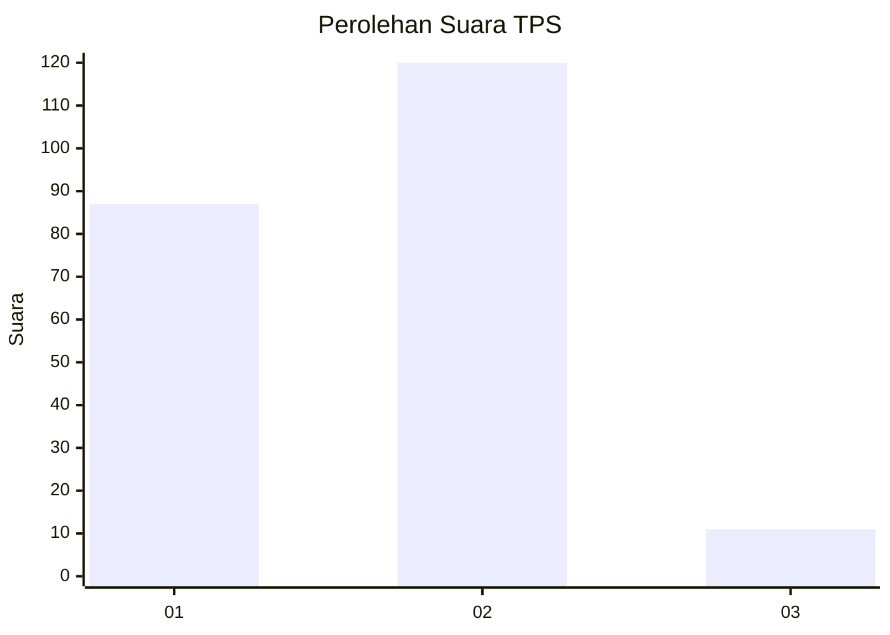
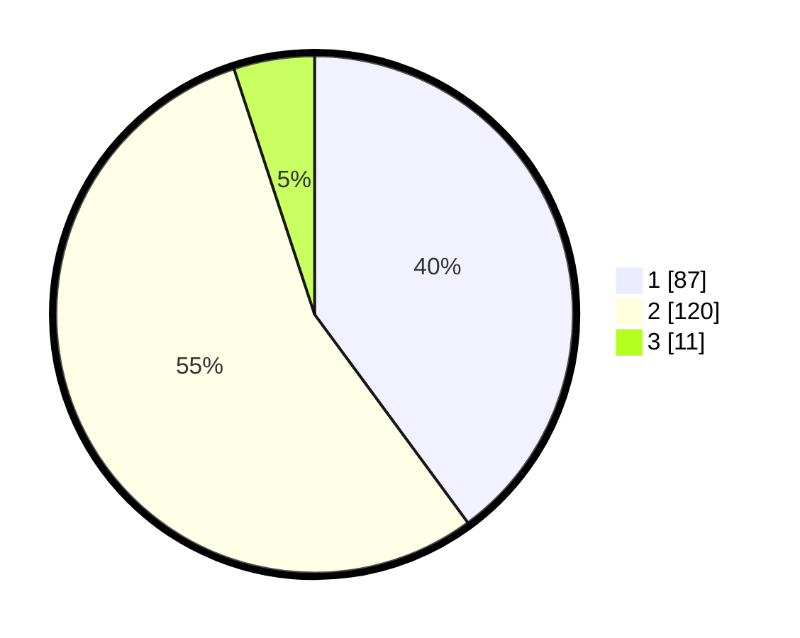

# Hasil

## Grafik

## Tabel

| No. | Nama Paslon    | Suara | Suara (raw) | Persentase |
|:--- |:-------------- | -----:| -----------:| ----------:|
| 1   | ANIES MUHAIMIN | 87    | [87][p-1]   | 39,91      |
| 2   | PRABOWO GIBRAN | 120   | [120][p-2]  | 55,05      |
| 3   | GANJAR MAHFUD  | 11    | [11][p-3]   | 5,05       |

[p-1]: https://github.com/gigit-pemilu/pemilu-2024-73-sulawesi-selatan/blob/main/pilpres/hitung-suara/sub/73-sulawesi-selatan/sub/01-kepulauan-selayar/sub/01-benteng/sub/1001-benteng-utara/sub/002-tps/sub/paslon-1.txt
[p-2]: https://github.com/gigit-pemilu/pemilu-2024-73-sulawesi-selatan/blob/main/pilpres/hitung-suara/sub/73-sulawesi-selatan/sub/01-kepulauan-selayar/sub/01-benteng/sub/1001-benteng-utara/sub/002-tps/sub/paslon-2.txt
[p-3]: https://github.com/gigit-pemilu/pemilu-2024-73-sulawesi-selatan/blob/main/pilpres/hitung-suara/sub/73-sulawesi-selatan/sub/01-kepulauan-selayar/sub/01-benteng/sub/1001-benteng-utara/sub/002-tps/sub/paslon-3.txt

## Foto C Plano

https://sirekap-obj-formc.kpu.go.id/04ff/pemilu/ppwp/73/01/01/10/01/7301011001002-20240216-131959--c4005058-4567-4dd8-bddc-c39e7ec12794.jpg

https://sirekap-obj-formc.kpu.go.id/04ff/pemilu/ppwp/73/01/01/10/01/7301011001002-20240216-132000--420b4394-7066-45d2-a766-e1bb3cf31bb6.jpg

https://sirekap-obj-formc.kpu.go.id/04ff/pemilu/ppwp/73/01/01/10/01/7301011001002-20240216-131959--7c846835-1b10-4f02-abc4-bef68f894218.jpg

## Metadata

| Key        | Value               |
| ---------- | ------------------- |
| Time Stamp | 2024-02-16 21:01:00 |

## DATA PEMILIH TETAP

Jumlah pemilih dalam DPT: **277**.
 * L: **131**.
 * P: **146**.

## DATA PENGGUNA HAK PILIH

Jumlah pengguna hak pilih dalam DPT: **212**.
 * L: **104**.
 * P: **108**.

Jumlah pengguna hak pilih dalam DPTb: **3**.
 * L: **1**.
 * P: **2**.

Jumlah pengguna hak pilih dalam DPK: **15**.
 * L: **9**.
 * P: **6**.

Jumlah pengguna hak pilih: **230**.
 * L: **114**.
 * P: **116**.

## JUMLAH SUARA SAH DAN TIDAK SAH

JUMLAH SELURUH SUARA SAH: **218**.

JUMLAH SUARA TIDAK SAH: **12**.

JUMLAH SELURUH SUARA SAH DAN SUARA TIDAK SAH: **230**.

