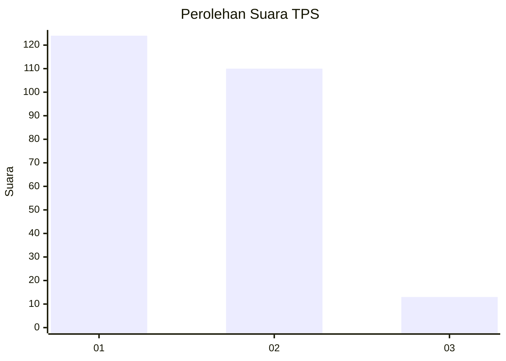
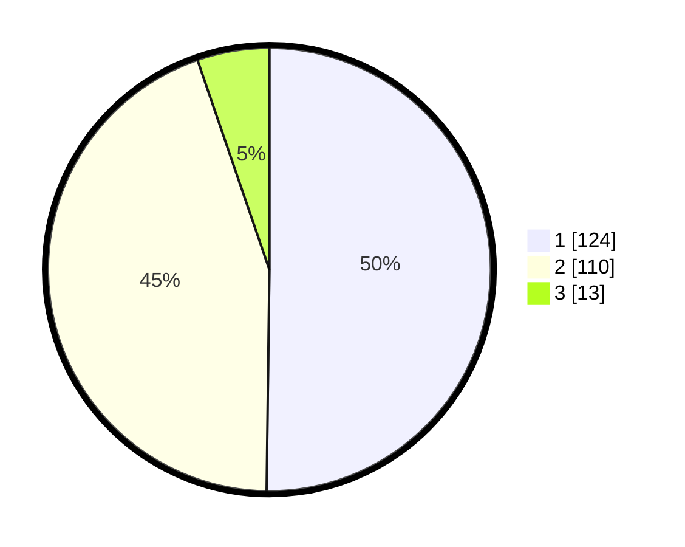

# Hasil

## Grafik

## Tabel

| No. | Nama Paslon    | Suara | Suara (raw) | Persentase |
|:--- |:-------------- | -----:| -----------:| ----------:|
| 1   | ANIES MUHAIMIN | 124   | [124][p-1]  | 50,20      |
| 2   | PRABOWO GIBRAN | 110   | [110][p-2]  | 44,53      |
| 3   | GANJAR MAHFUD  | 13    | [13][p-3]   | 5,26       |

[p-1]: https://github.com/gigit-pemilu/pemilu-2024-73-sulawesi-selatan/blob/main/pilpres/hitung-suara/sub/73-sulawesi-selatan/sub/01-kepulauan-selayar/sub/01-benteng/sub/1001-benteng-utara/sub/003-tps/sub/paslon-1.txt
[p-2]: https://github.com/gigit-pemilu/pemilu-2024-73-sulawesi-selatan/blob/main/pilpres/hitung-suara/sub/73-sulawesi-selatan/sub/01-kepulauan-selayar/sub/01-benteng/sub/1001-benteng-utara/sub/003-tps/sub/paslon-2.txt
[p-3]: https://github.com/gigit-pemilu/pemilu-2024-73-sulawesi-selatan/blob/main/pilpres/hitung-suara/sub/73-sulawesi-selatan/sub/01-kepulauan-selayar/sub/01-benteng/sub/1001-benteng-utara/sub/003-tps/sub/paslon-3.txt

## Foto C Plano

https://sirekap-obj-formc.kpu.go.id/d9b7/pemilu/ppwp/73/01/01/10/01/7301011001003-20240223-093449--afdaab98-37ad-4820-859c-8ab3d9fb4187.jpg

https://sirekap-obj-formc.kpu.go.id/d9b7/pemilu/ppwp/73/01/01/10/01/7301011001003-20240223-093451--e84b14b2-f96a-4d06-9d76-8b2c04a30f8b.jpg

https://sirekap-obj-formc.kpu.go.id/d9b7/pemilu/ppwp/73/01/01/10/01/7301011001003-20240223-093450--a5330af3-0a5c-4f98-96e0-daafbf31bd4d.jpg

## Metadata

| Key        | Value               |
| ---------- | ------------------- |
| Time Stamp | 2024-02-24 22:31:28 |

## DATA PEMILIH TETAP

Jumlah pemilih dalam DPT: **287**.
 * L: **135**.
 * P: **152**.

## DATA PENGGUNA HAK PILIH

Jumlah pengguna hak pilih dalam DPT: **247**.
 * L: **111**.
 * P: **136**.

Jumlah pengguna hak pilih dalam DPTb: **0**.
 * L: **0**.
 * P: **0**.

Jumlah pengguna hak pilih dalam DPK: **2**.
 * L: **1**.
 * P: **1**.

Jumlah pengguna hak pilih: **249**.
 * L: **112**.
 * P: **137**.

## JUMLAH SUARA SAH DAN TIDAK SAH

JUMLAH SELURUH SUARA SAH: **247**.

JUMLAH SUARA TIDAK SAH: **2**.

JUMLAH SELURUH SUARA SAH DAN SUARA TIDAK SAH: **249**.

