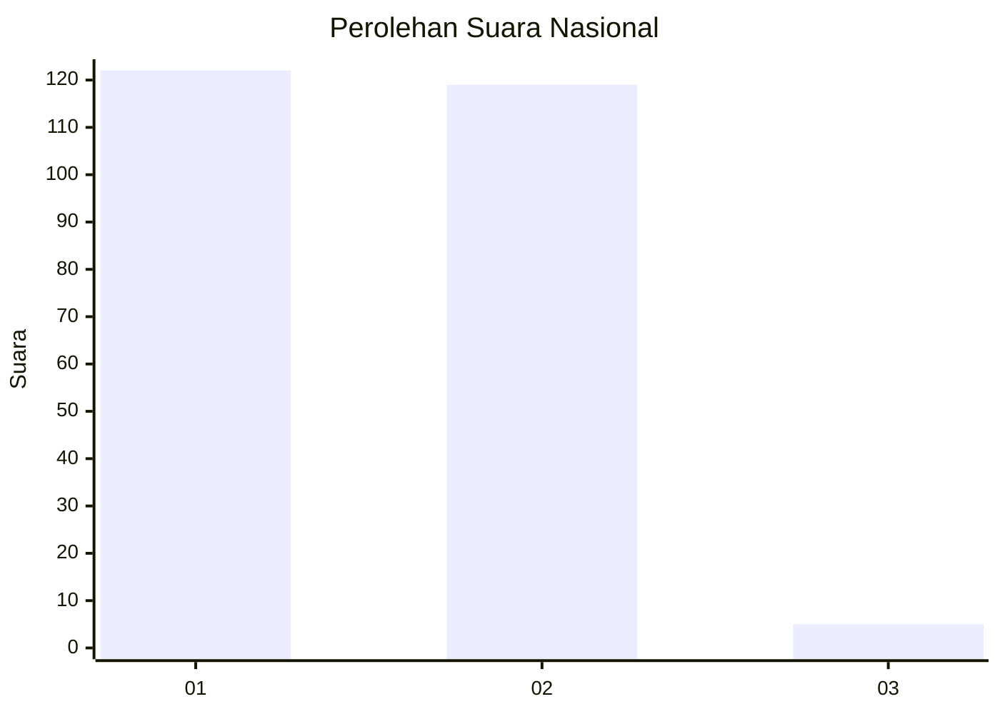
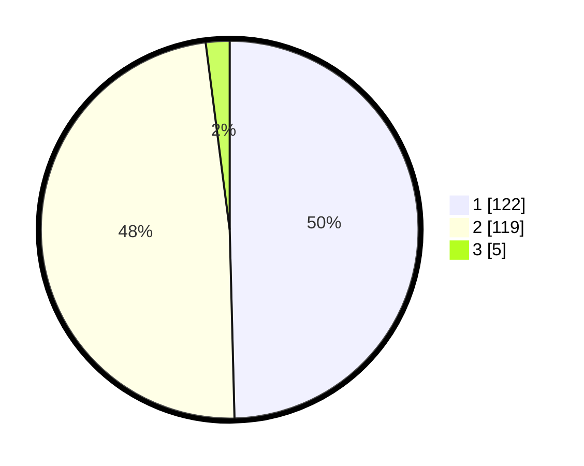

# Hasil

## Grafik

## Tabel

| No. | Nama Paslon    | Suara | Suara (raw) | Persentase |
|:--- |:-------------- | -----:| -----------:| ----------:|
| 1   | ANIES MUHAIMIN | 122   | [122][p-1]  | 49,59      |
| 2   | PRABOWO GIBRAN | 119   | [119][p-2]  | 48,37      |
| 3   | GANJAR MAHFUD  | 5     | [5][p-3]    | 2,03       |

[p-1]: https://github.com/gigit-pemilu/pemilu-2024/blob/main/pilpres/hitung-suara/sub/73-sulawesi-selatan/sub/01-kepulauan-selayar/sub/01-benteng/sub/1001-benteng-utara/sub/004-tps/sub/paslon-1.txt
[p-2]: https://github.com/gigit-pemilu/pemilu-2024/blob/main/pilpres/hitung-suara/sub/73-sulawesi-selatan/sub/01-kepulauan-selayar/sub/01-benteng/sub/1001-benteng-utara/sub/004-tps/sub/paslon-2.txt
[p-3]: https://github.com/gigit-pemilu/pemilu-2024/blob/main/pilpres/hitung-suara/sub/73-sulawesi-selatan/sub/01-kepulauan-selayar/sub/01-benteng/sub/1001-benteng-utara/sub/004-tps/sub/paslon-3.txt

## Foto C Plano

https://sirekap-obj-formc.kpu.go.id/d162/pemilu/ppwp/73/01/01/10/01/7301011001004-20240222-133253--ddfefea6-8b77-4842-8739-9b7457de74b0.jpg

https://sirekap-obj-formc.kpu.go.id/d162/pemilu/ppwp/73/01/01/10/01/7301011001004-20240222-133255--a5a65bd1-ae4b-45e8-b14e-106de1afa872.jpg

https://sirekap-obj-formc.kpu.go.id/d162/pemilu/ppwp/73/01/01/10/01/7301011001004-20240222-133254--2262dd16-246a-4609-a3f3-79b2ba6bc71a.jpg

## Metadata

| Key        | Value               |
| ---------- | ------------------- |
| Time Stamp | 2024-02-22 14:00:00 |

## DATA PEMILIH TETAP

Jumlah pemilih dalam DPT: **286**.
 * L: **135**.
 * P: **151**.

## DATA PENGGUNA HAK PILIH

Jumlah pengguna hak pilih dalam DPT: **228**.
 * L: **109**.
 * P: **119**.

Jumlah pengguna hak pilih dalam DPTb: **10**.
 * L: **4**.
 * P: **6**.

Jumlah pengguna hak pilih dalam DPK: **10**.
 * L: **1**.
 * P: **9**.

Jumlah pengguna hak pilih: **248**.
 * L: **114**.
 * P: **134**.

## JUMLAH SUARA SAH DAN TIDAK SAH

JUMLAH SELURUH SUARA SAH: **246**.

JUMLAH SUARA TIDAK SAH: **2**.

JUMLAH SELURUH SUARA SAH DAN SUARA TIDAK SAH: **248**.

