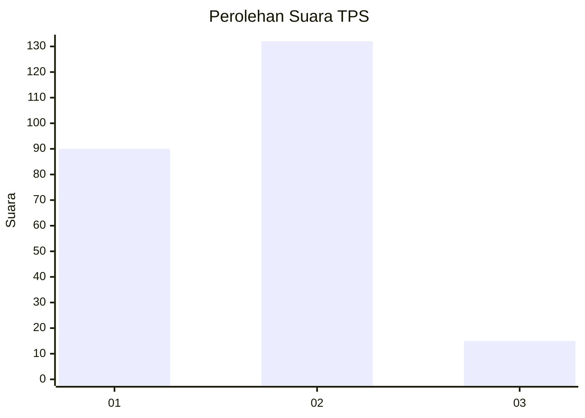
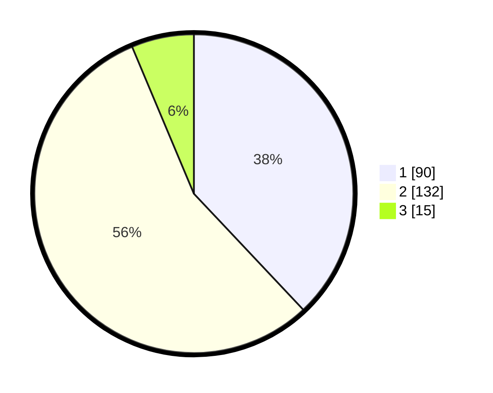

# Hasil

## Grafik

## Tabel

| No. | Nama Paslon    | Suara | Suara (raw) | Persentase |
|:--- |:-------------- | -----:| -----------:| ----------:|
| 1   | ANIES MUHAIMIN | 90    | [90][p-1]   | 37,97      |
| 2   | PRABOWO GIBRAN | 132   | [132][p-2]  | 55,70      |
| 3   | GANJAR MAHFUD  | 15    | [15][p-3]   | 6,33       |

[p-1]: https://github.com/gigit-pemilu/pemilu-2024-73-sulawesi-selatan/blob/main/pilpres/hitung-suara/sub/73-sulawesi-selatan/sub/01-kepulauan-selayar/sub/01-benteng/sub/1001-benteng-utara/sub/005-tps/sub/paslon-1.txt
[p-2]: https://github.com/gigit-pemilu/pemilu-2024-73-sulawesi-selatan/blob/main/pilpres/hitung-suara/sub/73-sulawesi-selatan/sub/01-kepulauan-selayar/sub/01-benteng/sub/1001-benteng-utara/sub/005-tps/sub/paslon-2.txt
[p-3]: https://github.com/gigit-pemilu/pemilu-2024-73-sulawesi-selatan/blob/main/pilpres/hitung-suara/sub/73-sulawesi-selatan/sub/01-kepulauan-selayar/sub/01-benteng/sub/1001-benteng-utara/sub/005-tps/sub/paslon-3.txt

## Foto C Plano

https://sirekap-obj-formc.kpu.go.id/4b5b/pemilu/ppwp/73/01/01/10/01/7301011001005-20240223-094821--ed447df7-2e59-4995-b385-860e1bdac690.jpg

https://sirekap-obj-formc.kpu.go.id/4b5b/pemilu/ppwp/73/01/01/10/01/7301011001005-20240223-094822--b8d5f6e1-4adb-4d72-8bd3-d53757e2d152.jpg

https://sirekap-obj-formc.kpu.go.id/4b5b/pemilu/ppwp/73/01/01/10/01/7301011001005-20240223-094822--1cf50130-e22d-4432-b827-a862854e8e93.jpg

## Metadata

| Key        | Value               |
| ---------- | ------------------- |
| Time Stamp | 2024-02-24 22:31:28 |

## DATA PEMILIH TETAP

Jumlah pemilih dalam DPT: **278**.
 * L: **141**.
 * P: **137**.

## DATA PENGGUNA HAK PILIH

Jumlah pengguna hak pilih dalam DPT: **228**.
 * L: **109**.
 * P: **119**.

Jumlah pengguna hak pilih dalam DPTb: **3**.
 * L: **1**.
 * P: **2**.

Jumlah pengguna hak pilih dalam DPK: **9**.
 * L: **6**.
 * P: **3**.

Jumlah pengguna hak pilih: **240**.
 * L: **116**.
 * P: **124**.

## JUMLAH SUARA SAH DAN TIDAK SAH

JUMLAH SELURUH SUARA SAH: **237**.

JUMLAH SUARA TIDAK SAH: **3**.

JUMLAH SELURUH SUARA SAH DAN SUARA TIDAK SAH: **240**.

