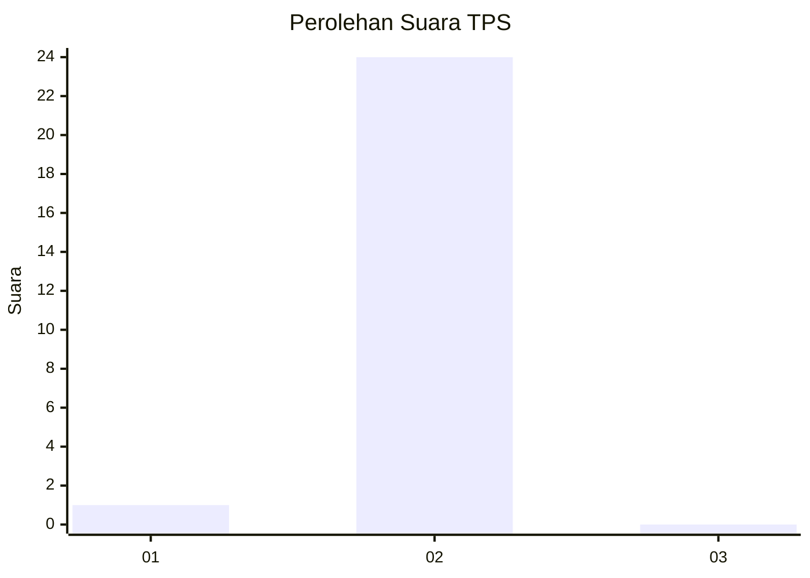
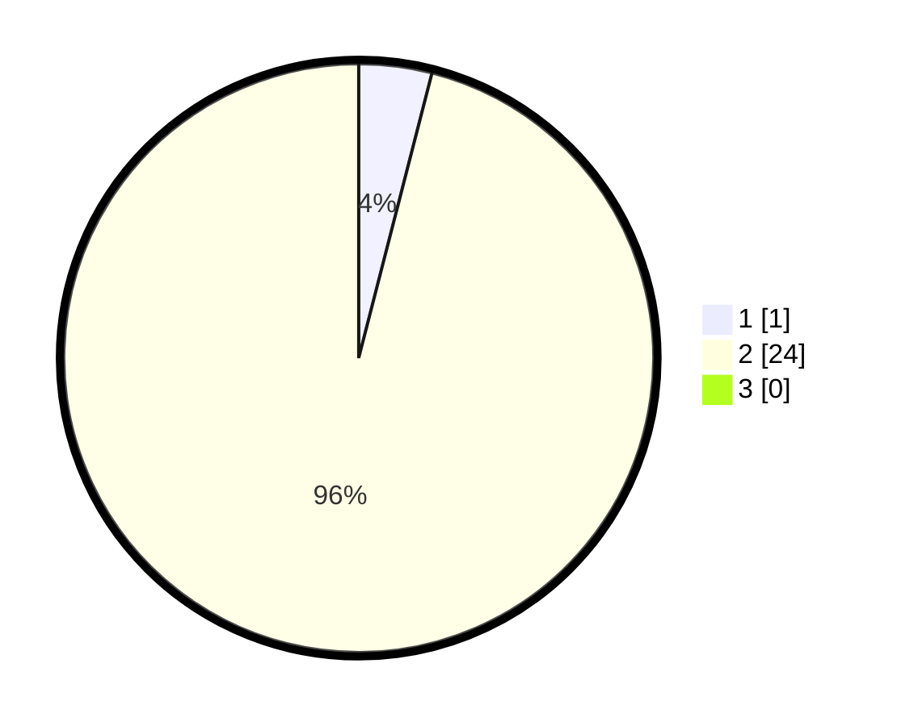

# Hasil

## Grafik

## Tabel

| No. | Nama Paslon    | Suara | Suara (raw) | Persentase |
|:--- |:-------------- | -----:| -----------:| ----------:|
| 1   | ANIES MUHAIMIN | 1     | [1][p-1]    | 4,00       |
| 2   | PRABOWO GIBRAN | 24    | [24][p-2]   | 96,00      |
| 3   | GANJAR MAHFUD  | 0     | [0][p-3]    | 0,00       |

[p-1]: https://github.com/gigit-pemilu/pemilu-2024-73-sulawesi-selatan/blob/main/pilpres/hitung-suara/sub/73-sulawesi-selatan/sub/01-kepulauan-selayar/sub/07-pasimarannu/sub/2006-komba-komba/sub/003-tps/sub/paslon-1.txt
[p-2]: https://github.com/gigit-pemilu/pemilu-2024-73-sulawesi-selatan/blob/main/pilpres/hitung-suara/sub/73-sulawesi-selatan/sub/01-kepulauan-selayar/sub/07-pasimarannu/sub/2006-komba-komba/sub/003-tps/sub/paslon-2.txt
[p-3]: https://github.com/gigit-pemilu/pemilu-2024-73-sulawesi-selatan/blob/main/pilpres/hitung-suara/sub/73-sulawesi-selatan/sub/01-kepulauan-selayar/sub/07-pasimarannu/sub/2006-komba-komba/sub/003-tps/sub/paslon-3.txt

## Foto C Plano

https://sirekap-obj-formc.kpu.go.id/c916/pemilu/ppwp/73/01/07/20/06/7301072006003-20240215-100335--696ee02a-9763-4df0-80a6-32007ac3fb3b.jpg

https://sirekap-obj-formc.kpu.go.id/c916/pemilu/ppwp/73/01/07/20/06/7301072006003-20240215-100701--1cf1a94b-b35b-4523-96a2-49e65d9592a7.jpg

https://sirekap-obj-formc.kpu.go.id/c916/pemilu/ppwp/73/01/07/20/06/7301072006003-20240215-100912--ace6d512-25db-4636-a75e-81264ee21253.jpg

## Metadata

| Key        | Value               |
| ---------- | ------------------- |
| Time Stamp | 2024-02-16 11:00:29 |

