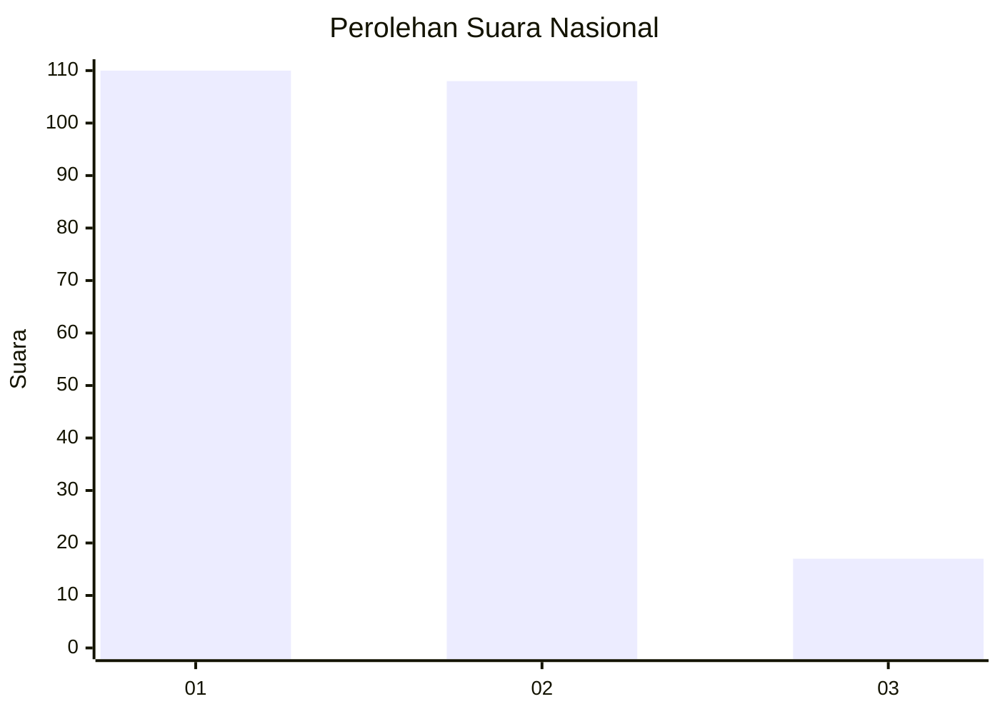
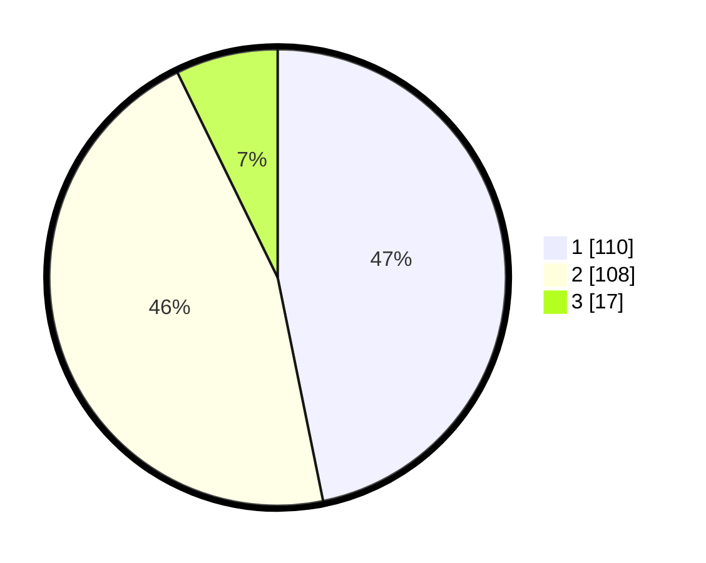

# Hasil

## Grafik

## Tabel

| No. | Nama Paslon    | Suara | Suara (raw) | Persentase |
|:--- |:-------------- | -----:| -----------:| ----------:|
| 1   | ANIES MUHAIMIN | 110   | [110][p-1]  | 46,81      |
| 2   | PRABOWO GIBRAN | 108   | [108][p-2]  | 45,96      |
| 3   | GANJAR MAHFUD  | 17    | [17][p-3]   | 7,23       |

[p-1]: https://github.com/gigit-pemilu/pemilu-2024/blob/main/pilpres/hitung-suara/sub/73-sulawesi-selatan/sub/01-kepulauan-selayar/sub/08-taka-bonerate/sub/2006-rajuni/sub/002-tps/sub/paslon-1.txt
[p-2]: https://github.com/gigit-pemilu/pemilu-2024/blob/main/pilpres/hitung-suara/sub/73-sulawesi-selatan/sub/01-kepulauan-selayar/sub/08-taka-bonerate/sub/2006-rajuni/sub/002-tps/sub/paslon-2.txt
[p-3]: https://github.com/gigit-pemilu/pemilu-2024/blob/main/pilpres/hitung-suara/sub/73-sulawesi-selatan/sub/01-kepulauan-selayar/sub/08-taka-bonerate/sub/2006-rajuni/sub/002-tps/sub/paslon-3.txt

## Foto C Plano

https://sirekap-obj-formc.kpu.go.id/83b2/pemilu/ppwp/73/01/08/20/06/7301082006002-20240215-074008--a935d6e0-9ea4-4916-8227-42ccbba860b2.jpg

https://sirekap-obj-formc.kpu.go.id/83b2/pemilu/ppwp/73/01/08/20/06/7301082006002-20240215-074129--d687cfd3-9c58-46c5-8d4b-c8be8b009cbd.jpg

https://sirekap-obj-formc.kpu.go.id/83b2/pemilu/ppwp/73/01/08/20/06/7301082006002-20240215-074315--0b04f2db-a598-4d00-9eee-f433a46ccfc7.jpg

## Metadata

| Key        | Value               |
| ---------- | ------------------- |
| Time Stamp | 2024-02-15 17:00:25 |

