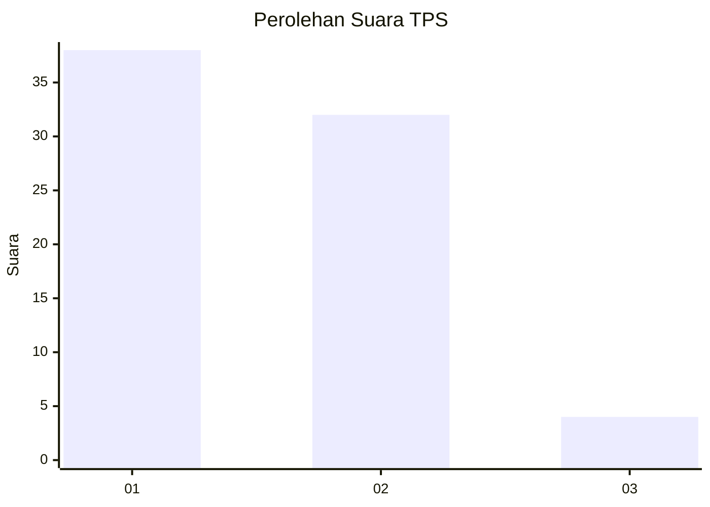
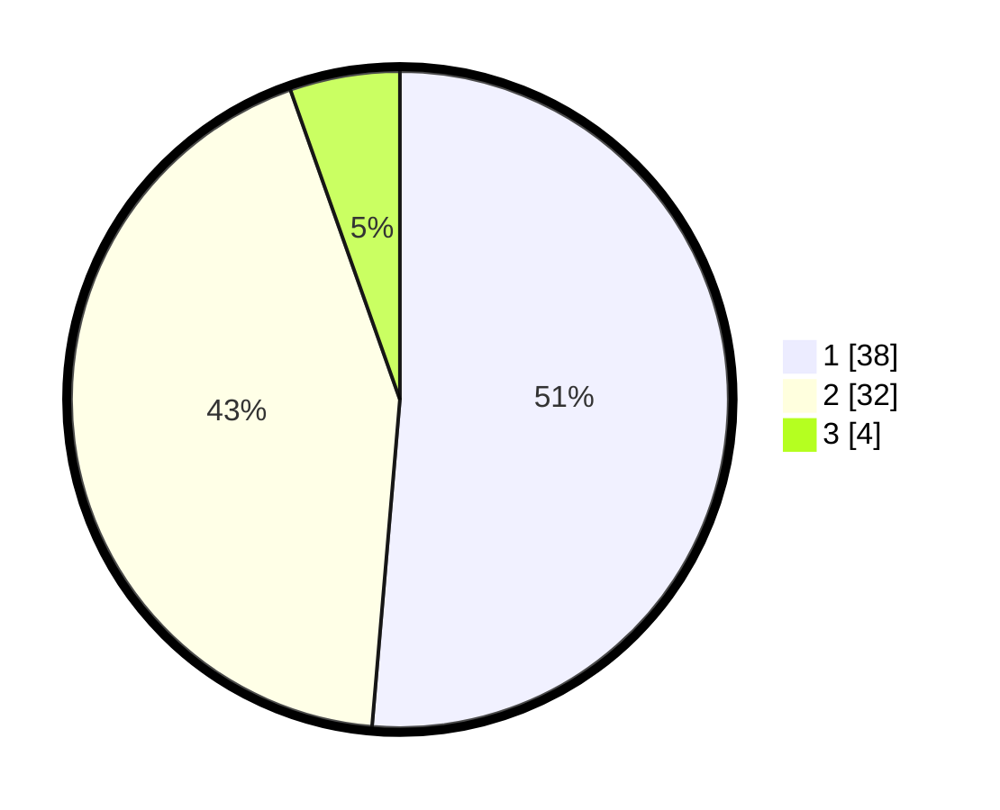

# Hasil

## Grafik

## Tabel

| No. | Nama Paslon    | Suara | Suara (raw) | Persentase |
|:--- |:-------------- | -----:| -----------:| ----------:|
| 1   | ANIES MUHAIMIN | 38    | [38][p-1]   | 51,35      |
| 2   | PRABOWO GIBRAN | 32    | [32][p-2]   | 43,24      |
| 3   | GANJAR MAHFUD  | 4     | [4][p-3]    | 5,41       |

[p-1]: https://github.com/gigit-pemilu/pemilu-2024-73-sulawesi-selatan/blob/main/pilpres/hitung-suara/sub/73-sulawesi-selatan/sub/01-kepulauan-selayar/sub/08-taka-bonerate/sub/2007-latondu/sub/003-tps/sub/paslon-1.txt
[p-2]: https://github.com/gigit-pemilu/pemilu-2024-73-sulawesi-selatan/blob/main/pilpres/hitung-suara/sub/73-sulawesi-selatan/sub/01-kepulauan-selayar/sub/08-taka-bonerate/sub/2007-latondu/sub/003-tps/sub/paslon-2.txt
[p-3]: https://github.com/gigit-pemilu/pemilu-2024-73-sulawesi-selatan/blob/main/pilpres/hitung-suara/sub/73-sulawesi-selatan/sub/01-kepulauan-selayar/sub/08-taka-bonerate/sub/2007-latondu/sub/003-tps/sub/paslon-3.txt

## Foto C Plano

https://sirekap-obj-formc.kpu.go.id/1ea7/pemilu/ppwp/73/01/08/20/07/7301082007003-20240215-094041--c73da860-e06f-4e2d-9af6-f20b60cea830.jpg

https://sirekap-obj-formc.kpu.go.id/1ea7/pemilu/ppwp/73/01/08/20/07/7301082007003-20240215-094142--2d37a838-45aa-4afa-b15f-99a21baaa406.jpg

https://sirekap-obj-formc.kpu.go.id/1ea7/pemilu/ppwp/73/01/08/20/07/7301082007003-20240215-094238--5a77fbe4-3ece-41d6-b9d1-292b5caa64a2.jpg

## Metadata

| Key        | Value               |
| ---------- | ------------------- |
| Time Stamp | 2024-02-15 17:00:25 |

