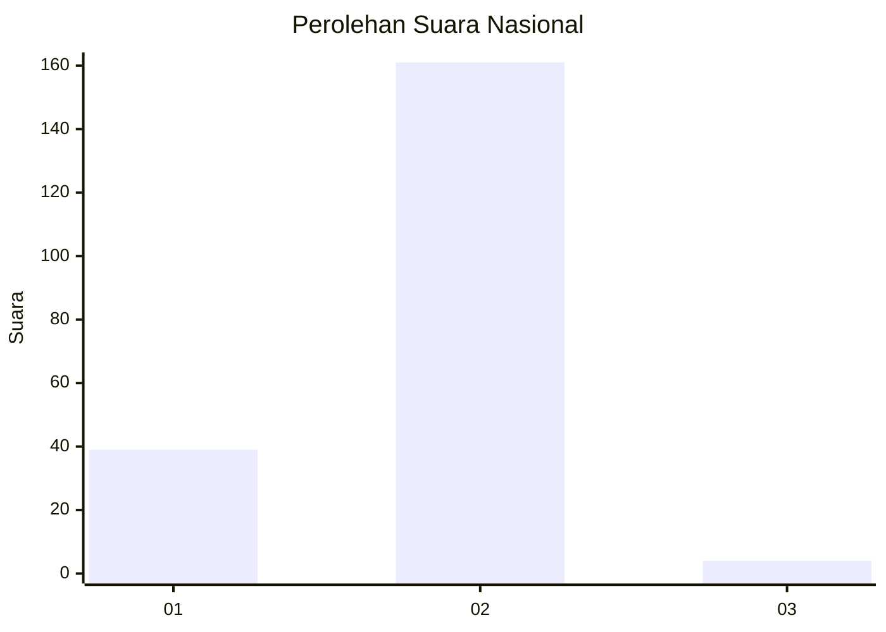
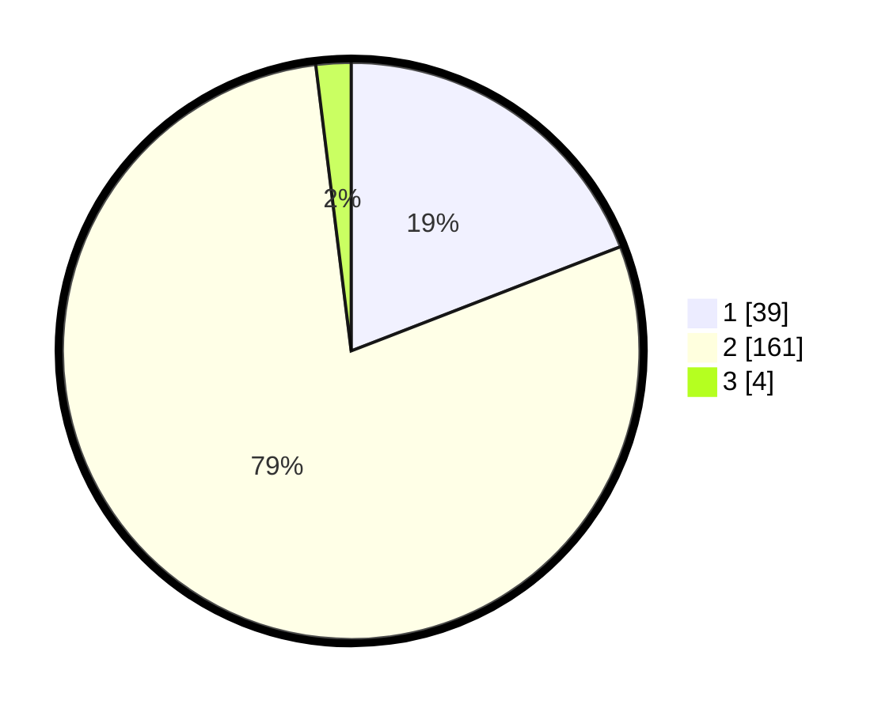

# Hasil

## Grafik

## Tabel

| No. | Nama Paslon    | Suara | Suara (raw) | Persentase |
|:--- |:-------------- | -----:| -----------:| ----------:|
| 1   | ANIES MUHAIMIN | 39    | [39][p-1]   | 19,12      |
| 2   | PRABOWO GIBRAN | 161   | [161][p-2]  | 78,92      |
| 3   | GANJAR MAHFUD  | 4     | [4][p-3]    | 1,96       |

[p-1]: https://github.com/gigit-pemilu/pemilu-2024/blob/main/pilpres/hitung-suara/sub/73-sulawesi-selatan/sub/01-kepulauan-selayar/sub/09-pasilambena/sub/2005-karumpa/sub/006-tps/sub/paslon-1.txt
[p-2]: https://github.com/gigit-pemilu/pemilu-2024/blob/main/pilpres/hitung-suara/sub/73-sulawesi-selatan/sub/01-kepulauan-selayar/sub/09-pasilambena/sub/2005-karumpa/sub/006-tps/sub/paslon-2.txt
[p-3]: https://github.com/gigit-pemilu/pemilu-2024/blob/main/pilpres/hitung-suara/sub/73-sulawesi-selatan/sub/01-kepulauan-selayar/sub/09-pasilambena/sub/2005-karumpa/sub/006-tps/sub/paslon-3.txt

## Foto C Plano

https://sirekap-obj-formc.kpu.go.id/2143/pemilu/ppwp/73/01/09/20/05/7301092005006-20240215-020257--3f306f41-c1c8-42a6-96c8-13c3065d1cc0.jpg

https://sirekap-obj-formc.kpu.go.id/2143/pemilu/ppwp/73/01/09/20/05/7301092005006-20240215-015629--5175dc28-821c-4ceb-b995-1aa5b982cc04.jpg

https://sirekap-obj-formc.kpu.go.id/2143/pemilu/ppwp/73/01/09/20/05/7301092005006-20240215-015208--5babd13f-b012-46da-ba66-9efeb72fa81d.jpg

## Metadata

| Key        | Value               |
| ---------- | ------------------- |
| Time Stamp | 2024-02-16 11:00:29 |

