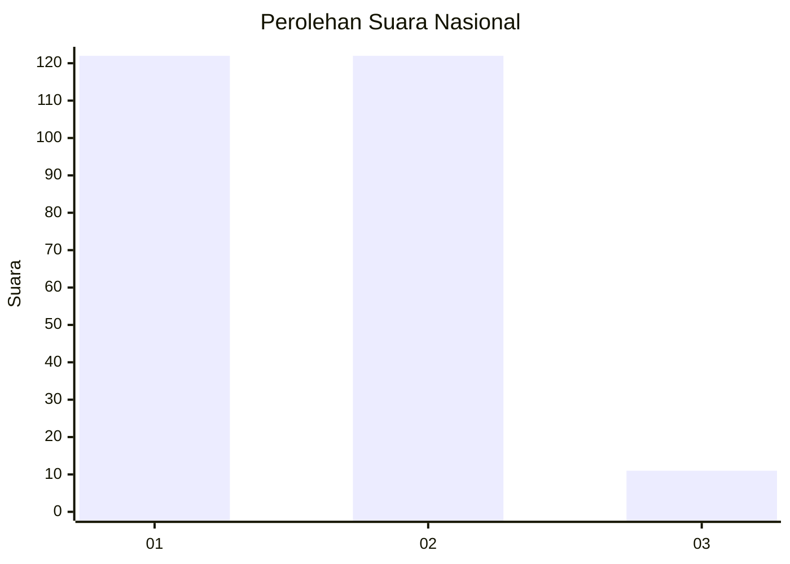
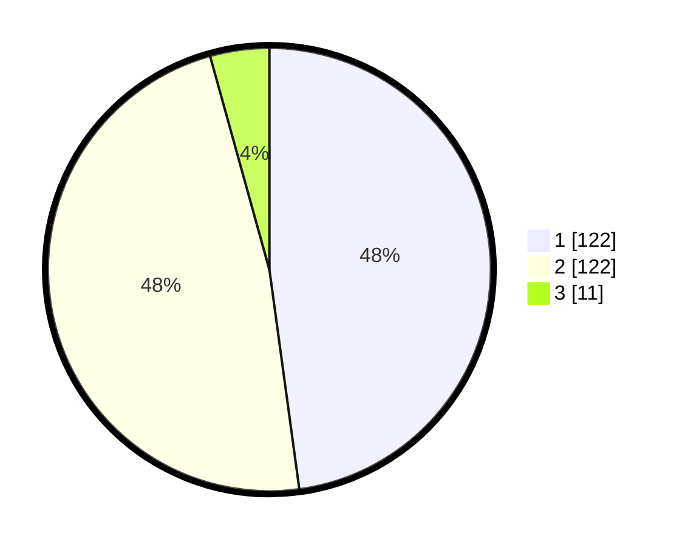

# Hasil

## Grafik

## Tabel

| No. | Nama Paslon    | Suara | Suara (raw) | Persentase |
|:--- |:-------------- | -----:| -----------:| ----------:|
| 1   | ANIES MUHAIMIN | 122   | [122][p-1]  | 47,84      |
| 2   | PRABOWO GIBRAN | 122   | [122][p-2]  | 47,84      |
| 3   | GANJAR MAHFUD  | 11    | [11][p-3]   | 4,31       |

[p-1]: https://github.com/gigit-pemilu/pemilu-2024/blob/main/pilpres/hitung-suara/sub/73-sulawesi-selatan/sub/03-bantaeng/sub/02-bantaeng/sub/1002-pallantikang/sub/005-tps/sub/paslon-1.txt
[p-2]: https://github.com/gigit-pemilu/pemilu-2024/blob/main/pilpres/hitung-suara/sub/73-sulawesi-selatan/sub/03-bantaeng/sub/02-bantaeng/sub/1002-pallantikang/sub/005-tps/sub/paslon-2.txt
[p-3]: https://github.com/gigit-pemilu/pemilu-2024/blob/main/pilpres/hitung-suara/sub/73-sulawesi-selatan/sub/03-bantaeng/sub/02-bantaeng/sub/1002-pallantikang/sub/005-tps/sub/paslon-3.txt

## Foto C Plano

https://sirekap-obj-formc.kpu.go.id/b9f0/pemilu/ppwp/73/03/02/10/02/7303021002005-20240214-203554--5c2220cb-cd0b-4d20-b56a-160ea776d79f.jpg

https://sirekap-obj-formc.kpu.go.id/b9f0/pemilu/ppwp/73/03/02/10/02/7303021002005-20240214-204610--43fdb0fd-5568-4138-97a2-3fd05eb026bc.jpg

https://sirekap-obj-formc.kpu.go.id/b9f0/pemilu/ppwp/73/03/02/10/02/7303021002005-20240214-204631--27bd165c-5c9a-43fb-87f2-bae846f4b385.jpg

## Metadata

| Key        | Value               |
| ---------- | ------------------- |
| Time Stamp | 2024-02-15 17:00:25 |

## DATA PEMILIH TETAP

Jumlah pemilih dalam DPT: **283**.
 * L: **138**.
 * P: **145**.

## DATA PENGGUNA HAK PILIH

Jumlah pengguna hak pilih dalam DPT: **242**.
 * L: **417**.
 * P: **424**.

Jumlah pengguna hak pilih dalam DPTb: **819**.
 * L: **840**.
 * P: **9**.

Jumlah pengguna hak pilih dalam DPK: **808**.
 * L: **808**.
 * P: **88**.

Jumlah pengguna hak pilih: **260**.
 * L: **423**.
 * P: **333**.

## JUMLAH SUARA SAH DAN TIDAK SAH

JUMLAH SELURUH SUARA SAH: **255**.

JUMLAH SUARA TIDAK SAH: **5**.

JUMLAH SELURUH SUARA SAH DAN SUARA TIDAK SAH: **260**.

