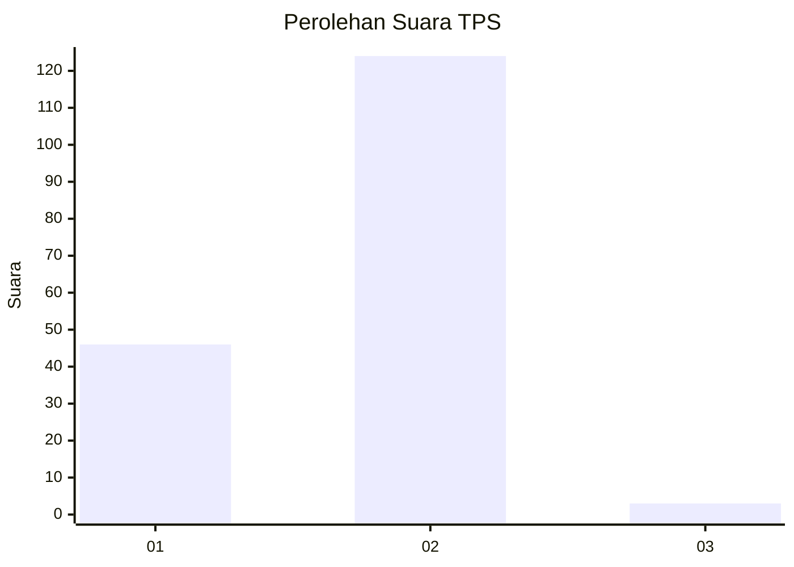
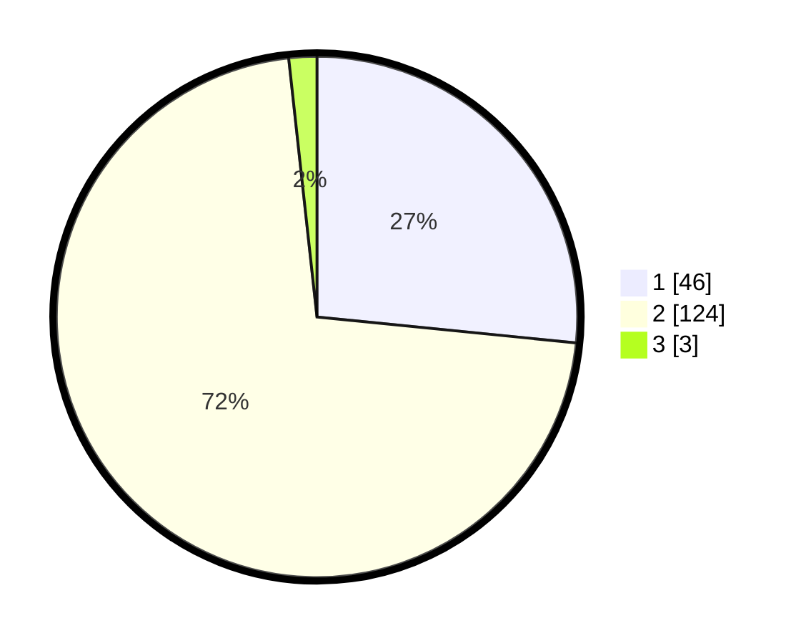

# Hasil

## Grafik

## Tabel

| No. | Nama Paslon    | Suara | Suara (raw) | Persentase |
|:--- |:-------------- | -----:| -----------:| ----------:|
| 1   | ANIES MUHAIMIN | 46    | [46][p-1]   | 26,59      |
| 2   | PRABOWO GIBRAN | 124   | [124][p-2]  | 71,68      |
| 3   | GANJAR MAHFUD  | 3     | [3][p-3]    | 1,73       |

[p-1]: https://github.com/gigit-pemilu/pemilu-2024-73-sulawesi-selatan/blob/main/pilpres/hitung-suara/sub/73-sulawesi-selatan/sub/03-bantaeng/sub/05-pajukukang/sub/2002-biangkeke/sub/005-tps/sub/paslon-1.txt
[p-2]: https://github.com/gigit-pemilu/pemilu-2024-73-sulawesi-selatan/blob/main/pilpres/hitung-suara/sub/73-sulawesi-selatan/sub/03-bantaeng/sub/05-pajukukang/sub/2002-biangkeke/sub/005-tps/sub/paslon-2.txt
[p-3]: https://github.com/gigit-pemilu/pemilu-2024-73-sulawesi-selatan/blob/main/pilpres/hitung-suara/sub/73-sulawesi-selatan/sub/03-bantaeng/sub/05-pajukukang/sub/2002-biangkeke/sub/005-tps/sub/paslon-3.txt

## Foto C Plano

https://sirekap-obj-formc.kpu.go.id/2e0a/pemilu/ppwp/73/03/05/20/02/7303052002005-20240215-131400--abd5a63d-4d86-4982-b2ac-65569968303a.jpg

https://sirekap-obj-formc.kpu.go.id/2e0a/pemilu/ppwp/73/03/05/20/02/7303052002005-20240215-135019--53c317eb-e876-40b6-8d17-674ed549eac8.jpg

https://sirekap-obj-formc.kpu.go.id/2e0a/pemilu/ppwp/73/03/05/20/02/7303052002005-20240215-135312--7cea7faa-f9c4-4ea2-90ca-86209e3ac066.jpg

## Metadata

| Key        | Value               |
| ---------- | ------------------- |
| Time Stamp | 2024-02-15 16:00:26 |

