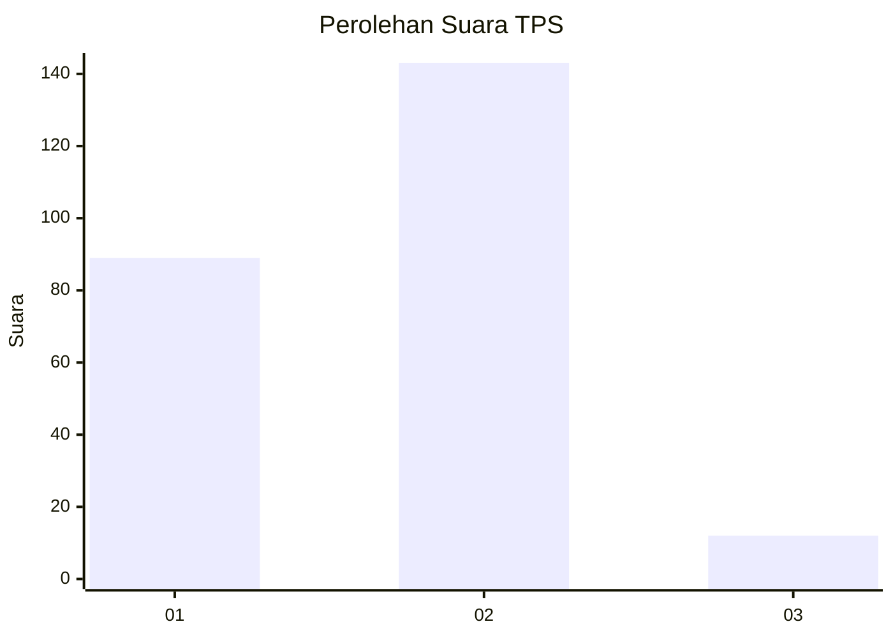
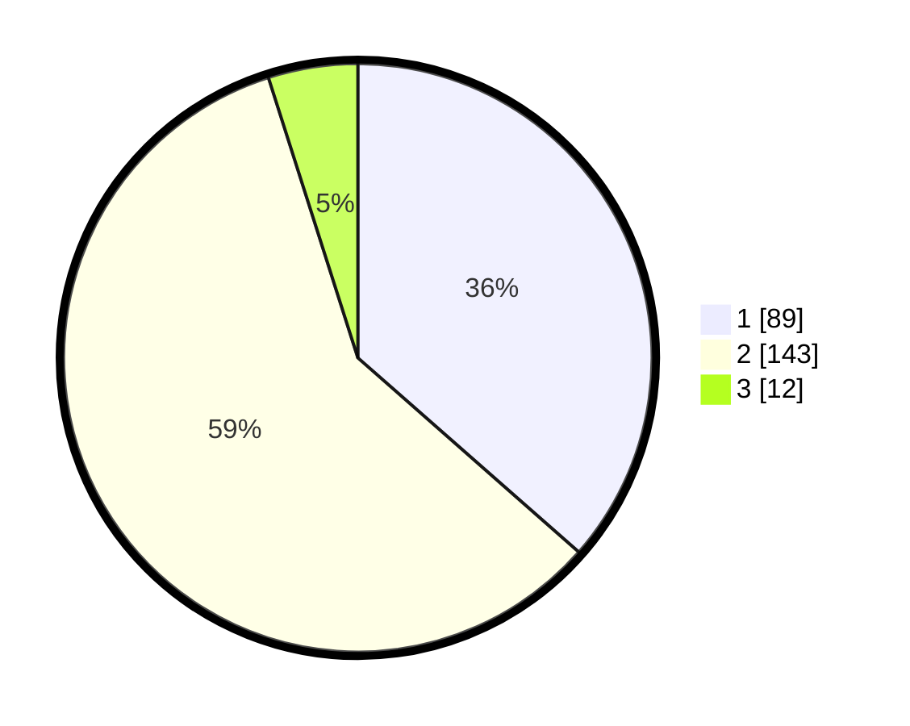

# Hasil

## Grafik

## Tabel

| No. | Nama Paslon    | Suara | Suara (raw) | Persentase |
|:--- |:-------------- | -----:| -----------:| ----------:|
| 1   | ANIES MUHAIMIN | 89    | [89][p-1]   | 36,48      |
| 2   | PRABOWO GIBRAN | 143   | [143][p-2]  | 58,61      |
| 3   | GANJAR MAHFUD  | 12    | [12][p-3]   | 4,92       |

[p-1]: https://github.com/gigit-pemilu/pemilu-2024-73-sulawesi-selatan/blob/main/pilpres/hitung-suara/sub/73-sulawesi-selatan/sub/03-bantaeng/sub/05-pajukukang/sub/2010-nipa-nipa/sub/011-tps/sub/paslon-1.txt
[p-2]: https://github.com/gigit-pemilu/pemilu-2024-73-sulawesi-selatan/blob/main/pilpres/hitung-suara/sub/73-sulawesi-selatan/sub/03-bantaeng/sub/05-pajukukang/sub/2010-nipa-nipa/sub/011-tps/sub/paslon-2.txt
[p-3]: https://github.com/gigit-pemilu/pemilu-2024-73-sulawesi-selatan/blob/main/pilpres/hitung-suara/sub/73-sulawesi-selatan/sub/03-bantaeng/sub/05-pajukukang/sub/2010-nipa-nipa/sub/011-tps/sub/paslon-3.txt

## Foto C Plano

https://sirekap-obj-formc.kpu.go.id/c0e7/pemilu/ppwp/73/03/05/20/10/7303052010011-20240216-150021--5baea5df-72cb-4abf-b69f-552af1e39182.jpg

https://sirekap-obj-formc.kpu.go.id/c0e7/pemilu/ppwp/73/03/05/20/10/7303052010011-20240216-143746--29468c91-3158-4b12-a62f-73cfd5e80817.jpg

https://sirekap-obj-formc.kpu.go.id/c0e7/pemilu/ppwp/73/03/05/20/10/7303052010011-20240216-171146--7f9bf014-9720-4e00-8d77-0ec386f4220b.jpg

## Metadata

| Key        | Value               |
| ---------- | ------------------- |
| Time Stamp | 2024-02-17 16:36:25 |

## DATA PEMILIH TETAP

Jumlah pemilih dalam DPT: **344**.
 * L: **135**.
 * P: **735**.

## DATA PENGGUNA HAK PILIH

Jumlah pengguna hak pilih dalam DPT: **344**.
 * L: **22**.
 * P: **233**.

Jumlah pengguna hak pilih dalam DPTb: **469**.
 * L: **147**.
 * P: **264**.

Jumlah pengguna hak pilih dalam DPK: **722**.
 * L: **777**.
 * P: **55**.

Jumlah pengguna hak pilih: **200**.
 * L: **565**.
 * P: **563**.

## JUMLAH SUARA SAH DAN TIDAK SAH

JUMLAH SELURUH SUARA SAH: **244**.

JUMLAH SUARA TIDAK SAH: **1**.

JUMLAH SELURUH SUARA SAH DAN SUARA TIDAK SAH: **245**.

