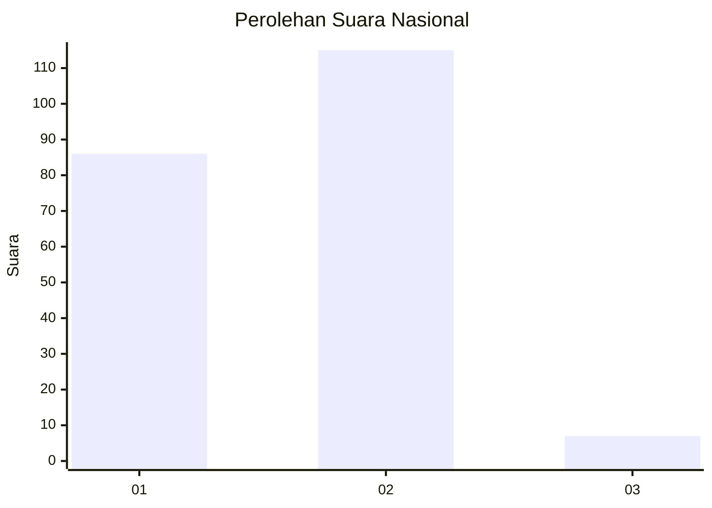
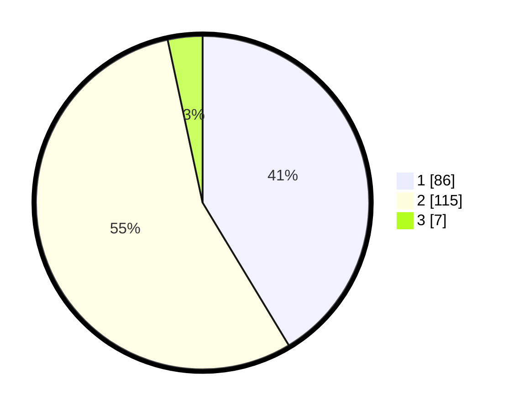

# Hasil

## Grafik

## Tabel

| No. | Nama Paslon    | Suara | Suara (raw) | Persentase |
|:--- |:-------------- | -----:| -----------:| ----------:|
| 1   | ANIES MUHAIMIN | 86    | [86][p-1]   | 41,35      |
| 2   | PRABOWO GIBRAN | 115   | [115][p-2]  | 55,29      |
| 3   | GANJAR MAHFUD  | 7     | [7][p-3]    | 3,37       |

[p-1]: https://github.com/gigit-pemilu/pemilu-2024/blob/main/pilpres/hitung-suara/sub/73-sulawesi-selatan/sub/04-jeneponto/sub/01-bangkala/sub/1003-pantai-bahari/sub/006-tps/sub/paslon-1.txt
[p-2]: https://github.com/gigit-pemilu/pemilu-2024/blob/main/pilpres/hitung-suara/sub/73-sulawesi-selatan/sub/04-jeneponto/sub/01-bangkala/sub/1003-pantai-bahari/sub/006-tps/sub/paslon-2.txt
[p-3]: https://github.com/gigit-pemilu/pemilu-2024/blob/main/pilpres/hitung-suara/sub/73-sulawesi-selatan/sub/04-jeneponto/sub/01-bangkala/sub/1003-pantai-bahari/sub/006-tps/sub/paslon-3.txt

## Foto C Plano

https://sirekap-obj-formc.kpu.go.id/8843/pemilu/ppwp/73/04/01/10/03/7304011003006-20240215-124308--654ecda5-eaf0-4552-b227-9270f4d446d1.jpg

https://sirekap-obj-formc.kpu.go.id/8843/pemilu/ppwp/73/04/01/10/03/7304011003006-20240215-124554--ac8c36b4-f4e5-49d6-9b70-caec43589b7a.jpg

https://sirekap-obj-formc.kpu.go.id/8843/pemilu/ppwp/73/04/01/10/03/7304011003006-20240215-094923--5559e750-2bdc-45e2-b39f-51f4ff4e6922.jpg

## Metadata

| Key        | Value               |
| ---------- | ------------------- |
| Time Stamp | 2024-02-15 19:00:26 |

