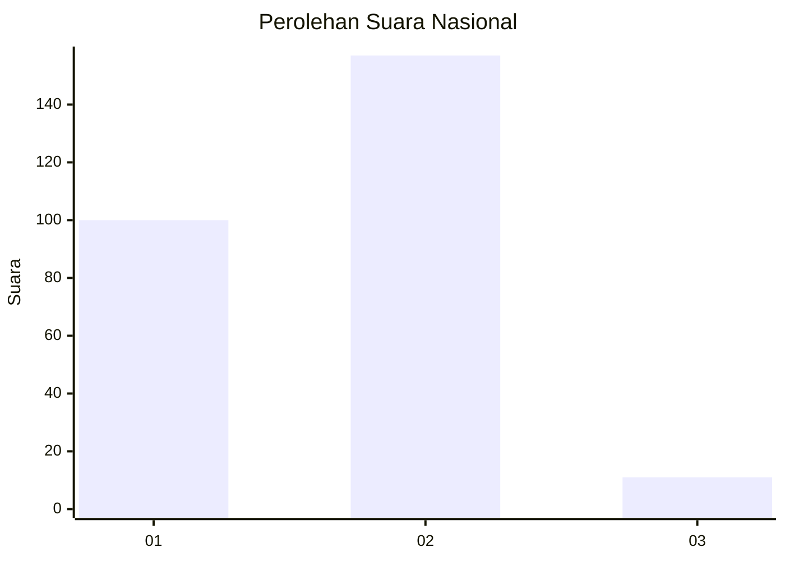
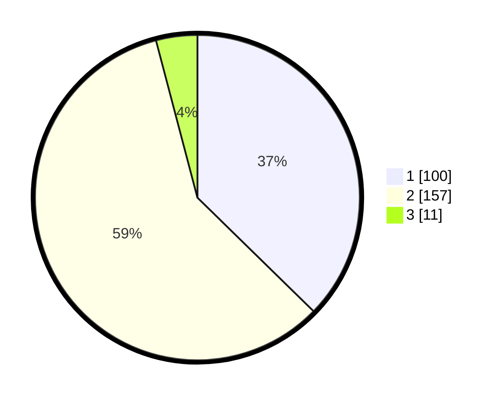

# Hasil

## Grafik

## Tabel

| No. | Nama Paslon    | Suara | Suara (raw) | Persentase |
|:--- |:-------------- | -----:| -----------:| ----------:|
| 1   | ANIES MUHAIMIN | 100   | [100][p-1]  | 37,31      |
| 2   | PRABOWO GIBRAN | 157   | [157][p-2]  | 58,58      |
| 3   | GANJAR MAHFUD  | 11    | [11][p-3]   | 4,10       |

[p-1]: https://github.com/gigit-pemilu/pemilu-2024/blob/main/pilpres/hitung-suara/sub/73-sulawesi-selatan/sub/04-jeneponto/sub/01-bangkala/sub/2005-pallantikang/sub/009-tps/sub/paslon-1.txt
[p-2]: https://github.com/gigit-pemilu/pemilu-2024/blob/main/pilpres/hitung-suara/sub/73-sulawesi-selatan/sub/04-jeneponto/sub/01-bangkala/sub/2005-pallantikang/sub/009-tps/sub/paslon-2.txt
[p-3]: https://github.com/gigit-pemilu/pemilu-2024/blob/main/pilpres/hitung-suara/sub/73-sulawesi-selatan/sub/04-jeneponto/sub/01-bangkala/sub/2005-pallantikang/sub/009-tps/sub/paslon-3.txt

## Foto C Plano

https://sirekap-obj-formc.kpu.go.id/5b4f/pemilu/ppwp/73/04/01/20/05/7304012005009-20240215-152832--7c2153b9-6da1-4b85-a9b5-849a12551ad2.jpg

https://sirekap-obj-formc.kpu.go.id/5b4f/pemilu/ppwp/73/04/01/20/05/7304012005009-20240215-133414--7c7ead43-01fd-42e9-8e13-f75f6c0f76d3.jpg

https://sirekap-obj-formc.kpu.go.id/5b4f/pemilu/ppwp/73/04/01/20/05/7304012005009-20240215-145012--0eca6f53-8f32-46d6-b884-499e2e0c331a.jpg

## Metadata

| Key        | Value               |
| ---------- | ------------------- |
| Time Stamp | 2024-02-15 23:29:50 |

