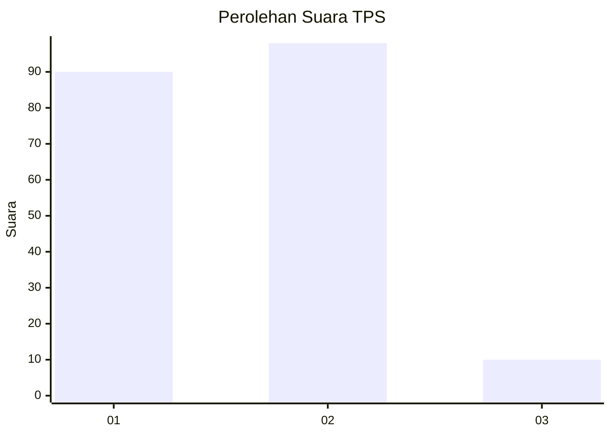
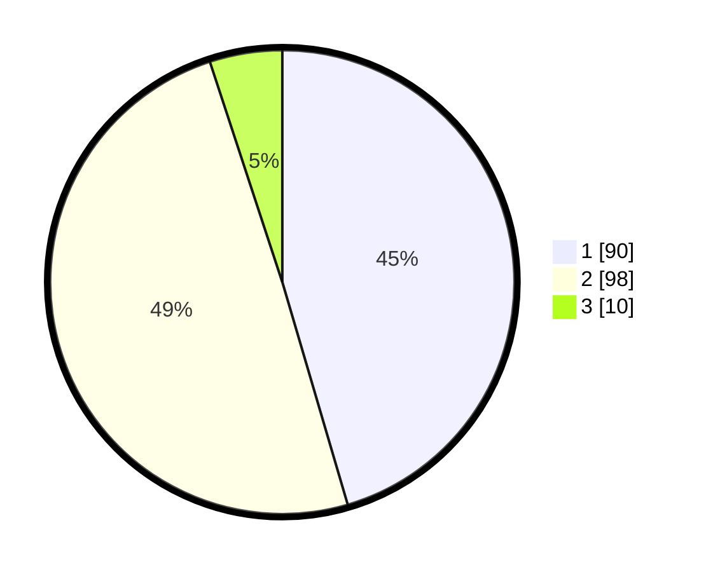

# Hasil

## Grafik

## Tabel

| No. | Nama Paslon    | Suara | Suara (raw) | Persentase |
|:--- |:-------------- | -----:| -----------:| ----------:|
| 1   | ANIES MUHAIMIN | 90    | [90][p-1]   | 45,45      |
| 2   | PRABOWO GIBRAN | 98    | [98][p-2]   | 49,49      |
| 3   | GANJAR MAHFUD  | 10    | [10][p-3]   | 5,05       |

[p-1]: https://github.com/gigit-pemilu/pemilu-2024-73-sulawesi-selatan/blob/main/pilpres/hitung-suara/sub/73-sulawesi-selatan/sub/04-jeneponto/sub/02-tamalatea/sub/1001-bonto-tangnga/sub/004-tps/sub/paslon-1.txt
[p-2]: https://github.com/gigit-pemilu/pemilu-2024-73-sulawesi-selatan/blob/main/pilpres/hitung-suara/sub/73-sulawesi-selatan/sub/04-jeneponto/sub/02-tamalatea/sub/1001-bonto-tangnga/sub/004-tps/sub/paslon-2.txt
[p-3]: https://github.com/gigit-pemilu/pemilu-2024-73-sulawesi-selatan/blob/main/pilpres/hitung-suara/sub/73-sulawesi-selatan/sub/04-jeneponto/sub/02-tamalatea/sub/1001-bonto-tangnga/sub/004-tps/sub/paslon-3.txt

## Foto C Plano

https://sirekap-obj-formc.kpu.go.id/d2e5/pemilu/ppwp/73/04/02/10/01/7304021001004-20240215-135830--57f89500-e971-43b2-a969-d1c0e1317d80.jpg

https://sirekap-obj-formc.kpu.go.id/d2e5/pemilu/ppwp/73/04/02/10/01/7304021001004-20240215-132909--91d7fb3e-59f4-46b6-bd67-69e6bc786586.jpg

https://sirekap-obj-formc.kpu.go.id/d2e5/pemilu/ppwp/73/04/02/10/01/7304021001004-20240215-133038--bdcf9213-7d63-4127-ad05-bb40d44c1d21.jpg

## Metadata

| Key        | Value               |
| ---------- | ------------------- |
| Time Stamp | 2024-02-21 18:00:00 |

