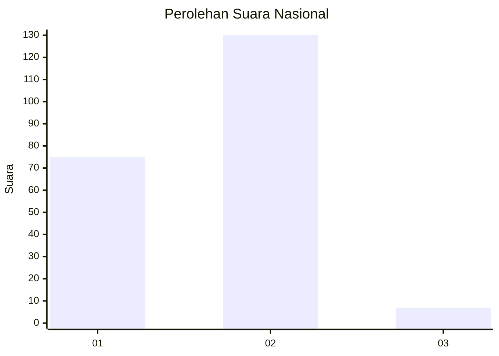
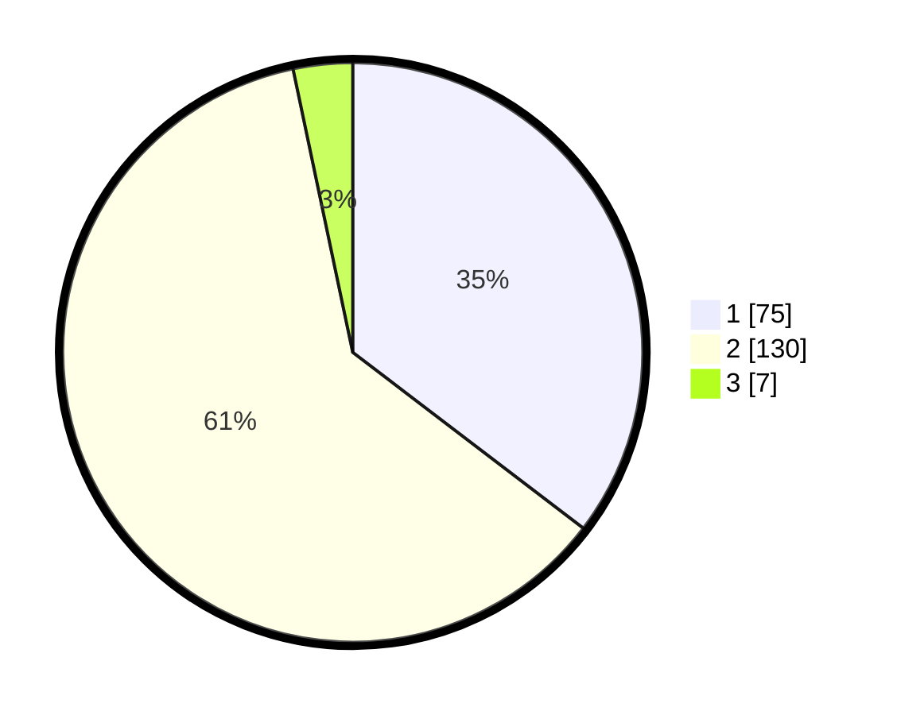

# Hasil

## Grafik

## Tabel

| No. | Nama Paslon    | Suara | Suara (raw) | Persentase |
|:--- |:-------------- | -----:| -----------:| ----------:|
| 1   | ANIES MUHAIMIN | 75    | [75][p-1]   | 35,38      |
| 2   | PRABOWO GIBRAN | 130   | [130][p-2]  | 61,32      |
| 3   | GANJAR MAHFUD  | 7     | [7][p-3]    | 3,30       |

[p-1]: https://github.com/gigit-pemilu/pemilu-2024/blob/main/pilpres/hitung-suara/sub/73-sulawesi-selatan/sub/04-jeneponto/sub/03-binamu/sub/1001-pabiringa/sub/005-tps/sub/paslon-1.txt
[p-2]: https://github.com/gigit-pemilu/pemilu-2024/blob/main/pilpres/hitung-suara/sub/73-sulawesi-selatan/sub/04-jeneponto/sub/03-binamu/sub/1001-pabiringa/sub/005-tps/sub/paslon-2.txt
[p-3]: https://github.com/gigit-pemilu/pemilu-2024/blob/main/pilpres/hitung-suara/sub/73-sulawesi-selatan/sub/04-jeneponto/sub/03-binamu/sub/1001-pabiringa/sub/005-tps/sub/paslon-3.txt

## Foto C Plano

https://sirekap-obj-formc.kpu.go.id/f6ef/pemilu/ppwp/73/04/03/10/01/7304031001005-20240215-012334--ff9ef70c-a52c-40c0-90f1-5f88c22d82b9.jpg

https://sirekap-obj-formc.kpu.go.id/f6ef/pemilu/ppwp/73/04/03/10/01/7304031001005-20240215-012511--14c840c5-efd1-4906-8b33-0b1899de3066.jpg

https://sirekap-obj-formc.kpu.go.id/f6ef/pemilu/ppwp/73/04/03/10/01/7304031001005-20240215-080131--46a30e69-2415-4d56-aa0a-316439a6b7f4.jpg

## Metadata

| Key        | Value               |
| ---------- | ------------------- |
| Time Stamp | 2024-02-15 17:30:25 |

