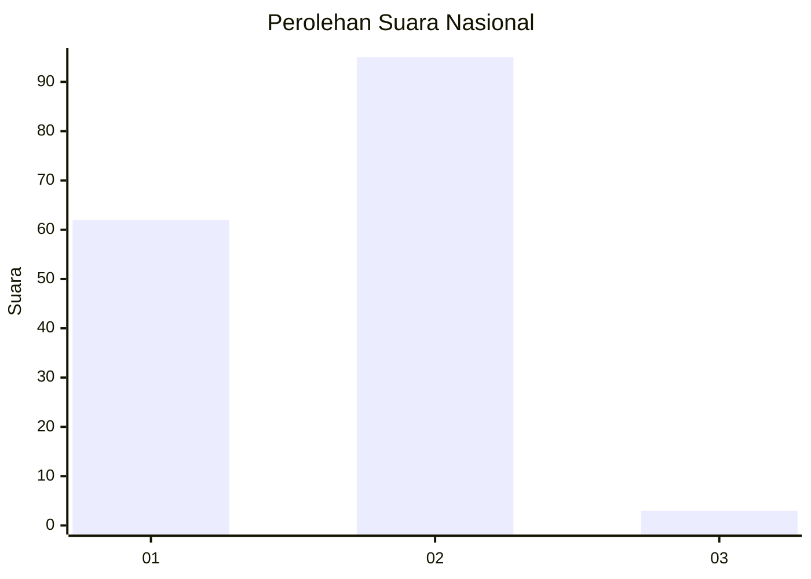
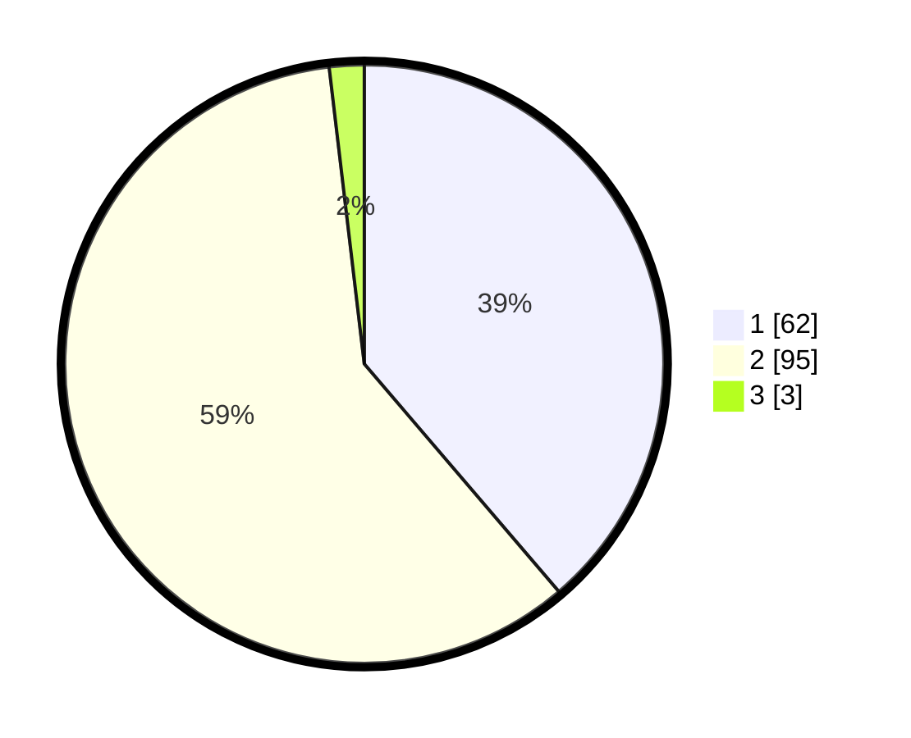

# Hasil

## Grafik

## Tabel

| No. | Nama Paslon    | Suara | Suara (raw) | Persentase |
|:--- |:-------------- | -----:| -----------:| ----------:|
| 1   | ANIES MUHAIMIN | 62    | [62][p-1]   | 38,75      |
| 2   | PRABOWO GIBRAN | 95    | [95][p-2]   | 59,38      |
| 3   | GANJAR MAHFUD  | 3     | [3][p-3]    | 1,88       |

[p-1]: https://github.com/gigit-pemilu/pemilu-2024/blob/main/pilpres/hitung-suara/sub/73-sulawesi-selatan/sub/04-jeneponto/sub/04-batang/sub/1001-togo-togo/sub/005-tps/sub/paslon-1.txt
[p-2]: https://github.com/gigit-pemilu/pemilu-2024/blob/main/pilpres/hitung-suara/sub/73-sulawesi-selatan/sub/04-jeneponto/sub/04-batang/sub/1001-togo-togo/sub/005-tps/sub/paslon-2.txt
[p-3]: https://github.com/gigit-pemilu/pemilu-2024/blob/main/pilpres/hitung-suara/sub/73-sulawesi-selatan/sub/04-jeneponto/sub/04-batang/sub/1001-togo-togo/sub/005-tps/sub/paslon-3.txt

## Foto C Plano

https://sirekap-obj-formc.kpu.go.id/18d5/pemilu/ppwp/73/04/04/10/01/7304041001005-20240215-021751--bd5be1fa-9158-4fc9-b892-6511158077ea.jpg

https://sirekap-obj-formc.kpu.go.id/18d5/pemilu/ppwp/73/04/04/10/01/7304041001005-20240215-021955--41596e65-de05-4467-ab45-473c9774edb6.jpg

https://sirekap-obj-formc.kpu.go.id/18d5/pemilu/ppwp/73/04/04/10/01/7304041001005-20240215-022138--9188fadc-a5f7-4456-9be3-3a2594e394d9.jpg

## Metadata

| Key        | Value               |
| ---------- | ------------------- |
| Time Stamp | 2024-02-15 12:00:28 |

