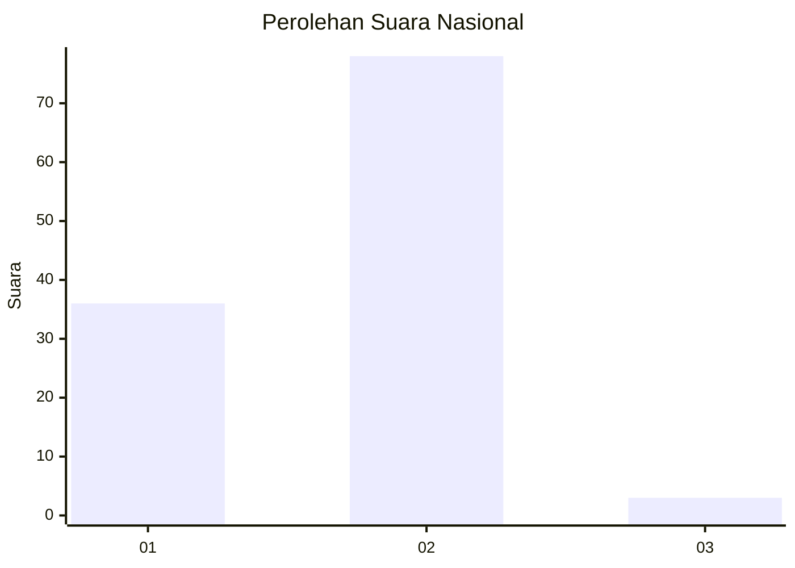
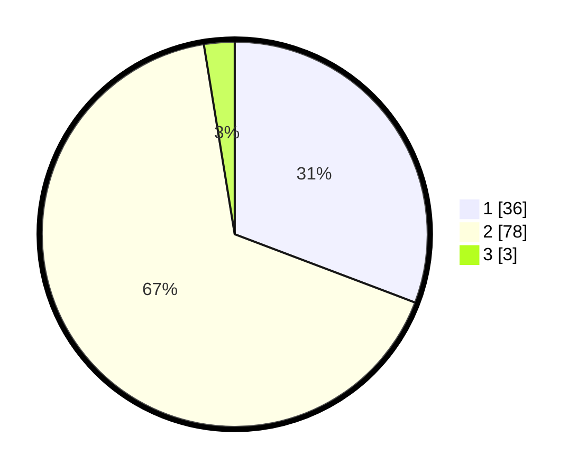

# Hasil

## Grafik

## Tabel

| No. | Nama Paslon    | Suara | Suara (raw) | Persentase |
|:--- |:-------------- | -----:| -----------:| ----------:|
| 1   | ANIES MUHAIMIN | 36    | [36][p-1]   | 30,77      |
| 2   | PRABOWO GIBRAN | 78    | [78][p-2]   | 66,67      |
| 3   | GANJAR MAHFUD  | 3     | [3][p-3]    | 2,56       |

[p-1]: https://github.com/gigit-pemilu/pemilu-2024/blob/main/pilpres/hitung-suara/sub/73-sulawesi-selatan/sub/04-jeneponto/sub/04-batang/sub/2009-kaluku/sub/007-tps/sub/paslon-1.txt
[p-2]: https://github.com/gigit-pemilu/pemilu-2024/blob/main/pilpres/hitung-suara/sub/73-sulawesi-selatan/sub/04-jeneponto/sub/04-batang/sub/2009-kaluku/sub/007-tps/sub/paslon-2.txt
[p-3]: https://github.com/gigit-pemilu/pemilu-2024/blob/main/pilpres/hitung-suara/sub/73-sulawesi-selatan/sub/04-jeneponto/sub/04-batang/sub/2009-kaluku/sub/007-tps/sub/paslon-3.txt

## Foto C Plano

https://sirekap-obj-formc.kpu.go.id/a2e1/pemilu/ppwp/73/04/04/20/09/7304042009007-20240215-004732--48afc60a-1d18-43c2-8e75-e6da4b490bbe.jpg

https://sirekap-obj-formc.kpu.go.id/a2e1/pemilu/ppwp/73/04/04/20/09/7304042009007-20240215-010550--a5ec241f-8d62-40b8-adfa-ebdf2c11eb38.jpg

https://sirekap-obj-formc.kpu.go.id/a2e1/pemilu/ppwp/73/04/04/20/09/7304042009007-20240215-010713--aa5c5129-fb17-43fd-80b9-a9d244b5d8a4.jpg

## Metadata

| Key        | Value               |
| ---------- | ------------------- |
| Time Stamp | 2024-02-15 19:00:26 |

