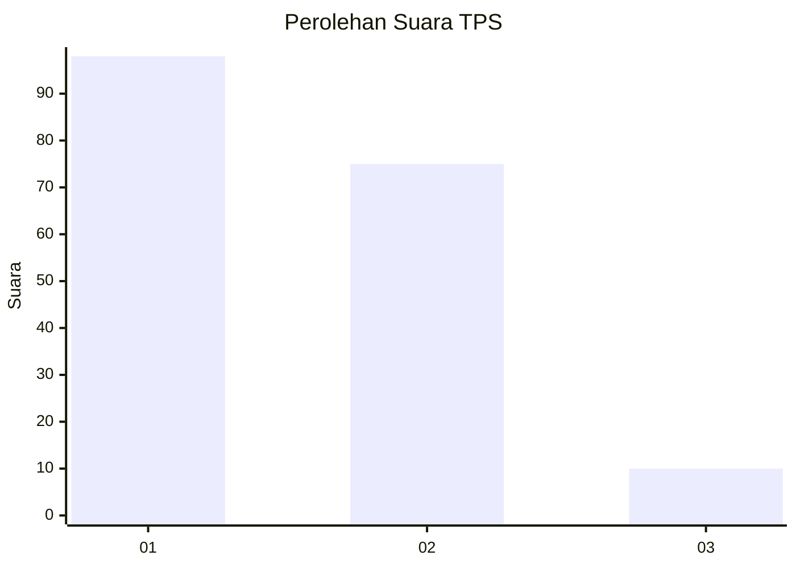
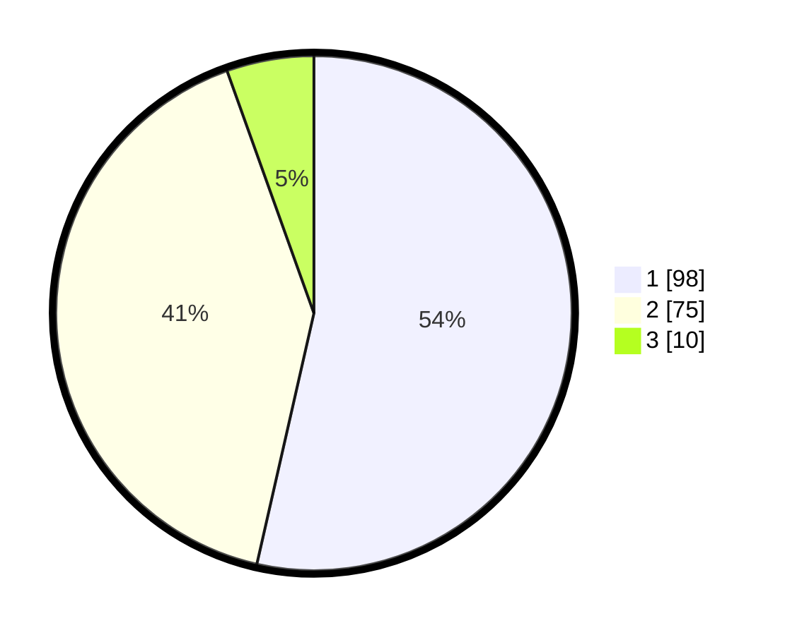

# Hasil

## Grafik

## Tabel

| No. | Nama Paslon    | Suara | Suara (raw) | Persentase |
|:--- |:-------------- | -----:| -----------:| ----------:|
| 1   | ANIES MUHAIMIN | 98    | [98][p-1]   | 53,55      |
| 2   | PRABOWO GIBRAN | 75    | [75][p-2]   | 40,98      |
| 3   | GANJAR MAHFUD  | 10    | [10][p-3]   | 5,46       |

[p-1]: https://github.com/gigit-pemilu/pemilu-2024-73-sulawesi-selatan/blob/main/pilpres/hitung-suara/sub/73-sulawesi-selatan/sub/04-jeneponto/sub/07-bontoramba/sub/1002-bontoramba/sub/007-tps/sub/paslon-1.txt
[p-2]: https://github.com/gigit-pemilu/pemilu-2024-73-sulawesi-selatan/blob/main/pilpres/hitung-suara/sub/73-sulawesi-selatan/sub/04-jeneponto/sub/07-bontoramba/sub/1002-bontoramba/sub/007-tps/sub/paslon-2.txt
[p-3]: https://github.com/gigit-pemilu/pemilu-2024-73-sulawesi-selatan/blob/main/pilpres/hitung-suara/sub/73-sulawesi-selatan/sub/04-jeneponto/sub/07-bontoramba/sub/1002-bontoramba/sub/007-tps/sub/paslon-3.txt

## Foto C Plano

https://sirekap-obj-formc.kpu.go.id/3f8f/pemilu/ppwp/73/04/07/10/02/7304071002007-20240215-160622--03532aff-a8d7-486b-8243-4f85157e6b3a.jpg

https://sirekap-obj-formc.kpu.go.id/3f8f/pemilu/ppwp/73/04/07/10/02/7304071002007-20240215-135623--f3ca61f8-4a32-41b6-bd2f-6afb34a716fc.jpg

https://sirekap-obj-formc.kpu.go.id/3f8f/pemilu/ppwp/73/04/07/10/02/7304071002007-20240215-161019--8c15cd8c-5b8c-4976-b51e-f1d75d83163a.jpg

## Metadata

| Key        | Value               |
| ---------- | ------------------- |
| Time Stamp | 2024-02-15 20:30:46 |

