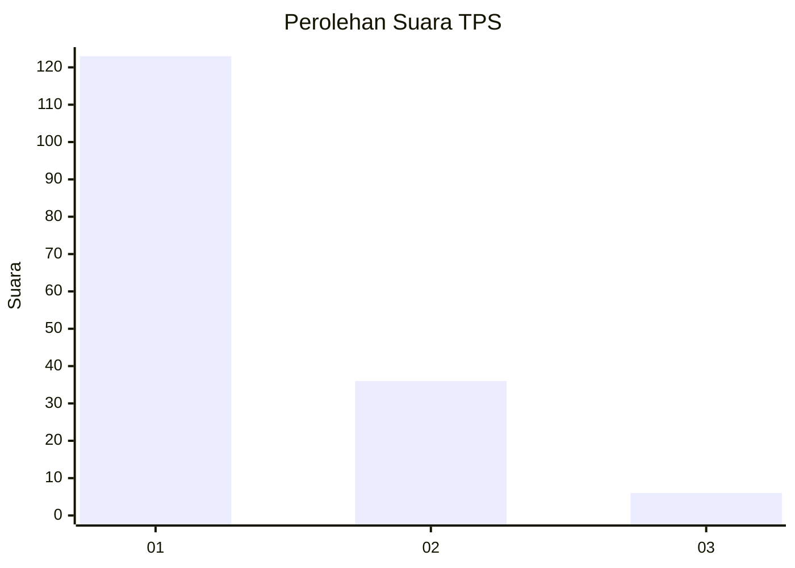
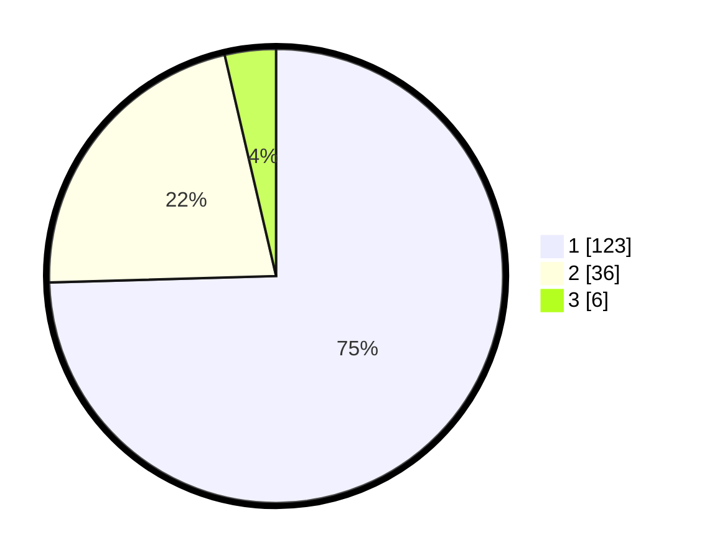

# Hasil

## Grafik

## Tabel

| No. | Nama Paslon    | Suara | Suara (raw) | Persentase |
|:--- |:-------------- | -----:| -----------:| ----------:|
| 1   | ANIES MUHAIMIN | 123   | [123][p-1]  | 74,55      |
| 2   | PRABOWO GIBRAN | 36    | [36][p-2]   | 21,82      |
| 3   | GANJAR MAHFUD  | 6     | [6][p-3]    | 3,64       |

[p-1]: https://github.com/gigit-pemilu/pemilu-2024-73-sulawesi-selatan/blob/main/pilpres/hitung-suara/sub/73-sulawesi-selatan/sub/04-jeneponto/sub/07-bontoramba/sub/2005-datara/sub/009-tps/sub/paslon-1.txt
[p-2]: https://github.com/gigit-pemilu/pemilu-2024-73-sulawesi-selatan/blob/main/pilpres/hitung-suara/sub/73-sulawesi-selatan/sub/04-jeneponto/sub/07-bontoramba/sub/2005-datara/sub/009-tps/sub/paslon-2.txt
[p-3]: https://github.com/gigit-pemilu/pemilu-2024-73-sulawesi-selatan/blob/main/pilpres/hitung-suara/sub/73-sulawesi-selatan/sub/04-jeneponto/sub/07-bontoramba/sub/2005-datara/sub/009-tps/sub/paslon-3.txt

## Foto C Plano

https://sirekap-obj-formc.kpu.go.id/e252/pemilu/ppwp/73/04/07/20/05/7304072005009-20240215-091257--4a63b1b2-f7ff-4c0b-9857-550c94e187a0.jpg

https://sirekap-obj-formc.kpu.go.id/e252/pemilu/ppwp/73/04/07/20/05/7304072005009-20240215-184511--bbd10d3d-6327-4a53-9db3-cacae0c25eb8.jpg

https://sirekap-obj-formc.kpu.go.id/e252/pemilu/ppwp/73/04/07/20/05/7304072005009-20240215-144008--bf132d61-9414-46ee-880d-1e2c2da67cbc.jpg

## Metadata

| Key        | Value               |
| ---------- | ------------------- |
| Time Stamp | 2024-02-15 21:30:27 |

