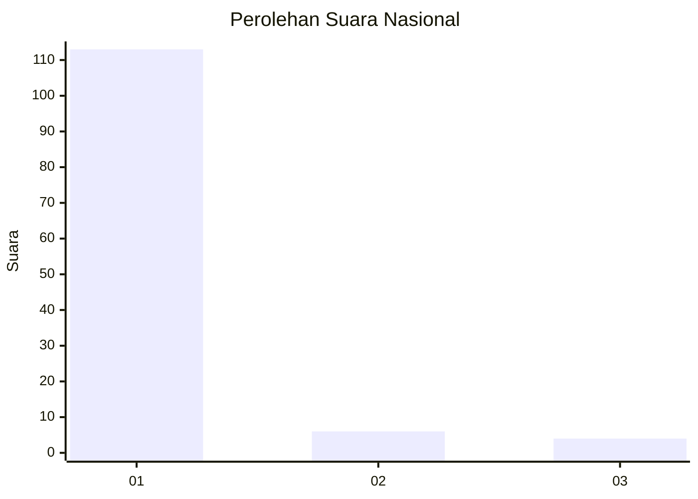
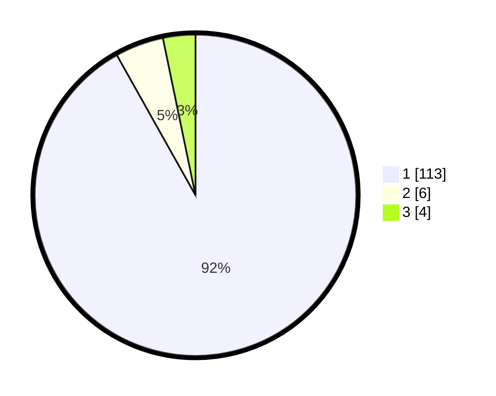

# Hasil

## Grafik

## Tabel

| No. | Nama Paslon    | Suara | Suara (raw) | Persentase |
|:--- |:-------------- | -----:| -----------:| ----------:|
| 1   | ANIES MUHAIMIN | 113   | [113][p-1]  | 91,87      |
| 2   | PRABOWO GIBRAN | 6     | [6][p-2]    | 4,88       |
| 3   | GANJAR MAHFUD  | 4     | [4][p-3]    | 3,25       |

[p-1]: https://github.com/gigit-pemilu/pemilu-2024/blob/main/pilpres/hitung-suara/sub/73-sulawesi-selatan/sub/04-jeneponto/sub/07-bontoramba/sub/2011-lentu/sub/003-tps/sub/paslon-1.txt
[p-2]: https://github.com/gigit-pemilu/pemilu-2024/blob/main/pilpres/hitung-suara/sub/73-sulawesi-selatan/sub/04-jeneponto/sub/07-bontoramba/sub/2011-lentu/sub/003-tps/sub/paslon-2.txt
[p-3]: https://github.com/gigit-pemilu/pemilu-2024/blob/main/pilpres/hitung-suara/sub/73-sulawesi-selatan/sub/04-jeneponto/sub/07-bontoramba/sub/2011-lentu/sub/003-tps/sub/paslon-3.txt

## Foto C Plano

https://sirekap-obj-formc.kpu.go.id/be9f/pemilu/ppwp/73/04/07/20/11/7304072011003-20240215-162330--dfa4c12b-816a-42e9-91f7-c7ade9ffe3af.jpg

https://sirekap-obj-formc.kpu.go.id/be9f/pemilu/ppwp/73/04/07/20/11/7304072011003-20240215-112407--7b7cb5d2-800e-4d6b-9313-2cfdc5c2f800.jpg

https://sirekap-obj-formc.kpu.go.id/be9f/pemilu/ppwp/73/04/07/20/11/7304072011003-20240215-112536--465e3070-8854-478c-9405-0df63114b155.jpg

## Metadata

| Key        | Value               |
| ---------- | ------------------- |
| Time Stamp | 2024-02-15 16:30:25 |

