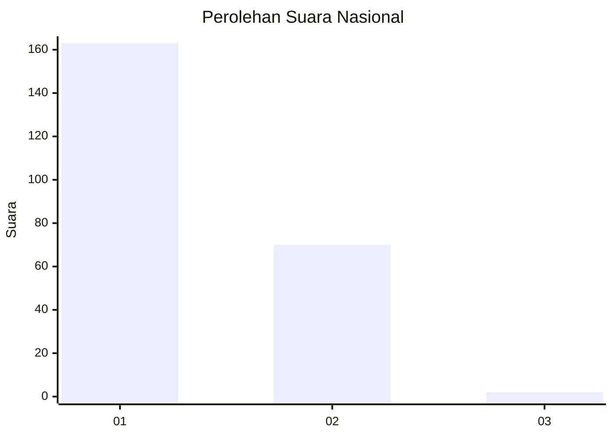
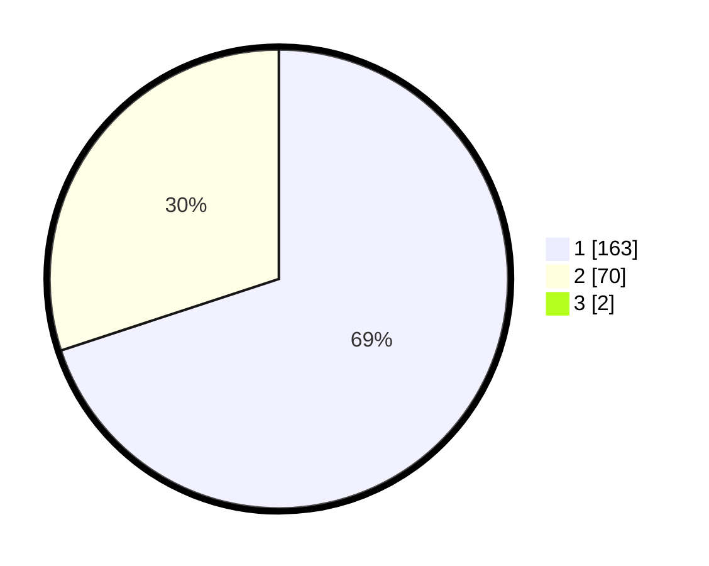

# Hasil

## Grafik

## Tabel

| No. | Nama Paslon    | Suara | Suara (raw) | Persentase |
|:--- |:-------------- | -----:| -----------:| ----------:|
| 1   | ANIES MUHAIMIN | 163   | [163][p-1]  | 69,36      |
| 2   | PRABOWO GIBRAN | 70    | [70][p-2]   | 29,79      |
| 3   | GANJAR MAHFUD  | 2     | [2][p-3]    | 0,85       |

[p-1]: https://github.com/gigit-pemilu/pemilu-2024/blob/main/pilpres/hitung-suara/sub/73-sulawesi-selatan/sub/04-jeneponto/sub/08-turatea/sub/2001-paitana/sub/001-tps/sub/paslon-1.txt
[p-2]: https://github.com/gigit-pemilu/pemilu-2024/blob/main/pilpres/hitung-suara/sub/73-sulawesi-selatan/sub/04-jeneponto/sub/08-turatea/sub/2001-paitana/sub/001-tps/sub/paslon-2.txt
[p-3]: https://github.com/gigit-pemilu/pemilu-2024/blob/main/pilpres/hitung-suara/sub/73-sulawesi-selatan/sub/04-jeneponto/sub/08-turatea/sub/2001-paitana/sub/001-tps/sub/paslon-3.txt

## Foto C Plano

https://sirekap-obj-formc.kpu.go.id/1041/pemilu/ppwp/73/04/08/20/01/7304082001001-20240214-215039--65e16a0f-acf4-469c-b6f4-feeba203b160.jpg

https://sirekap-obj-formc.kpu.go.id/1041/pemilu/ppwp/73/04/08/20/01/7304082001001-20240214-220403--25ffdf6c-5b63-427b-98c9-d294d0d0a1a1.jpg

https://sirekap-obj-formc.kpu.go.id/1041/pemilu/ppwp/73/04/08/20/01/7304082001001-20240214-220850--0c178cbf-6bba-4d6a-b660-be03a0ef4f9a.jpg

## Metadata

| Key        | Value               |
| ---------- | ------------------- |
| Time Stamp | 2024-02-15 09:00:24 |

