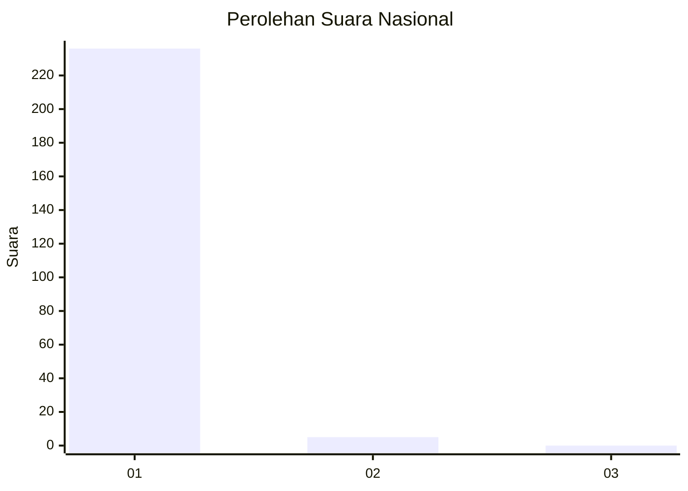
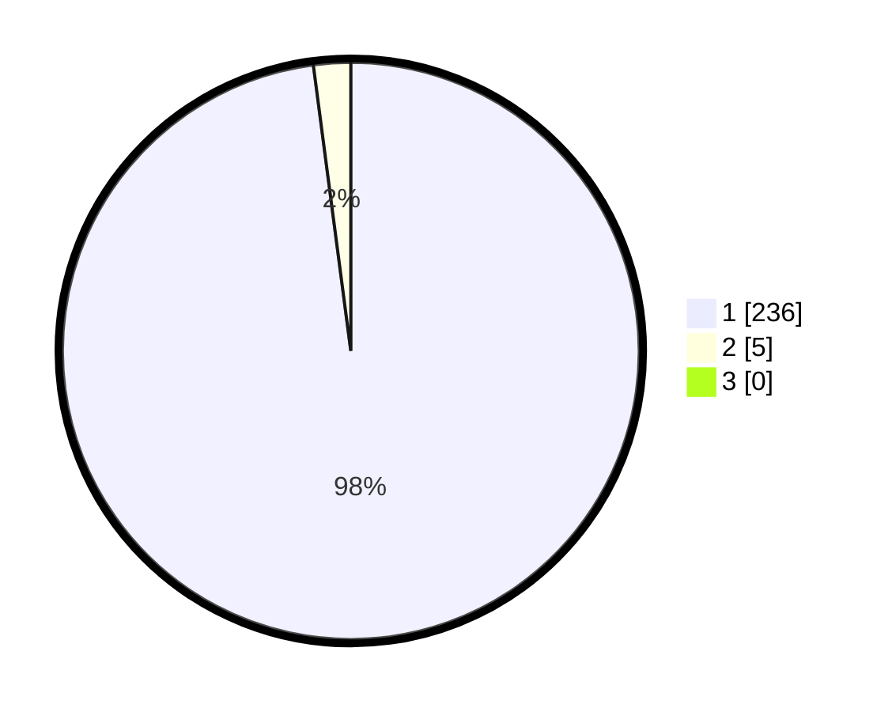

# Hasil

## Grafik

## Tabel

| No. | Nama Paslon    | Suara | Suara (raw) | Persentase |
|:--- |:-------------- | -----:| -----------:| ----------:|
| 1   | ANIES MUHAIMIN | 236   | [236][p-1]  | 97,93      |
| 2   | PRABOWO GIBRAN | 5     | [5][p-2]    | 2,07       |
| 3   | GANJAR MAHFUD  | 0     | [0][p-3]    | 0,00       |

[p-1]: https://github.com/gigit-pemilu/pemilu-2024/blob/main/pilpres/hitung-suara/sub/73-sulawesi-selatan/sub/04-jeneponto/sub/09-arungkeke/sub/2007-kampala/sub/006-tps/sub/paslon-1.txt
[p-2]: https://github.com/gigit-pemilu/pemilu-2024/blob/main/pilpres/hitung-suara/sub/73-sulawesi-selatan/sub/04-jeneponto/sub/09-arungkeke/sub/2007-kampala/sub/006-tps/sub/paslon-2.txt
[p-3]: https://github.com/gigit-pemilu/pemilu-2024/blob/main/pilpres/hitung-suara/sub/73-sulawesi-selatan/sub/04-jeneponto/sub/09-arungkeke/sub/2007-kampala/sub/006-tps/sub/paslon-3.txt

## Foto C Plano

https://sirekap-obj-formc.kpu.go.id/c0bb/pemilu/ppwp/73/04/09/20/07/7304092007006-20240215-004655--98e033bf-6092-4c3e-b655-487bfd537f2b.jpg

https://sirekap-obj-formc.kpu.go.id/c0bb/pemilu/ppwp/73/04/09/20/07/7304092007006-20240214-215222--55240fc4-5055-4d8f-878f-cf6259cebd6b.jpg

https://sirekap-obj-formc.kpu.go.id/c0bb/pemilu/ppwp/73/04/09/20/07/7304092007006-20240215-005004--13e7a575-ecbb-4996-9228-984551faedec.jpg

## Metadata

| Key        | Value               |
| ---------- | ------------------- |
| Time Stamp | 2024-02-15 21:01:18 |

