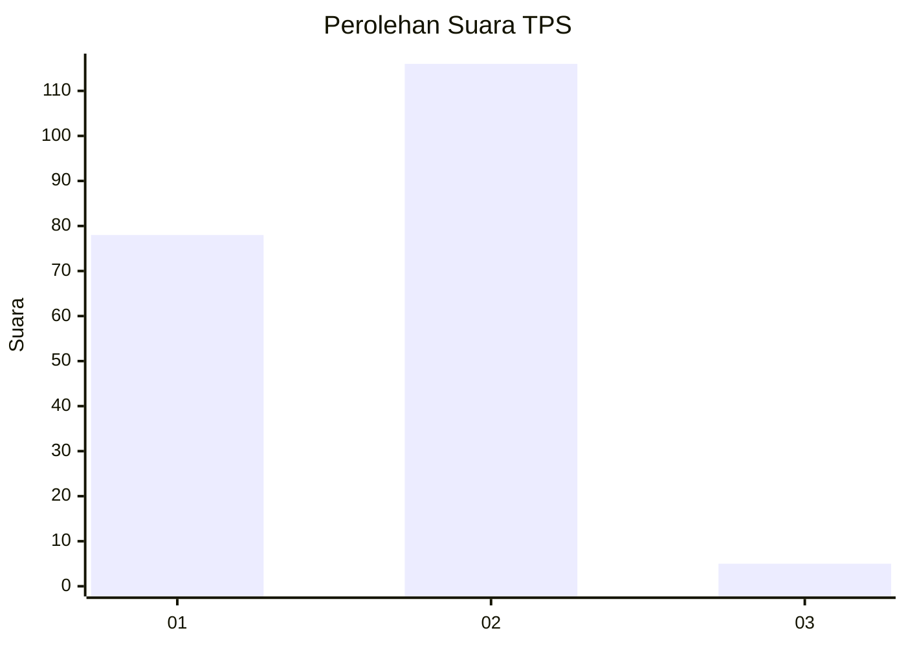
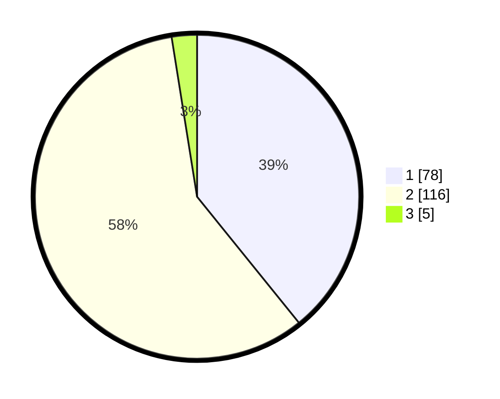

# Hasil

## Grafik

## Tabel

| No. | Nama Paslon    | Suara | Suara (raw) | Persentase |
|:--- |:-------------- | -----:| -----------:| ----------:|
| 1   | ANIES MUHAIMIN | 78    | [78][p-1]   | 39,20      |
| 2   | PRABOWO GIBRAN | 116   | [116][p-2]  | 58,29      |
| 3   | GANJAR MAHFUD  | 5     | [5][p-3]    | 2,51       |

[p-1]: https://github.com/gigit-pemilu/pemilu-2024-73-sulawesi-selatan/blob/main/pilpres/hitung-suara/sub/73-sulawesi-selatan/sub/04-jeneponto/sub/10-rumbia/sub/2001-rumbia/sub/005-tps/sub/paslon-1.txt
[p-2]: https://github.com/gigit-pemilu/pemilu-2024-73-sulawesi-selatan/blob/main/pilpres/hitung-suara/sub/73-sulawesi-selatan/sub/04-jeneponto/sub/10-rumbia/sub/2001-rumbia/sub/005-tps/sub/paslon-2.txt
[p-3]: https://github.com/gigit-pemilu/pemilu-2024-73-sulawesi-selatan/blob/main/pilpres/hitung-suara/sub/73-sulawesi-selatan/sub/04-jeneponto/sub/10-rumbia/sub/2001-rumbia/sub/005-tps/sub/paslon-3.txt

## Foto C Plano

https://sirekap-obj-formc.kpu.go.id/191b/pemilu/ppwp/73/04/10/20/01/7304102001005-20240215-165220--311c1509-7ee9-40b8-94f3-2c0cae344e4b.jpg

https://sirekap-obj-formc.kpu.go.id/191b/pemilu/ppwp/73/04/10/20/01/7304102001005-20240215-080304--5c8a04a7-c8ea-4990-b21d-0ad46914e4ac.jpg

https://sirekap-obj-formc.kpu.go.id/191b/pemilu/ppwp/73/04/10/20/01/7304102001005-20240215-165356--e1b2d93b-6aec-4fe5-8357-dd46376ea6e5.jpg

## Metadata

| Key        | Value               |
| ---------- | ------------------- |
| Time Stamp | 2024-02-16 08:00:28 |

