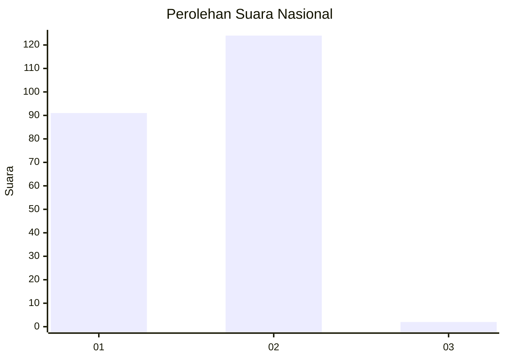
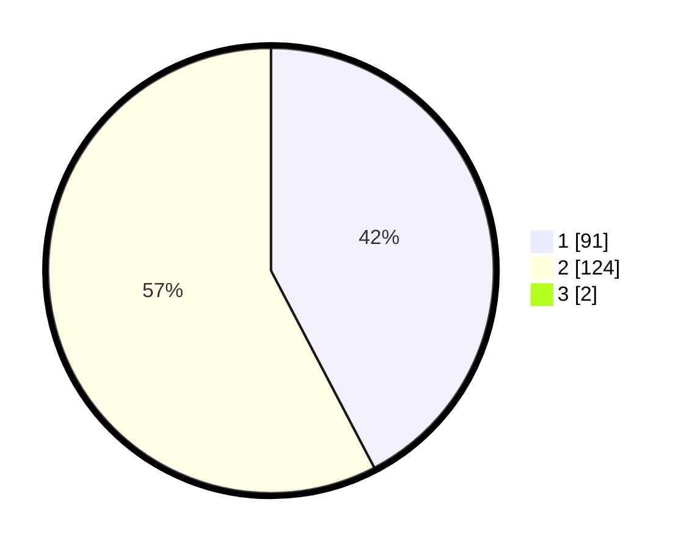

# Hasil

## Grafik

## Tabel

| No. | Nama Paslon    | Suara | Suara (raw) | Persentase |
|:--- |:-------------- | -----:| -----------:| ----------:|
| 1   | ANIES MUHAIMIN | 91    | [91][p-1]   | 41,94      |
| 2   | PRABOWO GIBRAN | 124   | [124][p-2]  | 57,14      |
| 3   | GANJAR MAHFUD  | 2     | [2][p-3]    | 0,92       |

[p-1]: https://github.com/gigit-pemilu/pemilu-2024/blob/main/pilpres/hitung-suara/sub/73-sulawesi-selatan/sub/05-takalar/sub/01-mappakasunggu/sub/1001-takalar/sub/003-tps/sub/paslon-1.txt
[p-2]: https://github.com/gigit-pemilu/pemilu-2024/blob/main/pilpres/hitung-suara/sub/73-sulawesi-selatan/sub/05-takalar/sub/01-mappakasunggu/sub/1001-takalar/sub/003-tps/sub/paslon-2.txt
[p-3]: https://github.com/gigit-pemilu/pemilu-2024/blob/main/pilpres/hitung-suara/sub/73-sulawesi-selatan/sub/05-takalar/sub/01-mappakasunggu/sub/1001-takalar/sub/003-tps/sub/paslon-3.txt

## Foto C Plano

https://sirekap-obj-formc.kpu.go.id/69bc/pemilu/ppwp/73/05/01/10/01/7305011001003-20240215-040322--70f0970c-b631-4639-be2e-05b3906065c3.jpg

https://sirekap-obj-formc.kpu.go.id/69bc/pemilu/ppwp/73/05/01/10/01/7305011001003-20240215-040443--b8b753ba-d3ca-46df-847c-b625a9a610d2.jpg

https://sirekap-obj-formc.kpu.go.id/69bc/pemilu/ppwp/73/05/01/10/01/7305011001003-20240215-040550--7753de95-aa52-437d-a313-16d1311e4f4e.jpg

## Metadata

| Key        | Value               |
| ---------- | ------------------- |
| Time Stamp | 2024-02-15 18:30:25 |

