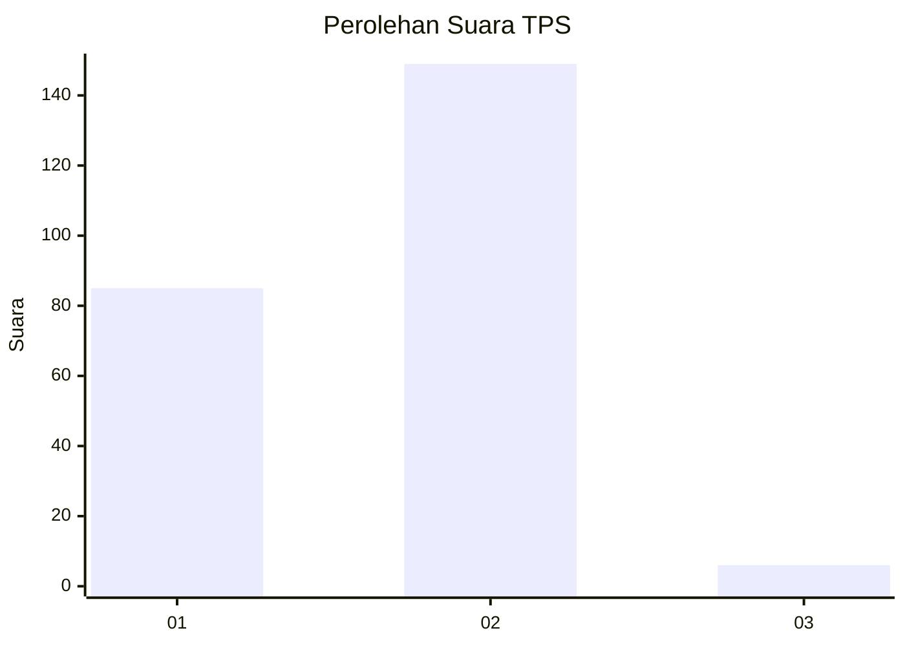
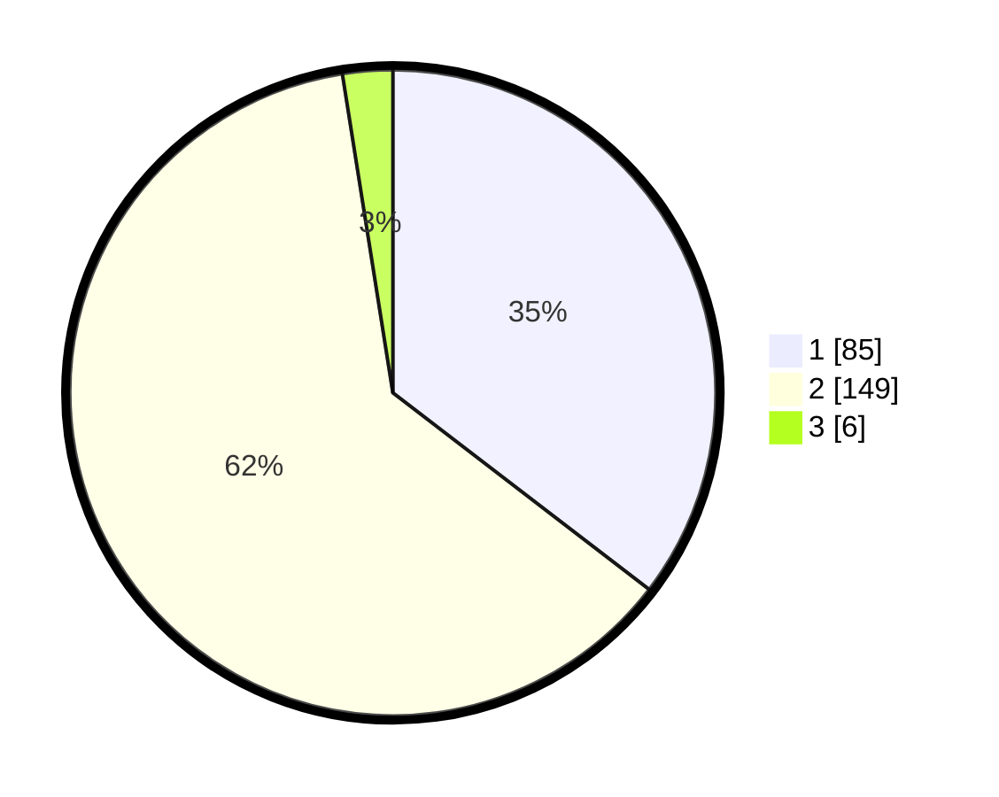

# Hasil

## Grafik

## Tabel

| No. | Nama Paslon    | Suara | Suara (raw) | Persentase |
|:--- |:-------------- | -----:| -----------:| ----------:|
| 1   | ANIES MUHAIMIN | 85    | [85][p-1]   | 35,42      |
| 2   | PRABOWO GIBRAN | 149   | [149][p-2]  | 62,08      |
| 3   | GANJAR MAHFUD  | 6     | [6][p-3]    | 2,50       |

[p-1]: https://github.com/gigit-pemilu/pemilu-2024-73-sulawesi-selatan/blob/main/pilpres/hitung-suara/sub/73-sulawesi-selatan/sub/05-takalar/sub/01-mappakasunggu/sub/1001-takalar/sub/004-tps/sub/paslon-1.txt
[p-2]: https://github.com/gigit-pemilu/pemilu-2024-73-sulawesi-selatan/blob/main/pilpres/hitung-suara/sub/73-sulawesi-selatan/sub/05-takalar/sub/01-mappakasunggu/sub/1001-takalar/sub/004-tps/sub/paslon-2.txt
[p-3]: https://github.com/gigit-pemilu/pemilu-2024-73-sulawesi-selatan/blob/main/pilpres/hitung-suara/sub/73-sulawesi-selatan/sub/05-takalar/sub/01-mappakasunggu/sub/1001-takalar/sub/004-tps/sub/paslon-3.txt

## Foto C Plano

https://sirekap-obj-formc.kpu.go.id/7348/pemilu/ppwp/73/05/01/10/01/7305011001004-20240215-011526--b4b47348-d0a4-45b4-9ba1-dc6dd619120f.jpg

https://sirekap-obj-formc.kpu.go.id/7348/pemilu/ppwp/73/05/01/10/01/7305011001004-20240214-202913--a74f6524-e54d-405f-97ab-e462ae613079.jpg

https://sirekap-obj-formc.kpu.go.id/7348/pemilu/ppwp/73/05/01/10/01/7305011001004-20240214-214613--92c9af31-ce09-49cc-8ce9-3a7126583a2e.jpg

## Metadata

| Key        | Value               |
| ---------- | ------------------- |
| Time Stamp | 2024-02-15 15:00:29 |

