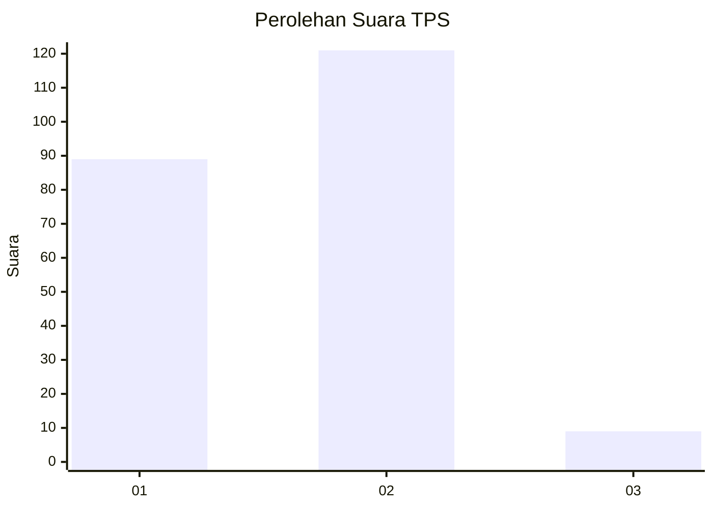
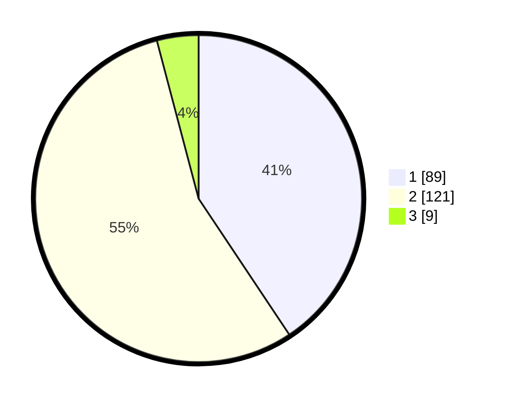

# Hasil

## Grafik

## Tabel

| No. | Nama Paslon    | Suara | Suara (raw) | Persentase |
|:--- |:-------------- | -----:| -----------:| ----------:|
| 1   | ANIES MUHAIMIN | 89    | [89][p-1]   | 40,64      |
| 2   | PRABOWO GIBRAN | 121   | [121][p-2]  | 55,25      |
| 3   | GANJAR MAHFUD  | 9     | [9][p-3]    | 4,11       |

[p-1]: https://github.com/gigit-pemilu/pemilu-2024-73-sulawesi-selatan/blob/main/pilpres/hitung-suara/sub/73-sulawesi-selatan/sub/05-takalar/sub/02-mangarabombang/sub/1002-mangadu/sub/004-tps/sub/paslon-1.txt
[p-2]: https://github.com/gigit-pemilu/pemilu-2024-73-sulawesi-selatan/blob/main/pilpres/hitung-suara/sub/73-sulawesi-selatan/sub/05-takalar/sub/02-mangarabombang/sub/1002-mangadu/sub/004-tps/sub/paslon-2.txt
[p-3]: https://github.com/gigit-pemilu/pemilu-2024-73-sulawesi-selatan/blob/main/pilpres/hitung-suara/sub/73-sulawesi-selatan/sub/05-takalar/sub/02-mangarabombang/sub/1002-mangadu/sub/004-tps/sub/paslon-3.txt

## Foto C Plano

https://sirekap-obj-formc.kpu.go.id/2bff/pemilu/ppwp/73/05/02/10/02/7305021002004-20240215-003637--b331020b-a28e-42cd-878e-37b977426b02.jpg

https://sirekap-obj-formc.kpu.go.id/2bff/pemilu/ppwp/73/05/02/10/02/7305021002004-20240215-003720--3b1bbbd5-f07d-44dd-b750-4d7e8df20dbe.jpg

https://sirekap-obj-formc.kpu.go.id/2bff/pemilu/ppwp/73/05/02/10/02/7305021002004-20240215-003817--f7c7cbe2-4fdf-48cf-a06b-2f8986686f60.jpg

## Metadata

| Key        | Value               |
| ---------- | ------------------- |
| Time Stamp | 2024-02-15 18:30:25 |

