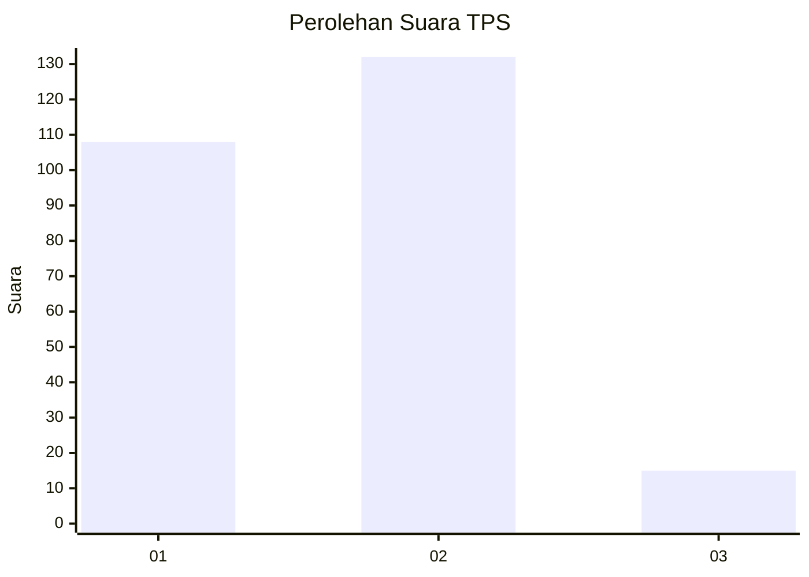
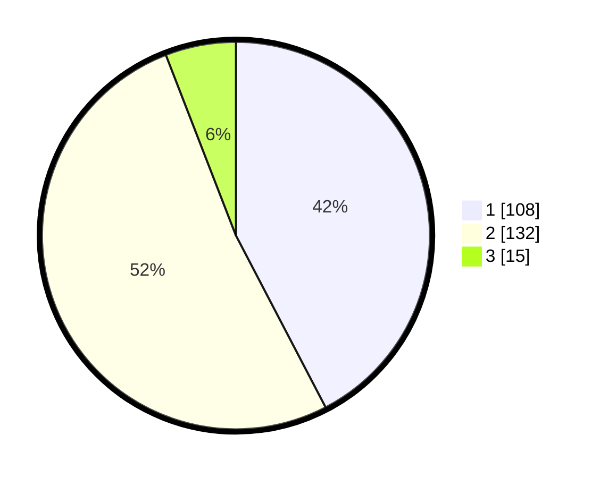

# Hasil

## Grafik

## Tabel

| No. | Nama Paslon    | Suara | Suara (raw) | Persentase |
|:--- |:-------------- | -----:| -----------:| ----------:|
| 1   | ANIES MUHAIMIN | 108   | [108][p-1]  | 42,35      |
| 2   | PRABOWO GIBRAN | 132   | [132][p-2]  | 51,76      |
| 3   | GANJAR MAHFUD  | 15    | [15][p-3]   | 5,88       |

[p-1]: https://github.com/gigit-pemilu/pemilu-2024-73-sulawesi-selatan/blob/main/pilpres/hitung-suara/sub/73-sulawesi-selatan/sub/05-takalar/sub/02-mangarabombang/sub/2003-topejawa/sub/002-tps/sub/paslon-1.txt
[p-2]: https://github.com/gigit-pemilu/pemilu-2024-73-sulawesi-selatan/blob/main/pilpres/hitung-suara/sub/73-sulawesi-selatan/sub/05-takalar/sub/02-mangarabombang/sub/2003-topejawa/sub/002-tps/sub/paslon-2.txt
[p-3]: https://github.com/gigit-pemilu/pemilu-2024-73-sulawesi-selatan/blob/main/pilpres/hitung-suara/sub/73-sulawesi-selatan/sub/05-takalar/sub/02-mangarabombang/sub/2003-topejawa/sub/002-tps/sub/paslon-3.txt

## Foto C Plano

https://sirekap-obj-formc.kpu.go.id/4481/pemilu/ppwp/73/05/02/20/03/7305022003002-20240215-032108--de783cec-f676-42e5-ad52-1b00c0ec96a1.jpg

https://sirekap-obj-formc.kpu.go.id/4481/pemilu/ppwp/73/05/02/20/03/7305022003002-20240215-031709--c21e24c0-ad22-41eb-ada3-a5c6d9b6ccf7.jpg

https://sirekap-obj-formc.kpu.go.id/4481/pemilu/ppwp/73/05/02/20/03/7305022003002-20240215-041802--44535064-d85a-4a3d-b4ec-528bac32d5ca.jpg

## Metadata

| Key        | Value               |
| ---------- | ------------------- |
| Time Stamp | 2024-02-15 22:40:13 |

