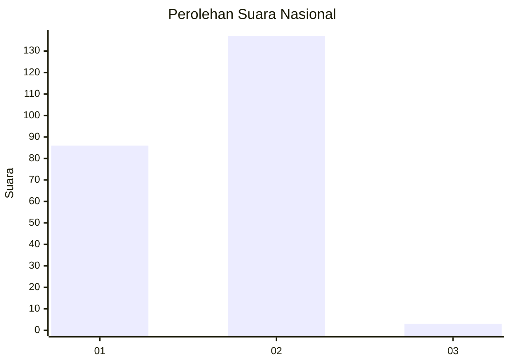
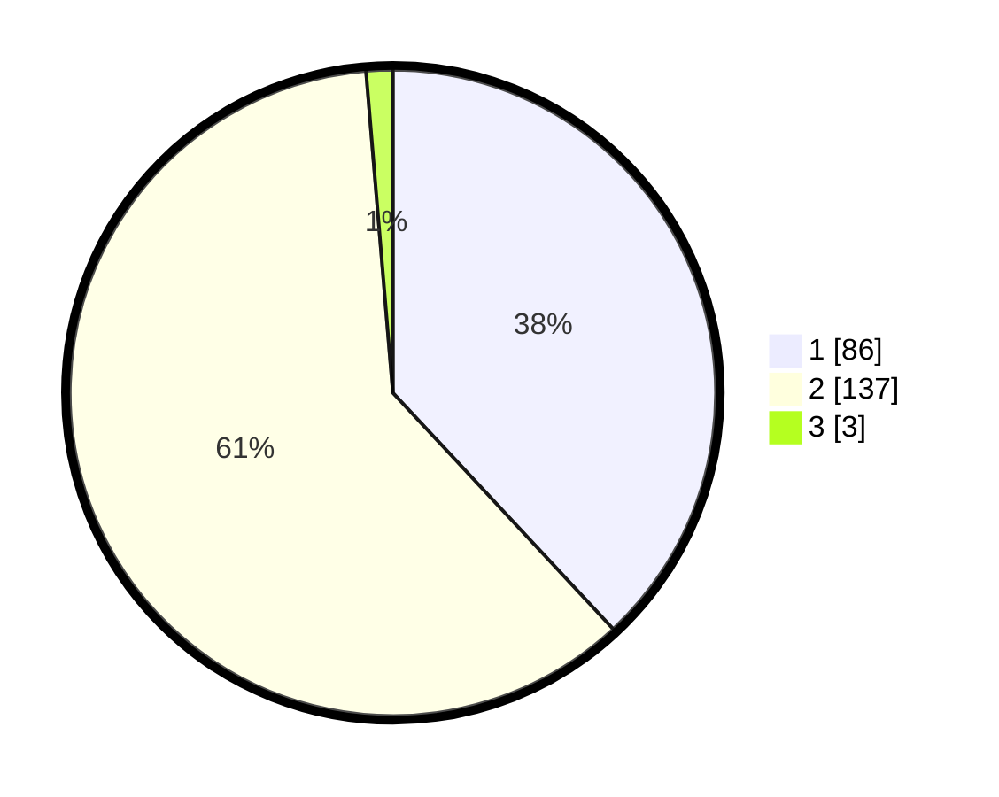

# Hasil

## Grafik

## Tabel

| No. | Nama Paslon    | Suara | Suara (raw) | Persentase |
|:--- |:-------------- | -----:| -----------:| ----------:|
| 1   | ANIES MUHAIMIN | 86    | [86][p-1]   | 38,05      |
| 2   | PRABOWO GIBRAN | 137   | [137][p-2]  | 60,62      |
| 3   | GANJAR MAHFUD  | 3     | [3][p-3]    | 1,33       |

[p-1]: https://github.com/gigit-pemilu/pemilu-2024/blob/main/pilpres/hitung-suara/sub/73-sulawesi-selatan/sub/05-takalar/sub/06-galesong-utara/sub/1004-bontolebang/sub/003-tps/sub/paslon-1.txt
[p-2]: https://github.com/gigit-pemilu/pemilu-2024/blob/main/pilpres/hitung-suara/sub/73-sulawesi-selatan/sub/05-takalar/sub/06-galesong-utara/sub/1004-bontolebang/sub/003-tps/sub/paslon-2.txt
[p-3]: https://github.com/gigit-pemilu/pemilu-2024/blob/main/pilpres/hitung-suara/sub/73-sulawesi-selatan/sub/05-takalar/sub/06-galesong-utara/sub/1004-bontolebang/sub/003-tps/sub/paslon-3.txt

## Foto C Plano

https://sirekap-obj-formc.kpu.go.id/47fd/pemilu/ppwp/73/05/06/10/04/7305061004003-20240215-015222--9c026563-eeab-4db2-8749-08e7a2e2cb4a.jpg

https://sirekap-obj-formc.kpu.go.id/47fd/pemilu/ppwp/73/05/06/10/04/7305061004003-20240214-223036--f18035ab-80f2-4d5e-b34d-9936997ea205.jpg

https://sirekap-obj-formc.kpu.go.id/47fd/pemilu/ppwp/73/05/06/10/04/7305061004003-20240214-223321--23031e66-42cf-4262-a02a-61f9a1729189.jpg

## Metadata

| Key        | Value               |
| ---------- | ------------------- |
| Time Stamp | 2024-02-16 01:30:27 |

