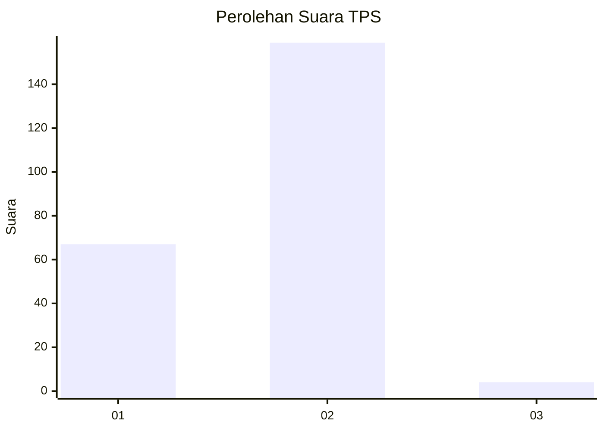
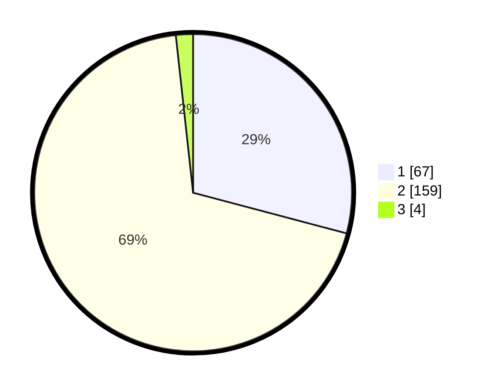

# Hasil

## Grafik

## Tabel

| No. | Nama Paslon    | Suara | Suara (raw) | Persentase |
|:--- |:-------------- | -----:| -----------:| ----------:|
| 1   | ANIES MUHAIMIN | 67    | [67][p-1]   | 29,13      |
| 2   | PRABOWO GIBRAN | 159   | [159][p-2]  | 69,13      |
| 3   | GANJAR MAHFUD  | 4     | [4][p-3]    | 1,74       |

[p-1]: https://github.com/gigit-pemilu/pemilu-2024-73-sulawesi-selatan/blob/main/pilpres/hitung-suara/sub/73-sulawesi-selatan/sub/05-takalar/sub/06-galesong-utara/sub/1004-bontolebang/sub/004-tps/sub/paslon-1.txt
[p-2]: https://github.com/gigit-pemilu/pemilu-2024-73-sulawesi-selatan/blob/main/pilpres/hitung-suara/sub/73-sulawesi-selatan/sub/05-takalar/sub/06-galesong-utara/sub/1004-bontolebang/sub/004-tps/sub/paslon-2.txt
[p-3]: https://github.com/gigit-pemilu/pemilu-2024-73-sulawesi-selatan/blob/main/pilpres/hitung-suara/sub/73-sulawesi-selatan/sub/05-takalar/sub/06-galesong-utara/sub/1004-bontolebang/sub/004-tps/sub/paslon-3.txt

## Foto C Plano

https://sirekap-obj-formc.kpu.go.id/7178/pemilu/ppwp/73/05/06/10/04/7305061004004-20240215-010008--a8854cdd-1110-4323-947a-bb59a6cf84c4.jpg

https://sirekap-obj-formc.kpu.go.id/7178/pemilu/ppwp/73/05/06/10/04/7305061004004-20240216-153323--0f28ded7-0bde-4e43-9b17-9fbff54db51f.jpg

https://sirekap-obj-formc.kpu.go.id/7178/pemilu/ppwp/73/05/06/10/04/7305061004004-20240216-153322--8423add9-3024-4989-9608-cbaea23ee250.jpg

## Metadata

| Key        | Value               |
| ---------- | ------------------- |
| Time Stamp | 2024-02-17 17:30:00 |

