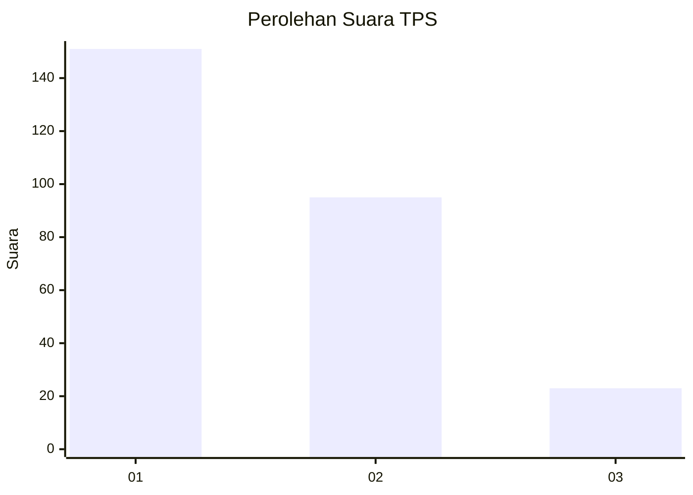
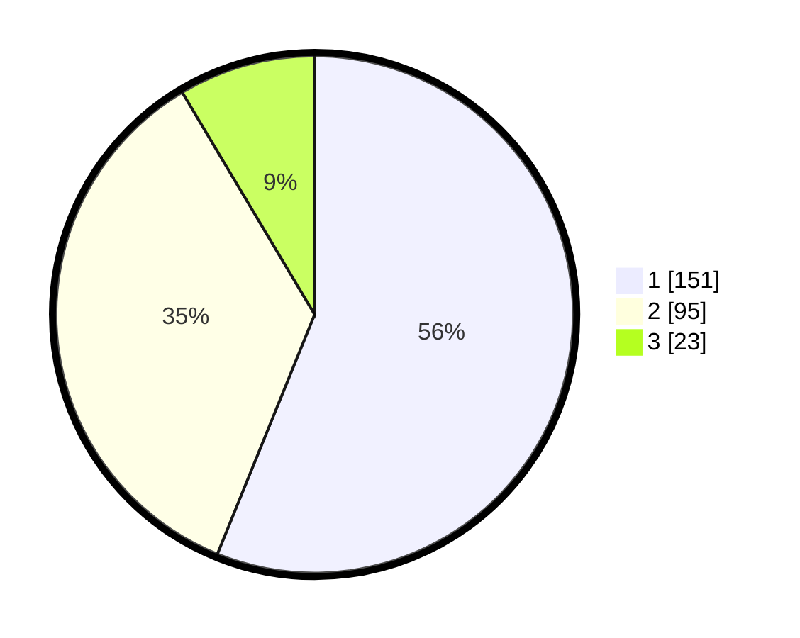

# Hasil

## Grafik

## Tabel

| No. | Nama Paslon    | Suara | Suara (raw) | Persentase |
|:--- |:-------------- | -----:| -----------:| ----------:|
| 1   | ANIES MUHAIMIN | 151   | [151][p-1]  | 56,13      |
| 2   | PRABOWO GIBRAN | 95    | [95][p-2]   | 35,32      |
| 3   | GANJAR MAHFUD  | 23    | [23][p-3]   | 8,55       |

[p-1]: https://github.com/gigit-pemilu/pemilu-2024-73-sulawesi-selatan/blob/main/pilpres/hitung-suara/sub/73-sulawesi-selatan/sub/05-takalar/sub/07-pattallassang/sub/1001-pattallassang/sub/001-tps/sub/paslon-1.txt
[p-2]: https://github.com/gigit-pemilu/pemilu-2024-73-sulawesi-selatan/blob/main/pilpres/hitung-suara/sub/73-sulawesi-selatan/sub/05-takalar/sub/07-pattallassang/sub/1001-pattallassang/sub/001-tps/sub/paslon-2.txt
[p-3]: https://github.com/gigit-pemilu/pemilu-2024-73-sulawesi-selatan/blob/main/pilpres/hitung-suara/sub/73-sulawesi-selatan/sub/05-takalar/sub/07-pattallassang/sub/1001-pattallassang/sub/001-tps/sub/paslon-3.txt

## Foto C Plano

https://sirekap-obj-formc.kpu.go.id/7b7f/pemilu/ppwp/73/05/07/10/01/7305071001001-20240215-040937--a646baaf-80b6-41cd-b1df-f5cea8a43a15.jpg

https://sirekap-obj-formc.kpu.go.id/7b7f/pemilu/ppwp/73/05/07/10/01/7305071001001-20240215-041159--296638ca-daae-4007-a968-72db7a077b2e.jpg

https://sirekap-obj-formc.kpu.go.id/7b7f/pemilu/ppwp/73/05/07/10/01/7305071001001-20240215-041310--e587b3c1-d63b-4782-b604-d14260ff99c8.jpg

## Metadata

| Key        | Value               |
| ---------- | ------------------- |
| Time Stamp | 2024-02-17 16:52:47 |

## DATA PEMILIH TETAP

Jumlah pemilih dalam DPT: **742**.
 * L: **230**.
 * P: **755**.

## DATA PENGGUNA HAK PILIH

Jumlah pengguna hak pilih dalam DPT: **252**.
 * L: **175**.
 * P: **737**.

Jumlah pengguna hak pilih dalam DPTb: **703**.
 * L: **0**.
 * P: **517**.

Jumlah pengguna hak pilih dalam DPK: **17**.
 * L: **7**.
 * P: **5**.

Jumlah pengguna hak pilih: **711**.
 * L: **135**.
 * P: **775**.

## JUMLAH SUARA SAH DAN TIDAK SAH

JUMLAH SELURUH SUARA SAH: **269**.

JUMLAH SUARA TIDAK SAH: **2**.

JUMLAH SELURUH SUARA SAH DAN SUARA TIDAK SAH: **271**.

