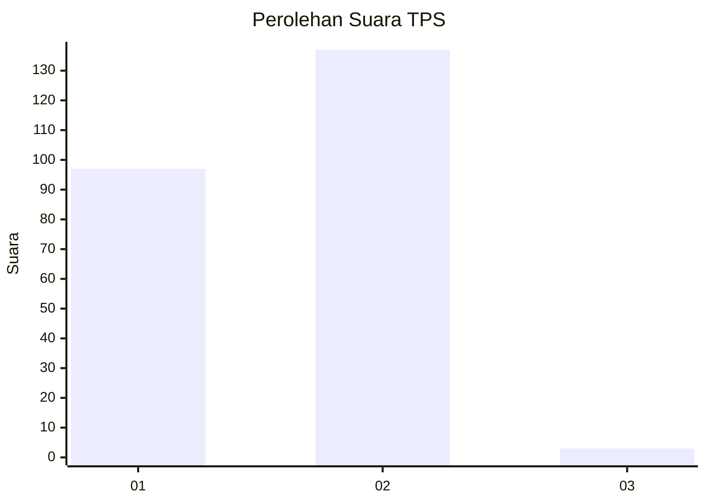
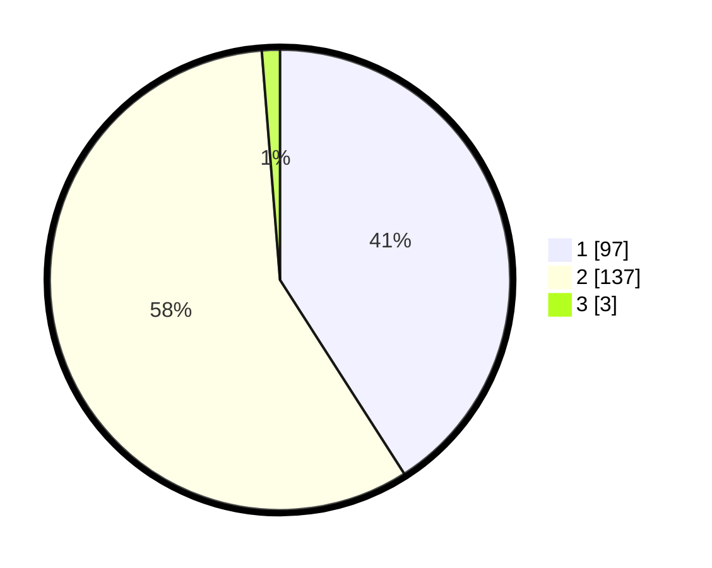

# Hasil

## Grafik

## Tabel

| No. | Nama Paslon    | Suara | Suara (raw) | Persentase |
|:--- |:-------------- | -----:| -----------:| ----------:|
| 1   | ANIES MUHAIMIN | 97    | [97][p-1]   | 40,93      |
| 2   | PRABOWO GIBRAN | 137   | [137][p-2]  | 57,81      |
| 3   | GANJAR MAHFUD  | 3     | [3][p-3]    | 1,27       |

[p-1]: https://github.com/gigit-pemilu/pemilu-2024-73-sulawesi-selatan/blob/main/pilpres/hitung-suara/sub/73-sulawesi-selatan/sub/05-takalar/sub/07-pattallassang/sub/1001-pattallassang/sub/003-tps/sub/paslon-1.txt
[p-2]: https://github.com/gigit-pemilu/pemilu-2024-73-sulawesi-selatan/blob/main/pilpres/hitung-suara/sub/73-sulawesi-selatan/sub/05-takalar/sub/07-pattallassang/sub/1001-pattallassang/sub/003-tps/sub/paslon-2.txt
[p-3]: https://github.com/gigit-pemilu/pemilu-2024-73-sulawesi-selatan/blob/main/pilpres/hitung-suara/sub/73-sulawesi-selatan/sub/05-takalar/sub/07-pattallassang/sub/1001-pattallassang/sub/003-tps/sub/paslon-3.txt

## Foto C Plano

https://sirekap-obj-formc.kpu.go.id/2715/pemilu/ppwp/73/05/07/10/01/7305071001003-20240214-231932--a6b9beeb-4323-4891-a275-561fc5fbd024.jpg

https://sirekap-obj-formc.kpu.go.id/2715/pemilu/ppwp/73/05/07/10/01/7305071001003-20240214-231644--a833a8d1-99f2-49a9-a867-5a9dfeb1c59b.jpg

https://sirekap-obj-formc.kpu.go.id/2715/pemilu/ppwp/73/05/07/10/01/7305071001003-20240214-231730--e9d2eddd-1417-4eeb-a15f-ba39a8e210f1.jpg

## Metadata

| Key        | Value               |
| ---------- | ------------------- |
| Time Stamp | 2024-02-15 22:00:27 |

