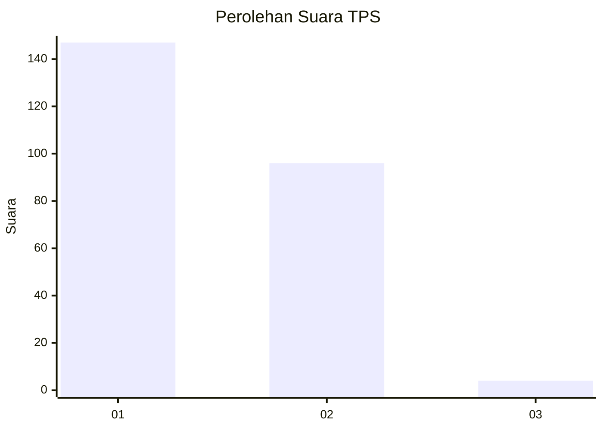
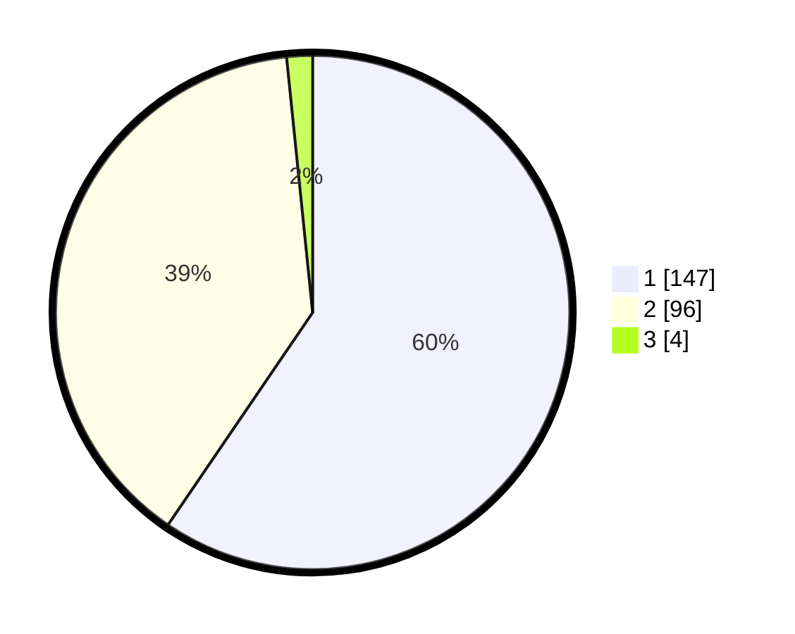

# Hasil

## Grafik

## Tabel

| No. | Nama Paslon    | Suara | Suara (raw) | Persentase |
|:--- |:-------------- | -----:| -----------:| ----------:|
| 1   | ANIES MUHAIMIN | 147   | [147][p-1]  | 59,51      |
| 2   | PRABOWO GIBRAN | 96    | [96][p-2]   | 38,87      |
| 3   | GANJAR MAHFUD  | 4     | [4][p-3]    | 1,62       |

[p-1]: https://github.com/gigit-pemilu/pemilu-2024-73-sulawesi-selatan/blob/main/pilpres/hitung-suara/sub/73-sulawesi-selatan/sub/05-takalar/sub/07-pattallassang/sub/1004-kalabbirang/sub/001-tps/sub/paslon-1.txt
[p-2]: https://github.com/gigit-pemilu/pemilu-2024-73-sulawesi-selatan/blob/main/pilpres/hitung-suara/sub/73-sulawesi-selatan/sub/05-takalar/sub/07-pattallassang/sub/1004-kalabbirang/sub/001-tps/sub/paslon-2.txt
[p-3]: https://github.com/gigit-pemilu/pemilu-2024-73-sulawesi-selatan/blob/main/pilpres/hitung-suara/sub/73-sulawesi-selatan/sub/05-takalar/sub/07-pattallassang/sub/1004-kalabbirang/sub/001-tps/sub/paslon-3.txt

## Foto C Plano

https://sirekap-obj-formc.kpu.go.id/69f2/pemilu/ppwp/73/05/07/10/04/7305071004001-20240215-075739--cd567ed3-d317-454f-8960-5c1face2b12c.jpg

https://sirekap-obj-formc.kpu.go.id/69f2/pemilu/ppwp/73/05/07/10/04/7305071004001-20240215-075956--c0d68709-73a9-448d-8928-82b2055f9cca.jpg

https://sirekap-obj-formc.kpu.go.id/69f2/pemilu/ppwp/73/05/07/10/04/7305071004001-20240215-080113--84d02c4a-4a06-4d56-bc61-62b28801775d.jpg

## Metadata

| Key        | Value               |
| ---------- | ------------------- |
| Time Stamp | 2024-02-16 00:30:27 |

