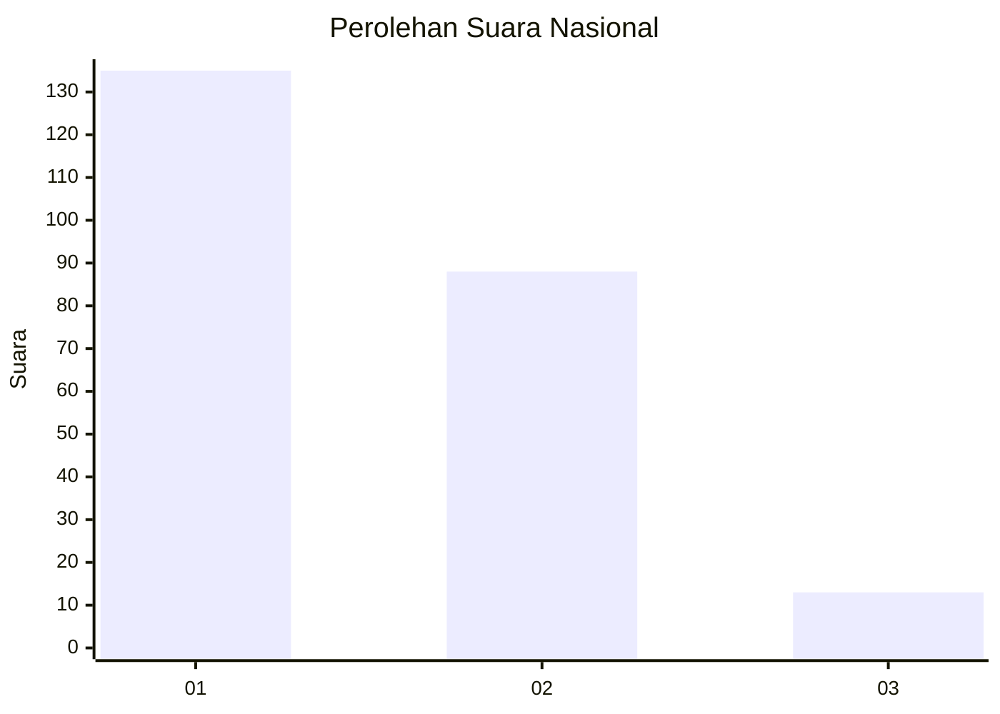
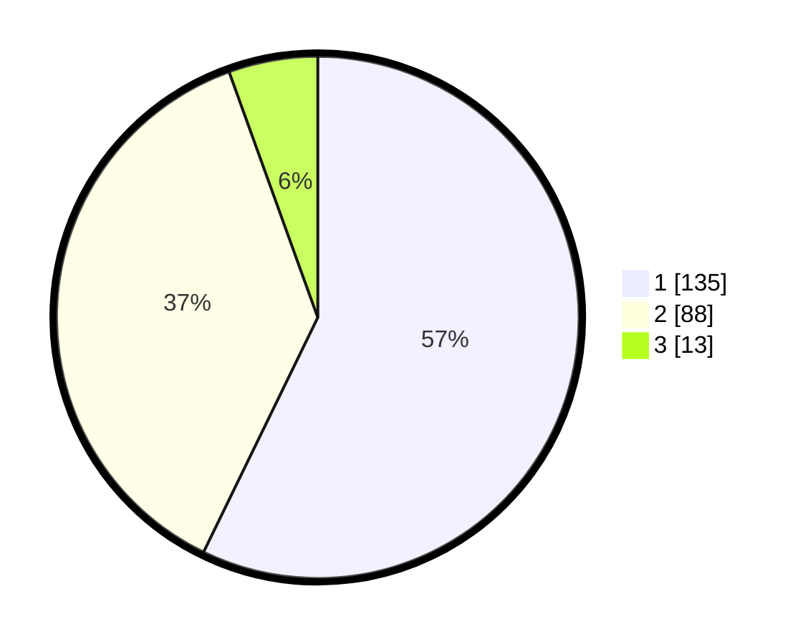

# Hasil

## Grafik

## Tabel

| No. | Nama Paslon    | Suara | Suara (raw) | Persentase |
|:--- |:-------------- | -----:| -----------:| ----------:|
| 1   | ANIES MUHAIMIN | 135   | [135][p-1]  | 57,20      |
| 2   | PRABOWO GIBRAN | 88    | [88][p-2]   | 37,29      |
| 3   | GANJAR MAHFUD  | 13    | [13][p-3]   | 5,51       |

[p-1]: https://github.com/gigit-pemilu/pemilu-2024/blob/main/pilpres/hitung-suara/sub/73-sulawesi-selatan/sub/05-takalar/sub/07-pattallassang/sub/1004-kalabbirang/sub/005-tps/sub/paslon-1.txt
[p-2]: https://github.com/gigit-pemilu/pemilu-2024/blob/main/pilpres/hitung-suara/sub/73-sulawesi-selatan/sub/05-takalar/sub/07-pattallassang/sub/1004-kalabbirang/sub/005-tps/sub/paslon-2.txt
[p-3]: https://github.com/gigit-pemilu/pemilu-2024/blob/main/pilpres/hitung-suara/sub/73-sulawesi-selatan/sub/05-takalar/sub/07-pattallassang/sub/1004-kalabbirang/sub/005-tps/sub/paslon-3.txt

## Foto C Plano

https://sirekap-obj-formc.kpu.go.id/052b/pemilu/ppwp/73/05/07/10/04/7305071004005-20240215-033928--ace73b1f-d893-43dd-bf29-e27b1eb21b41.jpg

https://sirekap-obj-formc.kpu.go.id/052b/pemilu/ppwp/73/05/07/10/04/7305071004005-20240215-033644--e7c2fdb4-2538-4df8-b960-35cda518c8aa.jpg

https://sirekap-obj-formc.kpu.go.id/052b/pemilu/ppwp/73/05/07/10/04/7305071004005-20240215-033425--dcb3a4d2-bd55-4c86-bfee-01c7dcf040a1.jpg

## Metadata

| Key        | Value               |
| ---------- | ------------------- |
| Time Stamp | 2024-02-16 00:30:27 |

