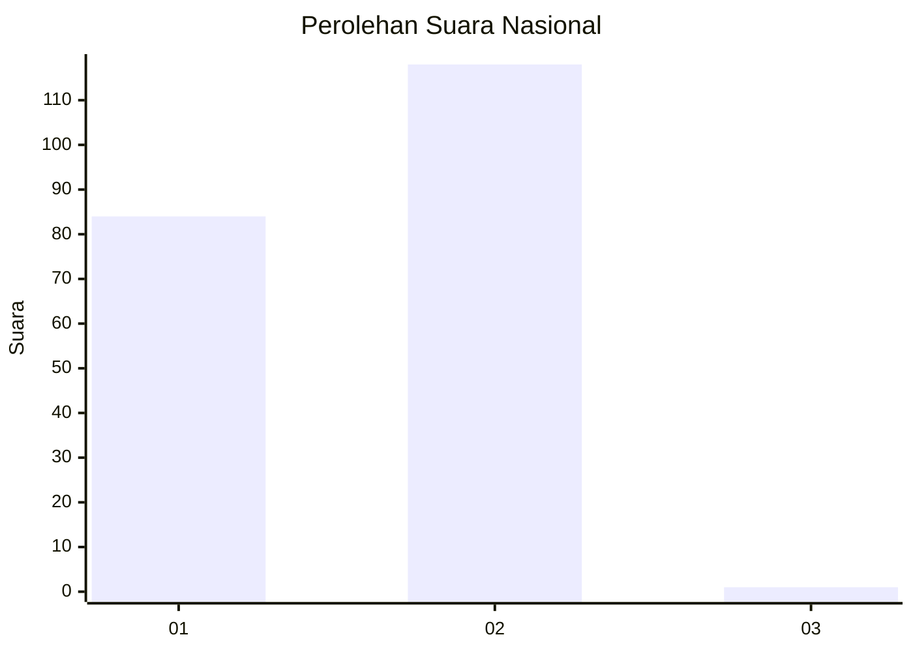
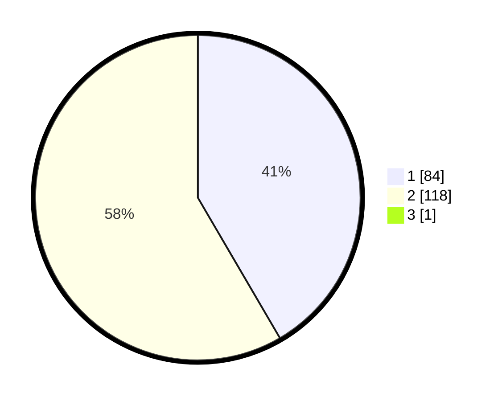

# Hasil

## Grafik

## Tabel

| No. | Nama Paslon    | Suara | Suara (raw) | Persentase |
|:--- |:-------------- | -----:| -----------:| ----------:|
| 1   | ANIES MUHAIMIN | 84    | [84][p-1]   | 41,38      |
| 2   | PRABOWO GIBRAN | 118   | [118][p-2]  | 58,13      |
| 3   | GANJAR MAHFUD  | 1     | [1][p-3]    | 0,49       |

[p-1]: https://github.com/gigit-pemilu/pemilu-2024/blob/main/pilpres/hitung-suara/sub/73-sulawesi-selatan/sub/05-takalar/sub/08-sanrobone/sub/2005-ujung-baji/sub/001-tps/sub/paslon-1.txt
[p-2]: https://github.com/gigit-pemilu/pemilu-2024/blob/main/pilpres/hitung-suara/sub/73-sulawesi-selatan/sub/05-takalar/sub/08-sanrobone/sub/2005-ujung-baji/sub/001-tps/sub/paslon-2.txt
[p-3]: https://github.com/gigit-pemilu/pemilu-2024/blob/main/pilpres/hitung-suara/sub/73-sulawesi-selatan/sub/05-takalar/sub/08-sanrobone/sub/2005-ujung-baji/sub/001-tps/sub/paslon-3.txt

## Foto C Plano

https://sirekap-obj-formc.kpu.go.id/ff3c/pemilu/ppwp/73/05/08/20/05/7305082005001-20240214-231727--59984e05-1330-4a4b-ab8f-c50576054492.jpg

https://sirekap-obj-formc.kpu.go.id/ff3c/pemilu/ppwp/73/05/08/20/05/7305082005001-20240214-231910--c9dd042b-05ab-4ad1-bc33-fab5812fe30d.jpg

https://sirekap-obj-formc.kpu.go.id/ff3c/pemilu/ppwp/73/05/08/20/05/7305082005001-20240214-232107--d1c78637-b3aa-457f-97ee-6d16a0ac871f.jpg

## Metadata

| Key        | Value               |
| ---------- | ------------------- |
| Time Stamp | 2024-02-16 09:30:28 |

