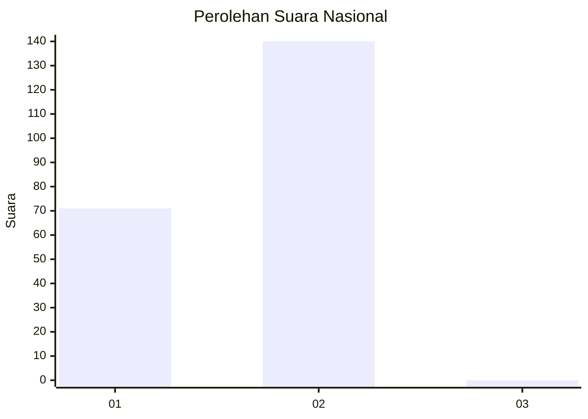
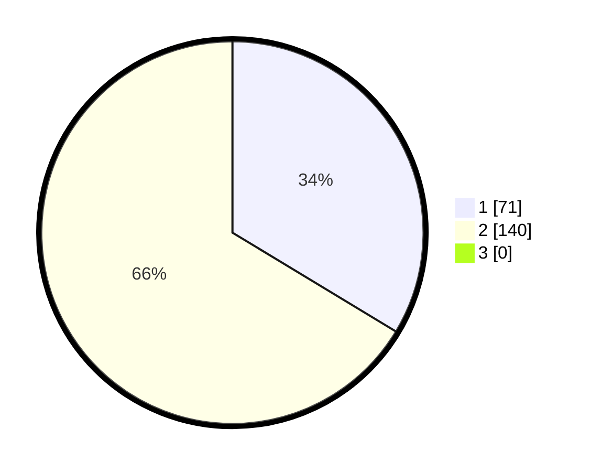

# Hasil

## Grafik

## Tabel

| No. | Nama Paslon    | Suara | Suara (raw) | Persentase |
|:--- |:-------------- | -----:| -----------:| ----------:|
| 1   | ANIES MUHAIMIN | 71    | [71][p-1]   | 33,65      |
| 2   | PRABOWO GIBRAN | 140   | [140][p-2]  | 66,35      |
| 3   | GANJAR MAHFUD  | 0     | [0][p-3]    | 0,00       |

[p-1]: https://github.com/gigit-pemilu/pemilu-2024/blob/main/pilpres/hitung-suara/sub/73-sulawesi-selatan/sub/05-takalar/sub/09-galesong/sub/2008-pa'rasangang-beru/sub/004-tps/sub/paslon-1.txt
[p-2]: https://github.com/gigit-pemilu/pemilu-2024/blob/main/pilpres/hitung-suara/sub/73-sulawesi-selatan/sub/05-takalar/sub/09-galesong/sub/2008-pa'rasangang-beru/sub/004-tps/sub/paslon-2.txt
[p-3]: https://github.com/gigit-pemilu/pemilu-2024/blob/main/pilpres/hitung-suara/sub/73-sulawesi-selatan/sub/05-takalar/sub/09-galesong/sub/2008-pa'rasangang-beru/sub/004-tps/sub/paslon-3.txt

## Foto C Plano

https://sirekap-obj-formc.kpu.go.id/31a4/pemilu/ppwp/73/05/09/20/08/7305092008004-20240214-235236--fb91bfa8-935b-46ac-8039-ce03f8c3b622.jpg

https://sirekap-obj-formc.kpu.go.id/31a4/pemilu/ppwp/73/05/09/20/08/7305092008004-20240214-235411--586f9553-33a1-4d9d-9c7a-b676b574a054.jpg

https://sirekap-obj-formc.kpu.go.id/31a4/pemilu/ppwp/73/05/09/20/08/7305092008004-20240214-235456--a6ca6718-7962-4193-9a51-b106a7e4b861.jpg

## Metadata

| Key        | Value               |
| ---------- | ------------------- |
| Time Stamp | 2024-02-16 09:30:28 |

