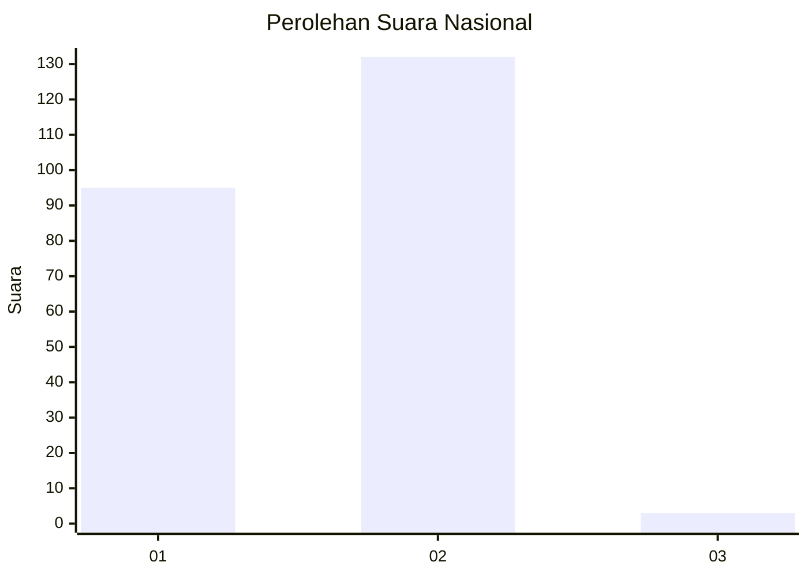
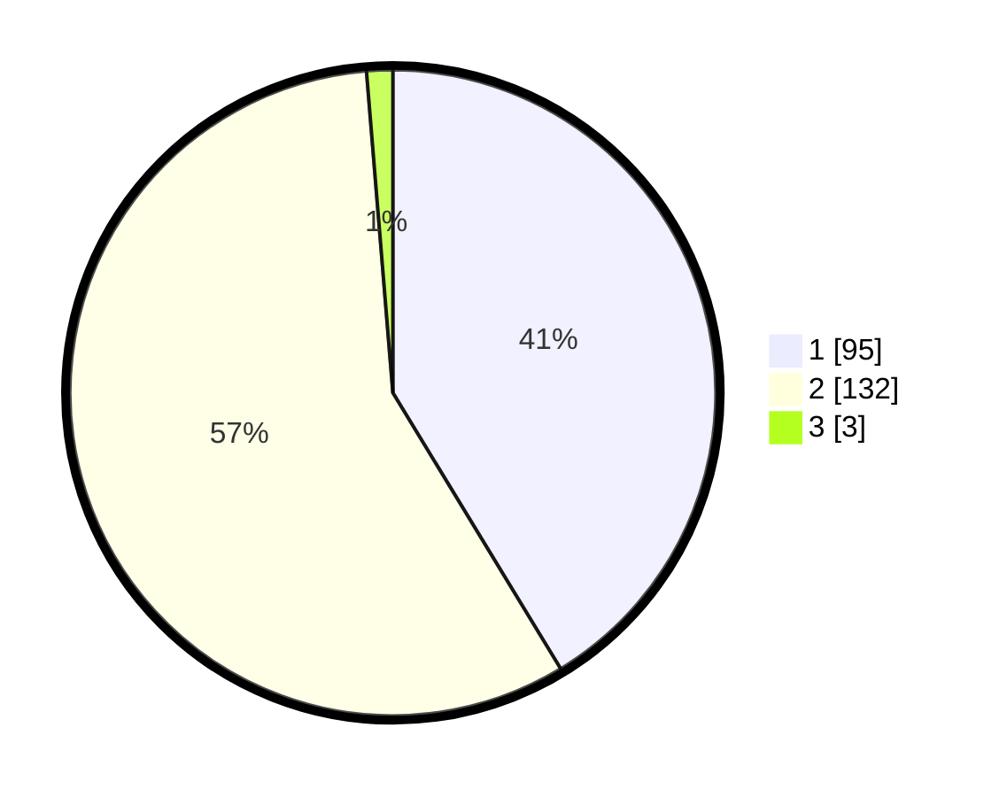

# Hasil

## Grafik

## Tabel

| No. | Nama Paslon    | Suara | Suara (raw) | Persentase |
|:--- |:-------------- | -----:| -----------:| ----------:|
| 1   | ANIES MUHAIMIN | 95    | [95][p-1]   | 41,30      |
| 2   | PRABOWO GIBRAN | 132   | [132][p-2]  | 57,39      |
| 3   | GANJAR MAHFUD  | 3     | [3][p-3]    | 1,30       |

[p-1]: https://github.com/gigit-pemilu/pemilu-2024/blob/main/pilpres/hitung-suara/sub/73-sulawesi-selatan/sub/05-takalar/sub/09-galesong/sub/2009-pa'lalakkang/sub/005-tps/sub/paslon-1.txt
[p-2]: https://github.com/gigit-pemilu/pemilu-2024/blob/main/pilpres/hitung-suara/sub/73-sulawesi-selatan/sub/05-takalar/sub/09-galesong/sub/2009-pa'lalakkang/sub/005-tps/sub/paslon-2.txt
[p-3]: https://github.com/gigit-pemilu/pemilu-2024/blob/main/pilpres/hitung-suara/sub/73-sulawesi-selatan/sub/05-takalar/sub/09-galesong/sub/2009-pa'lalakkang/sub/005-tps/sub/paslon-3.txt

## Foto C Plano

https://sirekap-obj-formc.kpu.go.id/721d/pemilu/ppwp/73/05/09/20/09/7305092009005-20240214-212748--2510bbb8-860e-4904-9f3b-9ab700b6bce3.jpg

https://sirekap-obj-formc.kpu.go.id/721d/pemilu/ppwp/73/05/09/20/09/7305092009005-20240214-212906--caa56a33-25db-4d20-9841-0a814a5f56d2.jpg

https://sirekap-obj-formc.kpu.go.id/721d/pemilu/ppwp/73/05/09/20/09/7305092009005-20240214-212952--883b94c5-9e7a-439c-a377-e770b9e3adfb.jpg

## Metadata

| Key        | Value               |
| ---------- | ------------------- |
| Time Stamp | 2024-02-15 22:40:13 |

