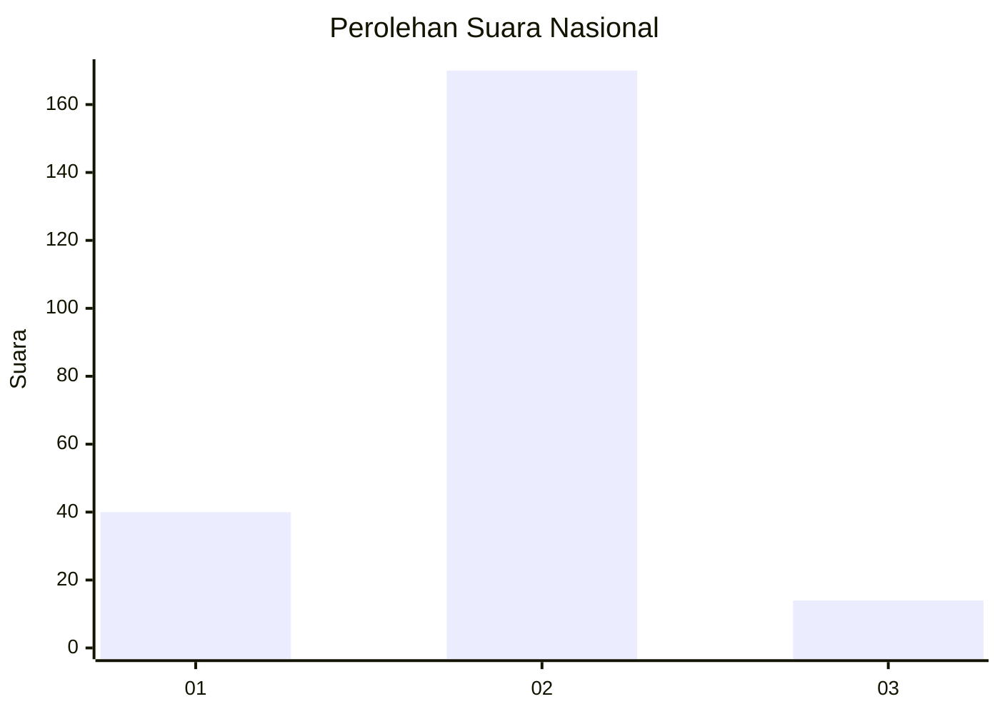
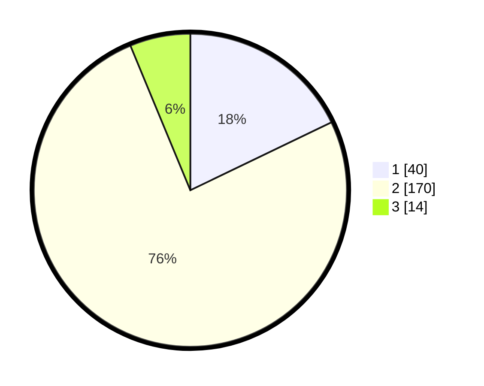

# Hasil

## Grafik

## Tabel

| No. | Nama Paslon    | Suara | Suara (raw) | Persentase |
|:--- |:-------------- | -----:| -----------:| ----------:|
| 1   | ANIES MUHAIMIN | 40    | [40][p-1]   | 17,86      |
| 2   | PRABOWO GIBRAN | 170   | [170][p-2]  | 75,89      |
| 3   | GANJAR MAHFUD  | 14    | [14][p-3]   | 6,25       |

[p-1]: https://github.com/gigit-pemilu/pemilu-2024/blob/main/pilpres/hitung-suara/sub/73-sulawesi-selatan/sub/05-takalar/sub/09-galesong/sub/2010-pattinoang/sub/005-tps/sub/paslon-1.txt
[p-2]: https://github.com/gigit-pemilu/pemilu-2024/blob/main/pilpres/hitung-suara/sub/73-sulawesi-selatan/sub/05-takalar/sub/09-galesong/sub/2010-pattinoang/sub/005-tps/sub/paslon-2.txt
[p-3]: https://github.com/gigit-pemilu/pemilu-2024/blob/main/pilpres/hitung-suara/sub/73-sulawesi-selatan/sub/05-takalar/sub/09-galesong/sub/2010-pattinoang/sub/005-tps/sub/paslon-3.txt

## Foto C Plano

https://sirekap-obj-formc.kpu.go.id/093a/pemilu/ppwp/73/05/09/20/10/7305092010005-20240215-114512--5ccfc773-53fd-412f-92fb-6c0eadba2a11.jpg

https://sirekap-obj-formc.kpu.go.id/093a/pemilu/ppwp/73/05/09/20/10/7305092010005-20240215-114539--f1caccf9-97d7-4a93-8f9c-b17ee33ca497.jpg

https://sirekap-obj-formc.kpu.go.id/093a/pemilu/ppwp/73/05/09/20/10/7305092010005-20240216-155459--7c7c8668-3886-4de0-819c-0eb9a1ae31b9.jpg

## Metadata

| Key        | Value               |
| ---------- | ------------------- |
| Time Stamp | 2024-02-16 16:25:10 |

