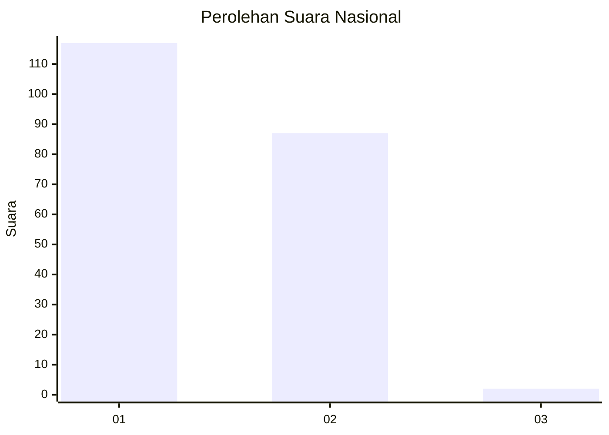
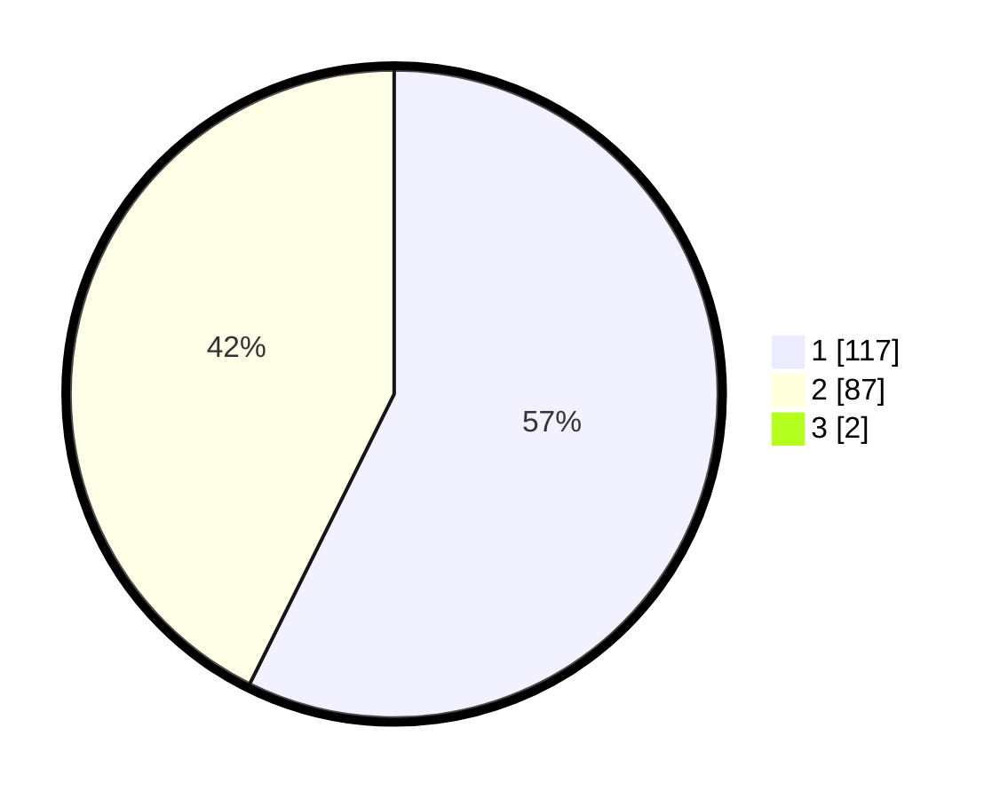

# Hasil

## Grafik

## Tabel

| No. | Nama Paslon    | Suara | Suara (raw) | Persentase |
|:--- |:-------------- | -----:| -----------:| ----------:|
| 1   | ANIES MUHAIMIN | 117   | [117][p-1]  | 56,80      |
| 2   | PRABOWO GIBRAN | 87    | [87][p-2]   | 42,23      |
| 3   | GANJAR MAHFUD  | 2     | [2][p-3]    | 0,97       |

[p-1]: https://github.com/gigit-pemilu/pemilu-2024/blob/main/pilpres/hitung-suara/sub/73-sulawesi-selatan/sub/05-takalar/sub/09-galesong/sub/2011-kalenna-bontongape/sub/005-tps/sub/paslon-1.txt
[p-2]: https://github.com/gigit-pemilu/pemilu-2024/blob/main/pilpres/hitung-suara/sub/73-sulawesi-selatan/sub/05-takalar/sub/09-galesong/sub/2011-kalenna-bontongape/sub/005-tps/sub/paslon-2.txt
[p-3]: https://github.com/gigit-pemilu/pemilu-2024/blob/main/pilpres/hitung-suara/sub/73-sulawesi-selatan/sub/05-takalar/sub/09-galesong/sub/2011-kalenna-bontongape/sub/005-tps/sub/paslon-3.txt

## Foto C Plano

https://sirekap-obj-formc.kpu.go.id/5ef6/pemilu/ppwp/73/05/09/20/11/7305092011005-20240214-221106--9086b0a3-3f14-433e-a788-a3a03ccf96c6.jpg

https://sirekap-obj-formc.kpu.go.id/5ef6/pemilu/ppwp/73/05/09/20/11/7305092011005-20240214-221314--8b56dbde-1bc5-4ab9-ba96-7254d818a280.jpg

https://sirekap-obj-formc.kpu.go.id/5ef6/pemilu/ppwp/73/05/09/20/11/7305092011005-20240214-221619--2b06ca3f-fdda-4a1b-a084-37e05f04398d.jpg

## Metadata

| Key        | Value               |
| ---------- | ------------------- |
| Time Stamp | 2024-02-16 09:30:28 |

