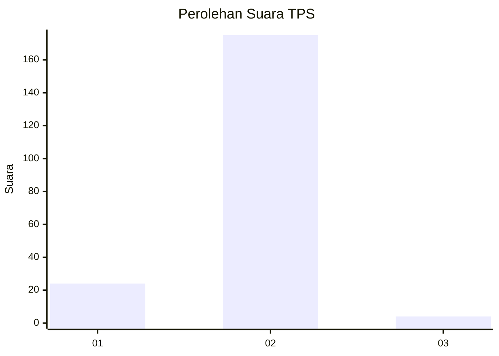
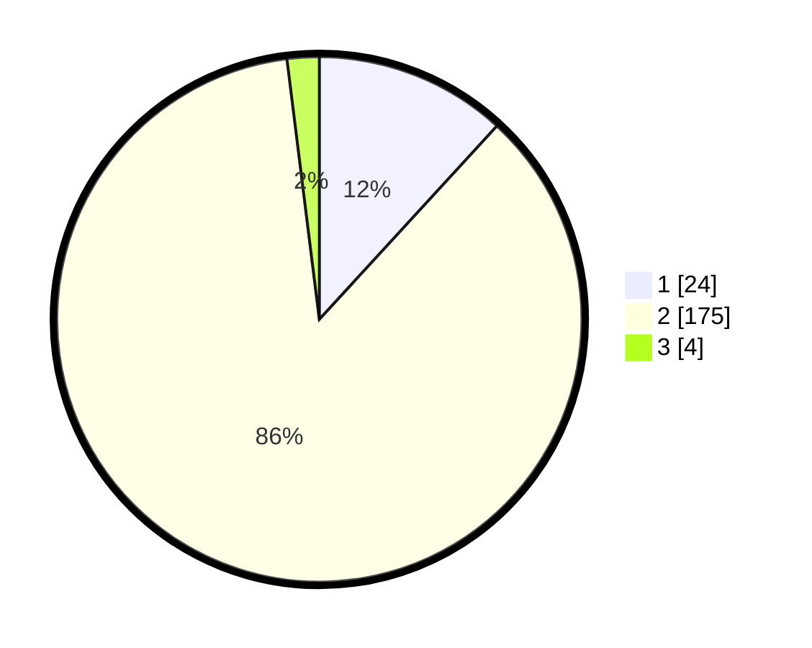

# Hasil

## Grafik

## Tabel

| No. | Nama Paslon    | Suara | Suara (raw) | Persentase |
|:--- |:-------------- | -----:| -----------:| ----------:|
| 1   | ANIES MUHAIMIN | 24    | [24][p-1]   | 11,82      |
| 2   | PRABOWO GIBRAN | 175   | [175][p-2]  | 86,21      |
| 3   | GANJAR MAHFUD  | 4     | [4][p-3]    | 1,97       |

[p-1]: https://github.com/gigit-pemilu/pemilu-2024-73-sulawesi-selatan/blob/main/pilpres/hitung-suara/sub/73-sulawesi-selatan/sub/05-takalar/sub/12-laikang/sub/2001-panyangkalang/sub/001-tps/sub/paslon-1.txt
[p-2]: https://github.com/gigit-pemilu/pemilu-2024-73-sulawesi-selatan/blob/main/pilpres/hitung-suara/sub/73-sulawesi-selatan/sub/05-takalar/sub/12-laikang/sub/2001-panyangkalang/sub/001-tps/sub/paslon-2.txt
[p-3]: https://github.com/gigit-pemilu/pemilu-2024-73-sulawesi-selatan/blob/main/pilpres/hitung-suara/sub/73-sulawesi-selatan/sub/05-takalar/sub/12-laikang/sub/2001-panyangkalang/sub/001-tps/sub/paslon-3.txt

## Foto C Plano

https://sirekap-obj-formc.kpu.go.id/074c/pemilu/ppwp/73/05/12/20/01/7305122001001-20240215-012329--4e0bdb0b-7bfc-4f20-8a58-1d47159ee49e.jpg

https://sirekap-obj-formc.kpu.go.id/074c/pemilu/ppwp/73/05/12/20/01/7305122001001-20240215-012409--5727bb25-d63a-4980-8d26-200f848b0b19.jpg

https://sirekap-obj-formc.kpu.go.id/074c/pemilu/ppwp/73/05/12/20/01/7305122001001-20240215-012454--5b1b2871-989c-406a-b8ae-bcf32fe6cbbb.jpg

## Metadata

| Key        | Value               |
| ---------- | ------------------- |
| Time Stamp | 2024-02-15 23:29:50 |

