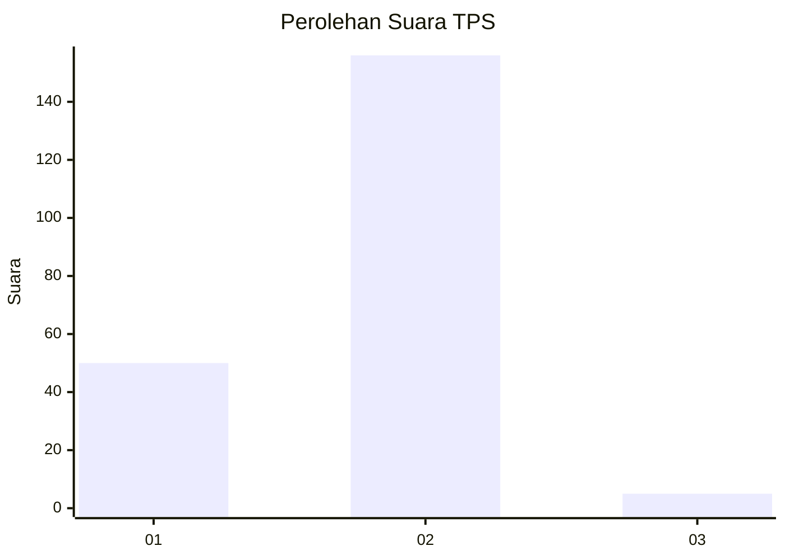
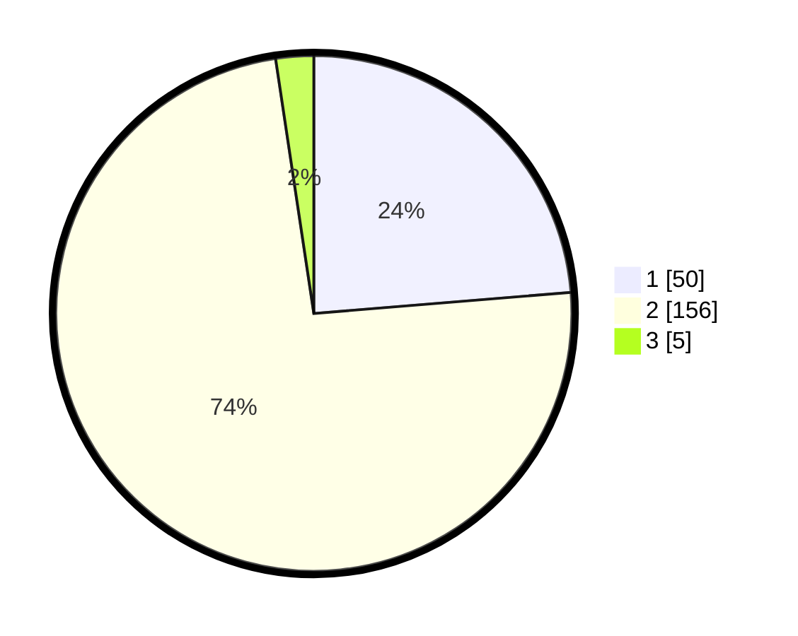

# Hasil

## Grafik

## Tabel

| No. | Nama Paslon    | Suara | Suara (raw) | Persentase |
|:--- |:-------------- | -----:| -----------:| ----------:|
| 1   | ANIES MUHAIMIN | 50    | [50][p-1]   | 23,70      |
| 2   | PRABOWO GIBRAN | 156   | [156][p-2]  | 73,93      |
| 3   | GANJAR MAHFUD  | 5     | [5][p-3]    | 2,37       |

[p-1]: https://github.com/gigit-pemilu/pemilu-2024-73-sulawesi-selatan/blob/main/pilpres/hitung-suara/sub/73-sulawesi-selatan/sub/05-takalar/sub/12-laikang/sub/2001-panyangkalang/sub/004-tps/sub/paslon-1.txt
[p-2]: https://github.com/gigit-pemilu/pemilu-2024-73-sulawesi-selatan/blob/main/pilpres/hitung-suara/sub/73-sulawesi-selatan/sub/05-takalar/sub/12-laikang/sub/2001-panyangkalang/sub/004-tps/sub/paslon-2.txt
[p-3]: https://github.com/gigit-pemilu/pemilu-2024-73-sulawesi-selatan/blob/main/pilpres/hitung-suara/sub/73-sulawesi-selatan/sub/05-takalar/sub/12-laikang/sub/2001-panyangkalang/sub/004-tps/sub/paslon-3.txt

## Foto C Plano

https://sirekap-obj-formc.kpu.go.id/903c/pemilu/ppwp/73/05/12/20/01/7305122001004-20240218-181953--17684b14-fff0-4aa0-92a5-e78e47269fa7.jpg

https://sirekap-obj-formc.kpu.go.id/903c/pemilu/ppwp/73/05/12/20/01/7305122001004-20240218-171037--3972cb87-515b-4e54-9381-2dc70019396a.jpg

https://sirekap-obj-formc.kpu.go.id/903c/pemilu/ppwp/73/05/12/20/01/7305122001004-20240218-171351--8d06b929-770a-49f3-b272-2071005ae173.jpg

## Metadata

| Key        | Value               |
| ---------- | ------------------- |
| Time Stamp | 2024-02-19 11:00:00 |

