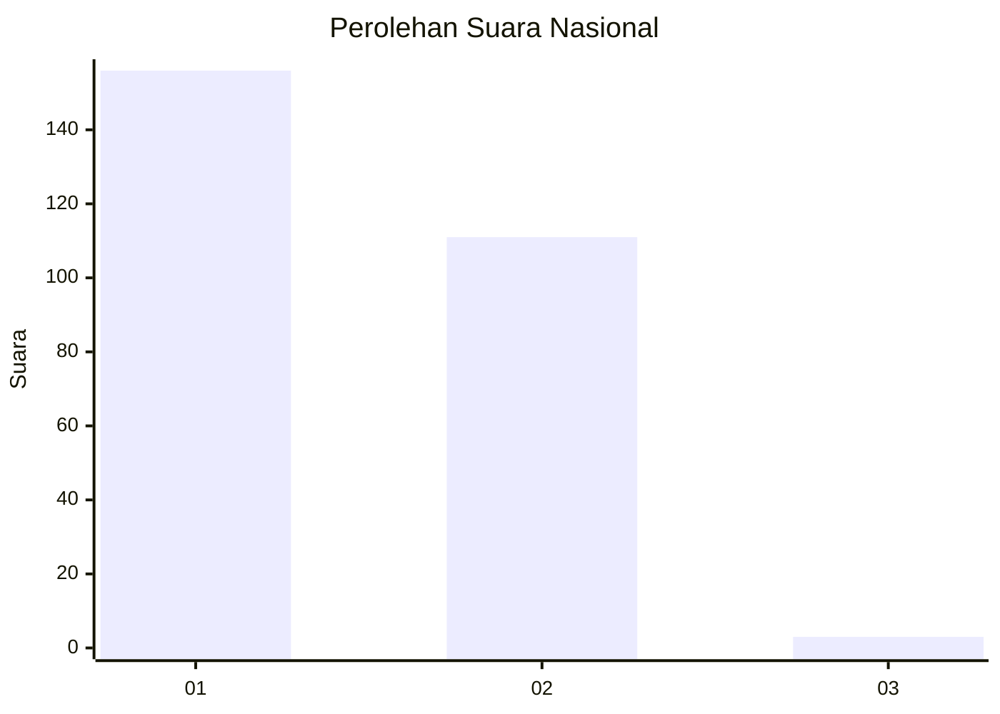
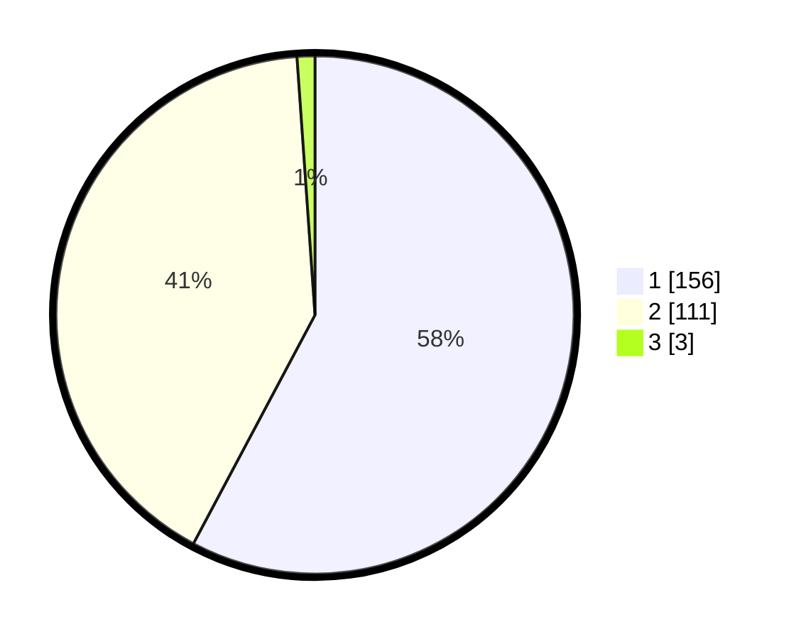

# Hasil

## Grafik

## Tabel

| No. | Nama Paslon    | Suara | Suara (raw) | Persentase |
|:--- |:-------------- | -----:| -----------:| ----------:|
| 1   | ANIES MUHAIMIN | 156   | [156][p-1]  | 57,78      |
| 2   | PRABOWO GIBRAN | 111   | [111][p-2]  | 41,11      |
| 3   | GANJAR MAHFUD  | 3     | [3][p-3]    | 1,11       |

[p-1]: https://github.com/gigit-pemilu/pemilu-2024/blob/main/pilpres/hitung-suara/sub/73-sulawesi-selatan/sub/06-gowa/sub/01-bontonompo/sub/1001-bontonompo/sub/003-tps/sub/paslon-1.txt
[p-2]: https://github.com/gigit-pemilu/pemilu-2024/blob/main/pilpres/hitung-suara/sub/73-sulawesi-selatan/sub/06-gowa/sub/01-bontonompo/sub/1001-bontonompo/sub/003-tps/sub/paslon-2.txt
[p-3]: https://github.com/gigit-pemilu/pemilu-2024/blob/main/pilpres/hitung-suara/sub/73-sulawesi-selatan/sub/06-gowa/sub/01-bontonompo/sub/1001-bontonompo/sub/003-tps/sub/paslon-3.txt

## Foto C Plano

https://sirekap-obj-formc.kpu.go.id/2dfd/pemilu/ppwp/73/06/01/10/01/7306011001003-20240214-235707--1fef9a80-da15-4689-8f74-f4024b98e950.jpg

https://sirekap-obj-formc.kpu.go.id/2dfd/pemilu/ppwp/73/06/01/10/01/7306011001003-20240215-000045--e00deeac-d426-4edc-b040-23134f05c536.jpg

https://sirekap-obj-formc.kpu.go.id/2dfd/pemilu/ppwp/73/06/01/10/01/7306011001003-20240215-000401--0717c8ad-b66c-41e1-bccc-531f2f53e0c5.jpg

## Metadata

| Key        | Value               |
| ---------- | ------------------- |
| Time Stamp | 2024-02-16 13:30:32 |

## DATA PEMILIH TETAP

Jumlah pemilih dalam DPT: **278**.
 * L: **118**.
 * P: **160**.

## DATA PENGGUNA HAK PILIH

Jumlah pengguna hak pilih dalam DPT: **260**.
 * L: **108**.
 * P: **152**.

Jumlah pengguna hak pilih dalam DPTb: **3**.
 * L: **1**.
 * P: **2**.

Jumlah pengguna hak pilih dalam DPK: **10**.
 * L: **3**.
 * P: **7**.

Jumlah pengguna hak pilih: **273**.
 * L: **112**.
 * P: **161**.

## JUMLAH SUARA SAH DAN TIDAK SAH

JUMLAH SELURUH SUARA SAH: **270**.

JUMLAH SUARA TIDAK SAH: **3**.

JUMLAH SELURUH SUARA SAH DAN SUARA TIDAK SAH: **273**.

