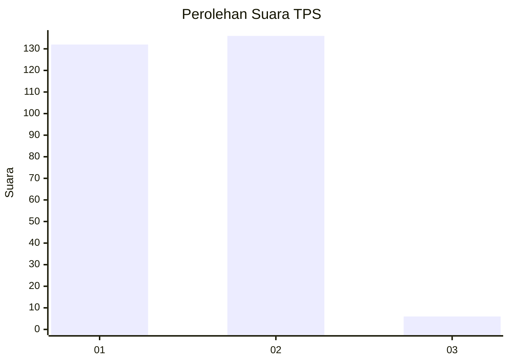
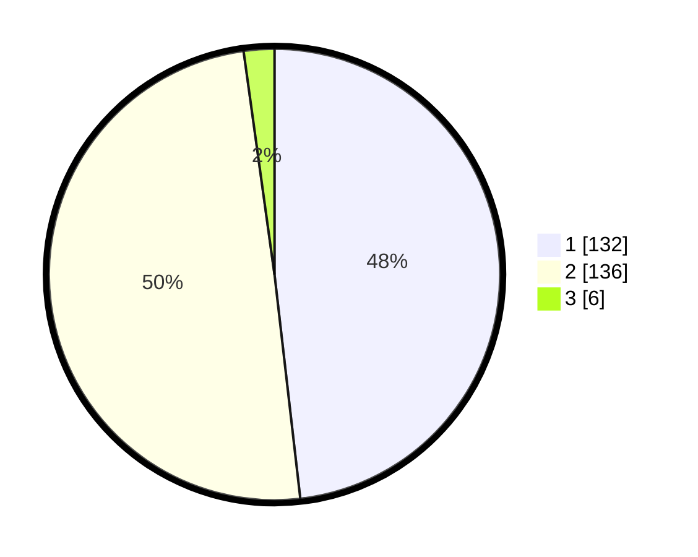

# Hasil

## Grafik

## Tabel

| No. | Nama Paslon    | Suara | Suara (raw) | Persentase |
|:--- |:-------------- | -----:| -----------:| ----------:|
| 1   | ANIES MUHAIMIN | 132   | [132][p-1]  | 48,18      |
| 2   | PRABOWO GIBRAN | 136   | [136][p-2]  | 49,64      |
| 3   | GANJAR MAHFUD  | 6     | [6][p-3]    | 2,19       |

[p-1]: https://github.com/gigit-pemilu/pemilu-2024-73-sulawesi-selatan/blob/main/pilpres/hitung-suara/sub/73-sulawesi-selatan/sub/06-gowa/sub/01-bontonompo/sub/1001-bontonompo/sub/006-tps/sub/paslon-1.txt
[p-2]: https://github.com/gigit-pemilu/pemilu-2024-73-sulawesi-selatan/blob/main/pilpres/hitung-suara/sub/73-sulawesi-selatan/sub/06-gowa/sub/01-bontonompo/sub/1001-bontonompo/sub/006-tps/sub/paslon-2.txt
[p-3]: https://github.com/gigit-pemilu/pemilu-2024-73-sulawesi-selatan/blob/main/pilpres/hitung-suara/sub/73-sulawesi-selatan/sub/06-gowa/sub/01-bontonompo/sub/1001-bontonompo/sub/006-tps/sub/paslon-3.txt

## Foto C Plano

https://sirekap-obj-formc.kpu.go.id/38a5/pemilu/ppwp/73/06/01/10/01/7306011001006-20240215-043653--d4922445-3a21-4fb5-94bc-3551d82bbdb6.jpg

https://sirekap-obj-formc.kpu.go.id/38a5/pemilu/ppwp/73/06/01/10/01/7306011001006-20240215-043938--7a89cd8a-bb43-4f64-a8eb-72b870c469d7.jpg

https://sirekap-obj-formc.kpu.go.id/38a5/pemilu/ppwp/73/06/01/10/01/7306011001006-20240215-043802--c21d47c3-ab4d-43f6-9fcb-5e7b664ca627.jpg

## Metadata

| Key        | Value               |
| ---------- | ------------------- |
| Time Stamp | 2024-02-15 16:30:25 |

## DATA PEMILIH TETAP

Jumlah pemilih dalam DPT: **282**.
 * L: **133**.
 * P: **149**.

## DATA PENGGUNA HAK PILIH

Jumlah pengguna hak pilih dalam DPT: **263**.
 * L: **123**.
 * P: **140**.

Jumlah pengguna hak pilih dalam DPTb: **8**.
 * L: **4**.
 * P: **4**.

Jumlah pengguna hak pilih dalam DPK: **6**.
 * L: **4**.
 * P: **2**.

Jumlah pengguna hak pilih: **277**.
 * L: **131**.
 * P: **146**.

## JUMLAH SUARA SAH DAN TIDAK SAH

JUMLAH SELURUH SUARA SAH: **274**.

JUMLAH SUARA TIDAK SAH: **3**.

JUMLAH SELURUH SUARA SAH DAN SUARA TIDAK SAH: **277**.

