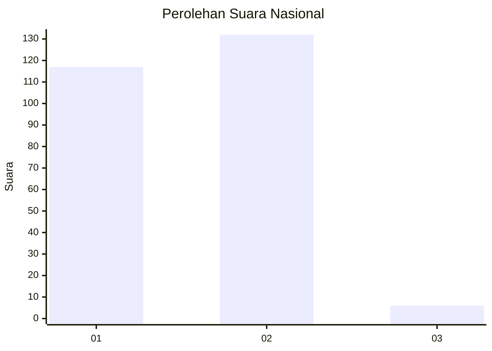
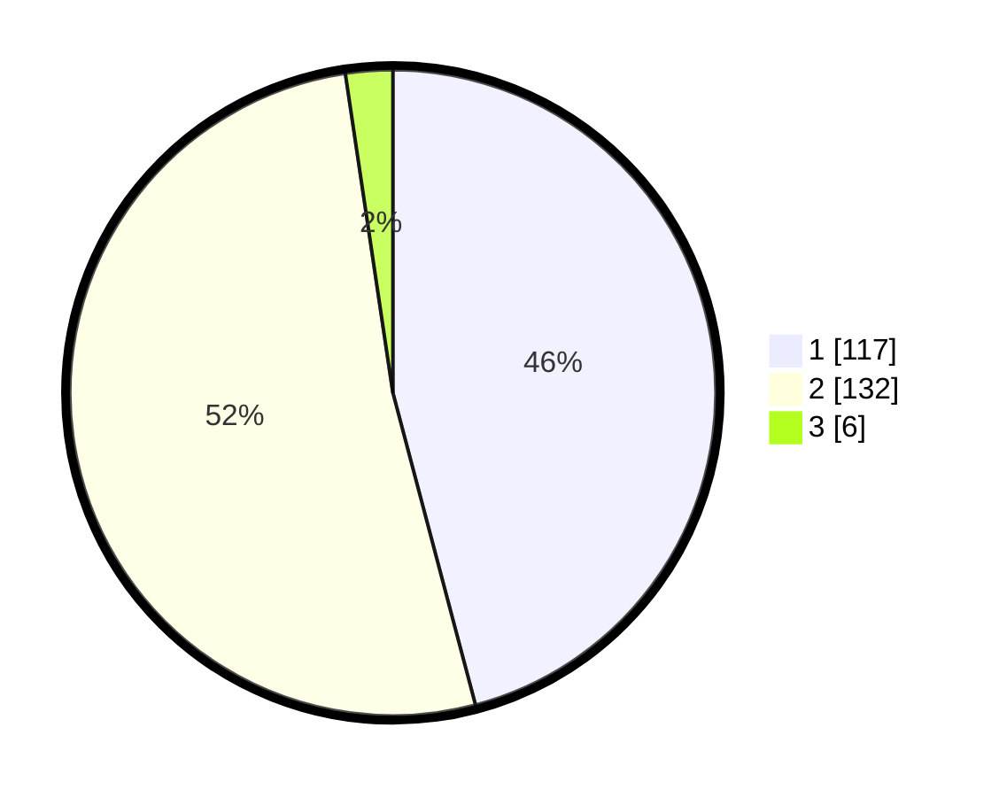

# Hasil

## Grafik

## Tabel

| No. | Nama Paslon    | Suara | Suara (raw) | Persentase |
|:--- |:-------------- | -----:| -----------:| ----------:|
| 1   | ANIES MUHAIMIN | 117   | [117][p-1]  | 45,88      |
| 2   | PRABOWO GIBRAN | 132   | [132][p-2]  | 51,76      |
| 3   | GANJAR MAHFUD  | 6     | [6][p-3]    | 2,35       |

[p-1]: https://github.com/gigit-pemilu/pemilu-2024/blob/main/pilpres/hitung-suara/sub/73-sulawesi-selatan/sub/06-gowa/sub/01-bontonompo/sub/1001-bontonompo/sub/009-tps/sub/paslon-1.txt
[p-2]: https://github.com/gigit-pemilu/pemilu-2024/blob/main/pilpres/hitung-suara/sub/73-sulawesi-selatan/sub/06-gowa/sub/01-bontonompo/sub/1001-bontonompo/sub/009-tps/sub/paslon-2.txt
[p-3]: https://github.com/gigit-pemilu/pemilu-2024/blob/main/pilpres/hitung-suara/sub/73-sulawesi-selatan/sub/06-gowa/sub/01-bontonompo/sub/1001-bontonompo/sub/009-tps/sub/paslon-3.txt

## Foto C Plano

https://sirekap-obj-formc.kpu.go.id/00b4/pemilu/ppwp/73/06/01/10/01/7306011001009-20240215-053718--1aa08780-7999-4621-9724-96ff6a796f8b.jpg

https://sirekap-obj-formc.kpu.go.id/00b4/pemilu/ppwp/73/06/01/10/01/7306011001009-20240215-053831--45b0f684-e278-46f2-b31a-08b751268e1d.jpg

https://sirekap-obj-formc.kpu.go.id/00b4/pemilu/ppwp/73/06/01/10/01/7306011001009-20240215-053920--20d865eb-111c-43e4-af2b-02d48c6b73ec.jpg

## Metadata

| Key        | Value               |
| ---------- | ------------------- |
| Time Stamp | 2024-02-15 15:00:29 |

