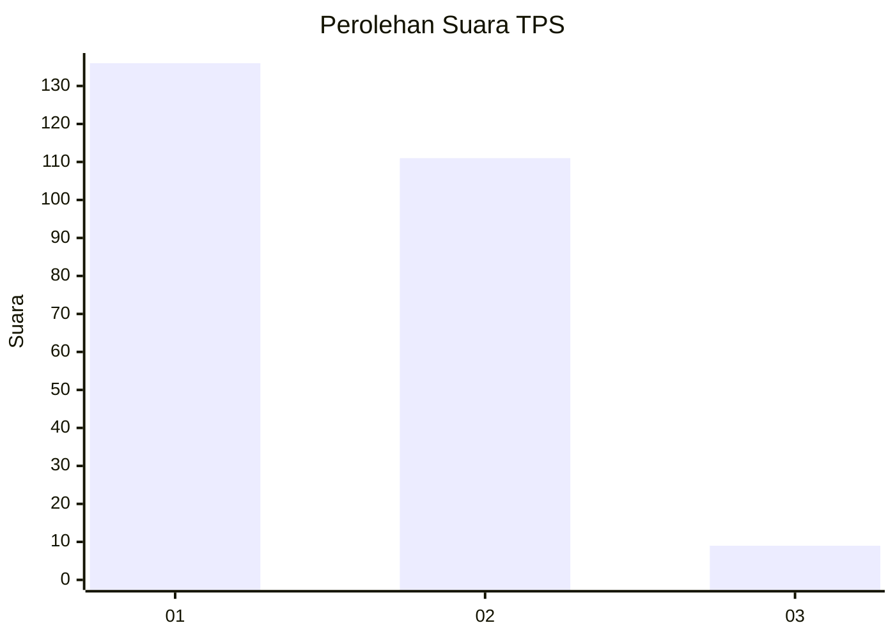
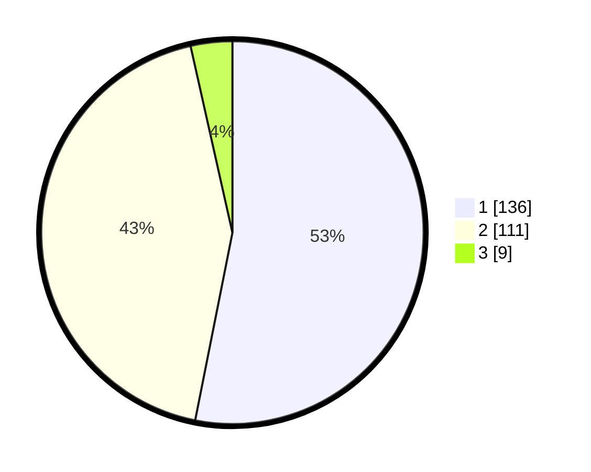

# Hasil

## Grafik

## Tabel

| No. | Nama Paslon    | Suara | Suara (raw) | Persentase |
|:--- |:-------------- | -----:| -----------:| ----------:|
| 1   | ANIES MUHAIMIN | 136   | [136][p-1]  | 53,13      |
| 2   | PRABOWO GIBRAN | 111   | [111][p-2]  | 43,36      |
| 3   | GANJAR MAHFUD  | 9     | [9][p-3]    | 3,52       |

[p-1]: https://github.com/gigit-pemilu/pemilu-2024-73-sulawesi-selatan/blob/main/pilpres/hitung-suara/sub/73-sulawesi-selatan/sub/06-gowa/sub/01-bontonompo/sub/2016-bontobiraeng/sub/005-tps/sub/paslon-1.txt
[p-2]: https://github.com/gigit-pemilu/pemilu-2024-73-sulawesi-selatan/blob/main/pilpres/hitung-suara/sub/73-sulawesi-selatan/sub/06-gowa/sub/01-bontonompo/sub/2016-bontobiraeng/sub/005-tps/sub/paslon-2.txt
[p-3]: https://github.com/gigit-pemilu/pemilu-2024-73-sulawesi-selatan/blob/main/pilpres/hitung-suara/sub/73-sulawesi-selatan/sub/06-gowa/sub/01-bontonompo/sub/2016-bontobiraeng/sub/005-tps/sub/paslon-3.txt

## Foto C Plano

https://sirekap-obj-formc.kpu.go.id/2320/pemilu/ppwp/73/06/01/20/16/7306012016005-20240215-062856--aac1a55b-26ad-4ad3-9075-6a2c4e4f3a2a.jpg

https://sirekap-obj-formc.kpu.go.id/2320/pemilu/ppwp/73/06/01/20/16/7306012016005-20240215-063007--e1b2f5a6-317a-4dd6-a048-83a2f4cd1346.jpg

https://sirekap-obj-formc.kpu.go.id/2320/pemilu/ppwp/73/06/01/20/16/7306012016005-20240215-063055--01d33303-947d-48fe-865a-616bdba7478e.jpg

## Metadata

| Key        | Value               |
| ---------- | ------------------- |
| Time Stamp | 2024-02-15 15:00:29 |

