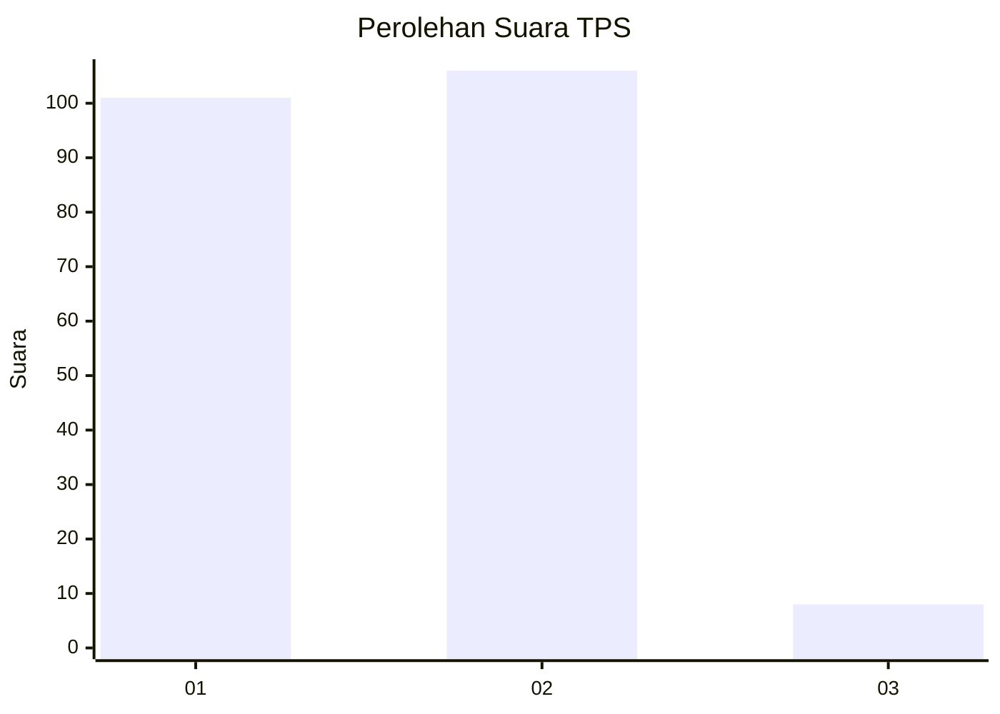
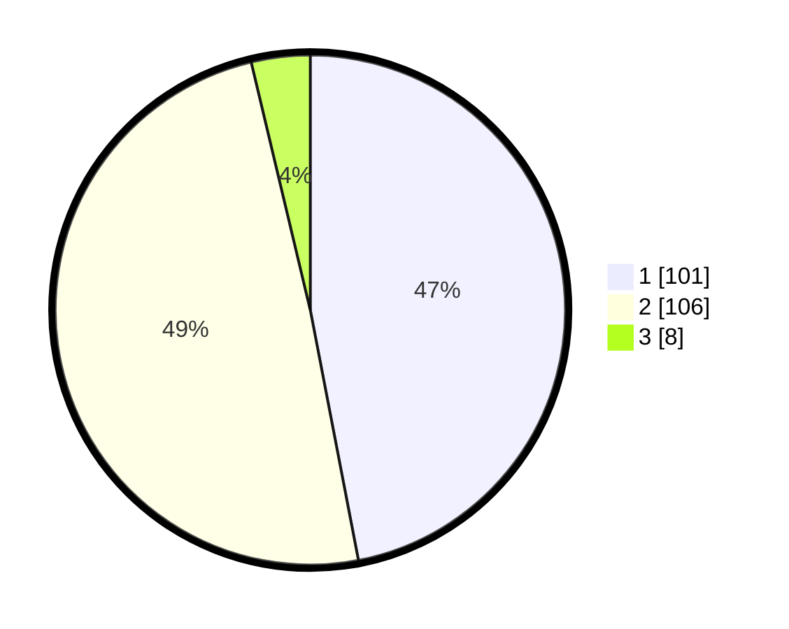

# Hasil

## Grafik

## Tabel

| No. | Nama Paslon    | Suara | Suara (raw) | Persentase |
|:--- |:-------------- | -----:| -----------:| ----------:|
| 1   | ANIES MUHAIMIN | 101   | [101][p-1]  | 46,98      |
| 2   | PRABOWO GIBRAN | 106   | [106][p-2]  | 49,30      |
| 3   | GANJAR MAHFUD  | 8     | [8][p-3]    | 3,72       |

[p-1]: https://github.com/gigit-pemilu/pemilu-2024-73-sulawesi-selatan/blob/main/pilpres/hitung-suara/sub/73-sulawesi-selatan/sub/06-gowa/sub/02-bajeng/sub/1001-kalebajeng/sub/001-tps/sub/paslon-1.txt
[p-2]: https://github.com/gigit-pemilu/pemilu-2024-73-sulawesi-selatan/blob/main/pilpres/hitung-suara/sub/73-sulawesi-selatan/sub/06-gowa/sub/02-bajeng/sub/1001-kalebajeng/sub/001-tps/sub/paslon-2.txt
[p-3]: https://github.com/gigit-pemilu/pemilu-2024-73-sulawesi-selatan/blob/main/pilpres/hitung-suara/sub/73-sulawesi-selatan/sub/06-gowa/sub/02-bajeng/sub/1001-kalebajeng/sub/001-tps/sub/paslon-3.txt

## Foto C Plano

https://sirekap-obj-formc.kpu.go.id/f53b/pemilu/ppwp/73/06/02/10/01/7306021001001-20240214-231720--1514bed9-da27-429e-8813-415a3ee02df4.jpg

https://sirekap-obj-formc.kpu.go.id/f53b/pemilu/ppwp/73/06/02/10/01/7306021001001-20240214-231629--98dcd22b-2be0-47be-84a4-9507f7bed774.jpg

https://sirekap-obj-formc.kpu.go.id/f53b/pemilu/ppwp/73/06/02/10/01/7306021001001-20240214-231830--d8151051-f9c6-46aa-8a54-3dc34d3113e5.jpg

## Metadata

| Key        | Value               |
| ---------- | ------------------- |
| Time Stamp | 2024-02-15 19:00:26 |

