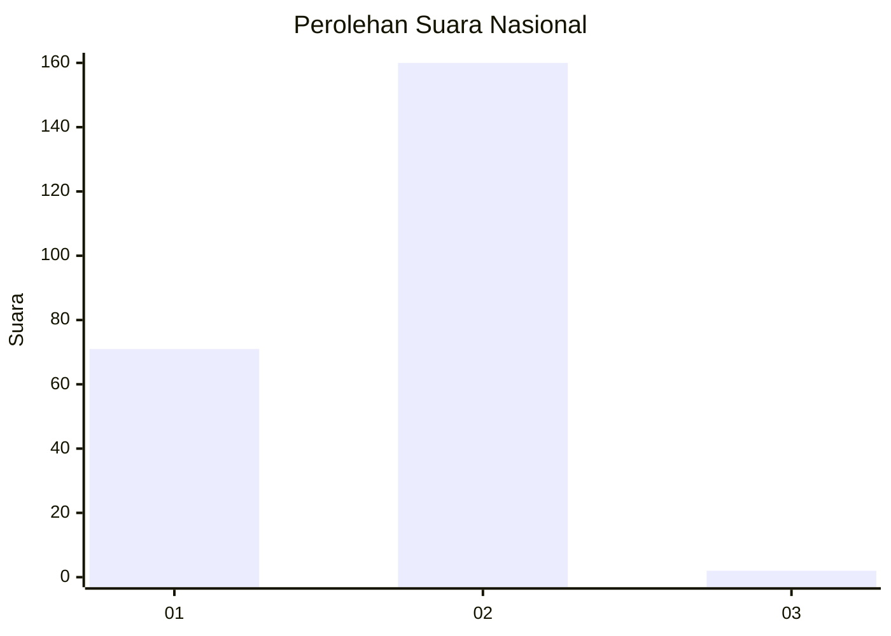
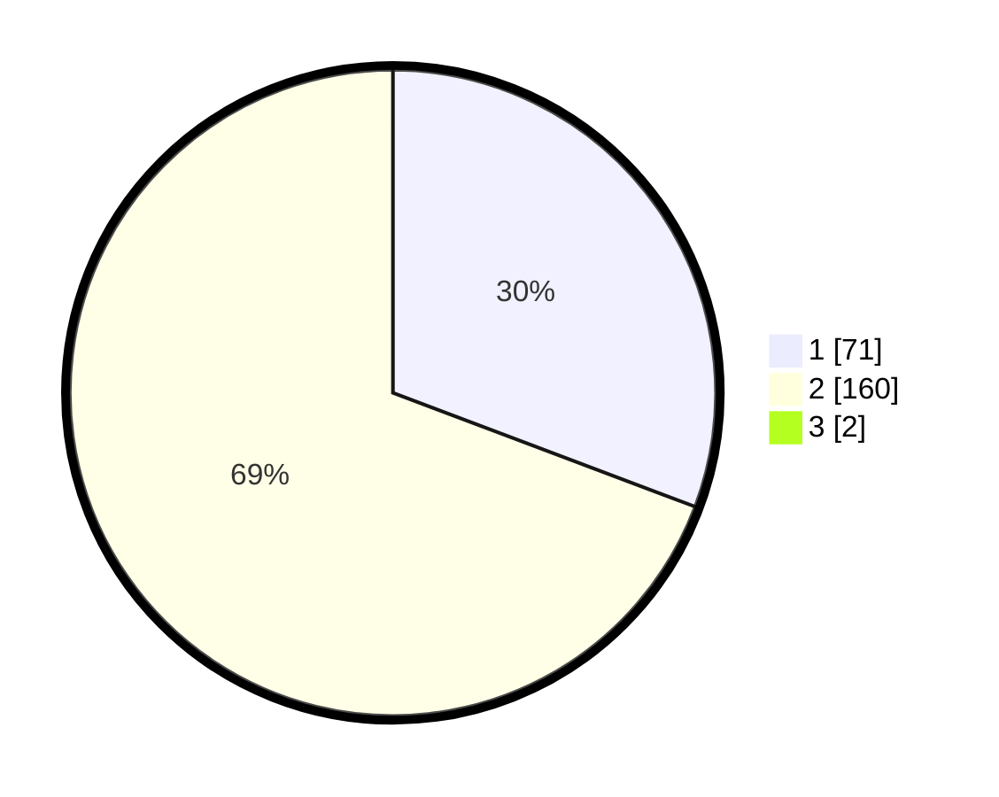

# Hasil

## Grafik

## Tabel

| No. | Nama Paslon    | Suara | Suara (raw) | Persentase |
|:--- |:-------------- | -----:| -----------:| ----------:|
| 1   | ANIES MUHAIMIN | 71    | [71][p-1]   | 30,47      |
| 2   | PRABOWO GIBRAN | 160   | [160][p-2]  | 68,67      |
| 3   | GANJAR MAHFUD  | 2     | [2][p-3]    | 0,86       |

[p-1]: https://github.com/gigit-pemilu/pemilu-2024/blob/main/pilpres/hitung-suara/sub/73-sulawesi-selatan/sub/06-gowa/sub/02-bajeng/sub/2009-tangkebajeng/sub/001-tps/sub/paslon-1.txt
[p-2]: https://github.com/gigit-pemilu/pemilu-2024/blob/main/pilpres/hitung-suara/sub/73-sulawesi-selatan/sub/06-gowa/sub/02-bajeng/sub/2009-tangkebajeng/sub/001-tps/sub/paslon-2.txt
[p-3]: https://github.com/gigit-pemilu/pemilu-2024/blob/main/pilpres/hitung-suara/sub/73-sulawesi-selatan/sub/06-gowa/sub/02-bajeng/sub/2009-tangkebajeng/sub/001-tps/sub/paslon-3.txt

## Foto C Plano

https://sirekap-obj-formc.kpu.go.id/1bf1/pemilu/ppwp/73/06/02/20/09/7306022009001-20240215-055407--b78b92c7-4dfd-4d69-8bc8-8ed23b8e59ff.jpg

https://sirekap-obj-formc.kpu.go.id/1bf1/pemilu/ppwp/73/06/02/20/09/7306022009001-20240215-055711--07a7375c-db7b-43b7-ae56-29e6b3ebe52e.jpg

https://sirekap-obj-formc.kpu.go.id/1bf1/pemilu/ppwp/73/06/02/20/09/7306022009001-20240215-055858--66038787-46c7-4876-97d8-fd8a09d8c94a.jpg

## Metadata

| Key        | Value               |
| ---------- | ------------------- |
| Time Stamp | 2024-02-15 15:00:29 |

