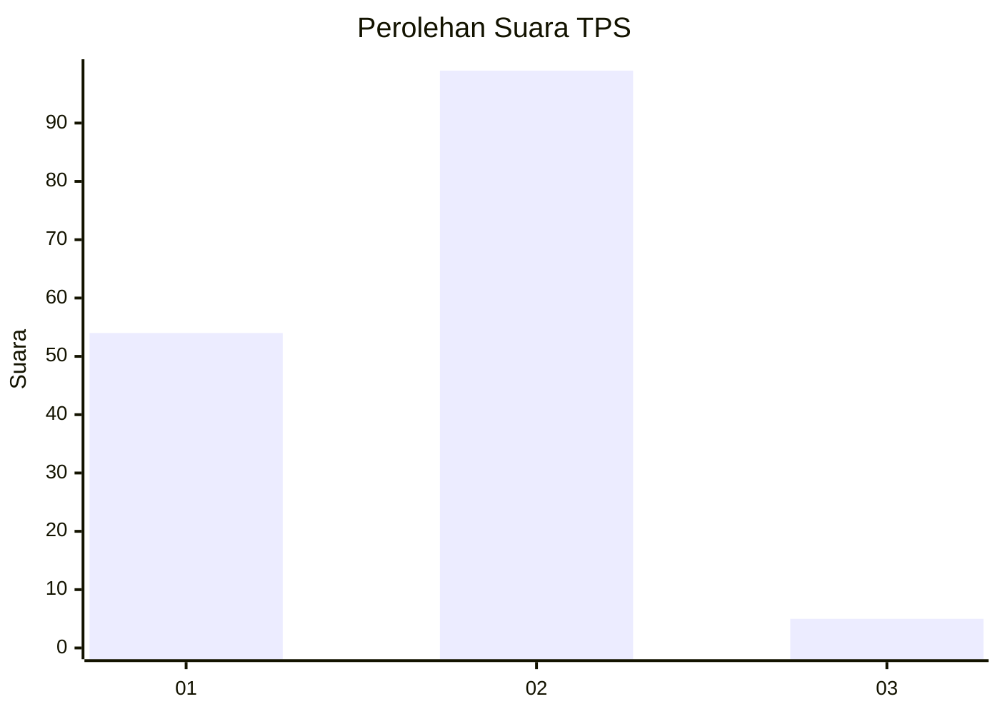
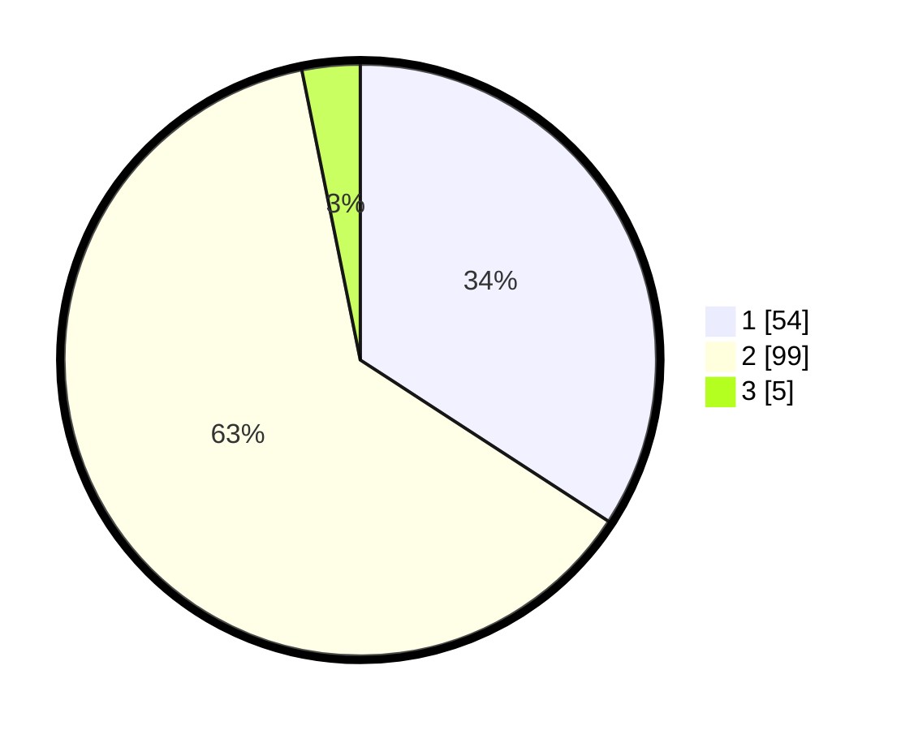

# Hasil

## Grafik

## Tabel

| No. | Nama Paslon    | Suara | Suara (raw) | Persentase |
|:--- |:-------------- | -----:| -----------:| ----------:|
| 1   | ANIES MUHAIMIN | 54    | [54][p-1]   | 34,18      |
| 2   | PRABOWO GIBRAN | 99    | [99][p-2]   | 62,66      |
| 3   | GANJAR MAHFUD  | 5     | [5][p-3]    | 3,16       |

[p-1]: https://github.com/gigit-pemilu/pemilu-2024-73-sulawesi-selatan/blob/main/pilpres/hitung-suara/sub/73-sulawesi-selatan/sub/06-gowa/sub/02-bajeng/sub/2015-pannyangkalang/sub/008-tps/sub/paslon-1.txt
[p-2]: https://github.com/gigit-pemilu/pemilu-2024-73-sulawesi-selatan/blob/main/pilpres/hitung-suara/sub/73-sulawesi-selatan/sub/06-gowa/sub/02-bajeng/sub/2015-pannyangkalang/sub/008-tps/sub/paslon-2.txt
[p-3]: https://github.com/gigit-pemilu/pemilu-2024-73-sulawesi-selatan/blob/main/pilpres/hitung-suara/sub/73-sulawesi-selatan/sub/06-gowa/sub/02-bajeng/sub/2015-pannyangkalang/sub/008-tps/sub/paslon-3.txt

## Foto C Plano

https://sirekap-obj-formc.kpu.go.id/1355/pemilu/ppwp/73/06/02/20/15/7306022015008-20240227-124649--a971f9a2-8248-493b-aa34-d561ff0a3ab3.jpg

https://sirekap-obj-formc.kpu.go.id/1355/pemilu/ppwp/73/06/02/20/15/7306022015008-20240227-125013--2150fe33-fde4-42dd-9440-2f7aa3a90162.jpg

https://sirekap-obj-formc.kpu.go.id/1355/pemilu/ppwp/73/06/02/20/15/7306022015008-20240227-125206--bd40469f-88f8-4b73-bca4-08563b49253d.jpg

## Metadata

| Key        | Value               |
| ---------- | ------------------- |
| Time Stamp | 2024-02-27 13:00:00 |

## DATA PEMILIH TETAP

Jumlah pemilih dalam DPT: **253**.
 * L: **633**.
 * P: **650**.

## DATA PENGGUNA HAK PILIH

Jumlah pengguna hak pilih dalam DPT: **328**.
 * L: **408**.
 * P: **623**.

Jumlah pengguna hak pilih dalam DPTb: **0**.
 * L: **0**.
 * P: **0**.

Jumlah pengguna hak pilih dalam DPK: **33**.
 * L: **29**.
 * P: **65**.

Jumlah pengguna hak pilih: **363**.
 * L: **226**.
 * P: **43**.

## JUMLAH SUARA SAH DAN TIDAK SAH

JUMLAH SELURUH SUARA SAH: **258**.

JUMLAH SUARA TIDAK SAH: **993**.

JUMLAH SELURUH SUARA SAH DAN SUARA TIDAK SAH: **363**.

