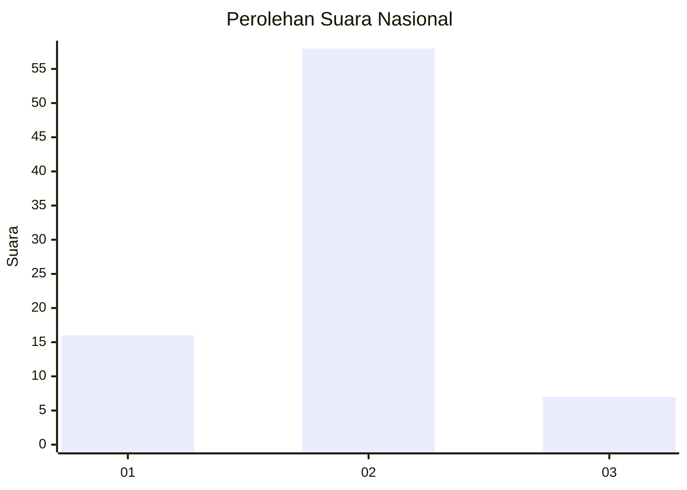
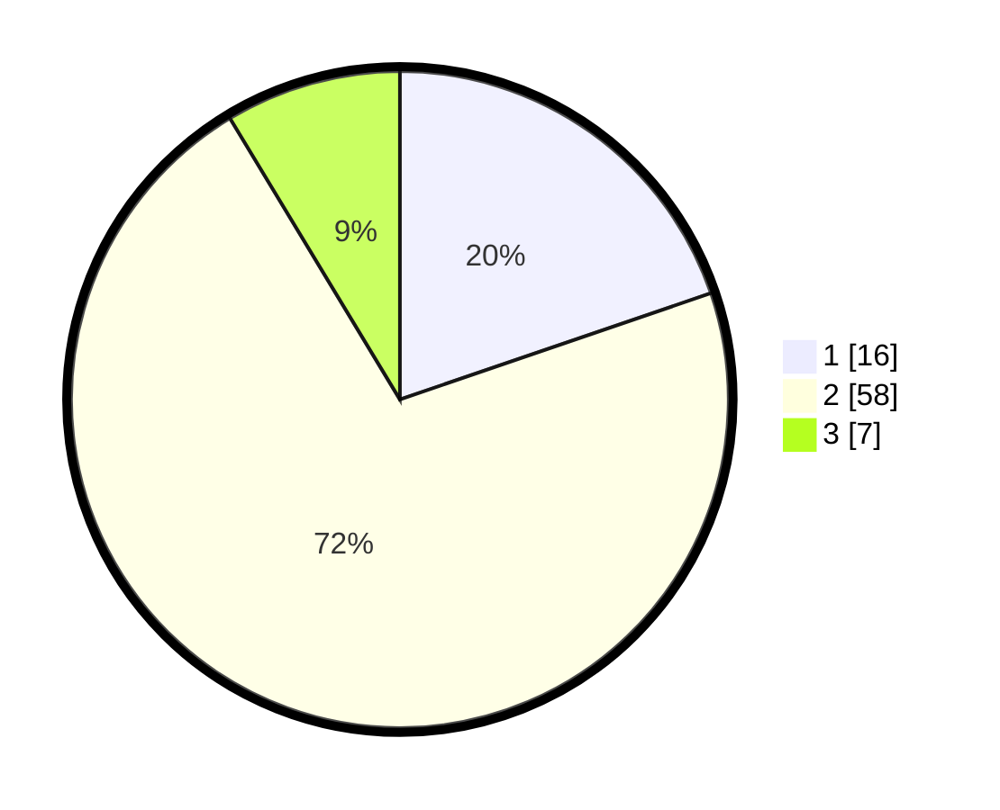

# Hasil

## Grafik

## Tabel

| No. | Nama Paslon    | Suara | Suara (raw) | Persentase |
|:--- |:-------------- | -----:| -----------:| ----------:|
| 1   | ANIES MUHAIMIN | 16    | [16][p-1]   | 19,75      |
| 2   | PRABOWO GIBRAN | 58    | [58][p-2]   | 71,60      |
| 3   | GANJAR MAHFUD  | 7     | [7][p-3]    | 8,64       |

[p-1]: https://github.com/gigit-pemilu/pemilu-2024/blob/main/pilpres/hitung-suara/sub/73-sulawesi-selatan/sub/06-gowa/sub/04-tinggimoncong/sub/1001-malino/sub/901-tps/sub/paslon-1.txt
[p-2]: https://github.com/gigit-pemilu/pemilu-2024/blob/main/pilpres/hitung-suara/sub/73-sulawesi-selatan/sub/06-gowa/sub/04-tinggimoncong/sub/1001-malino/sub/901-tps/sub/paslon-2.txt
[p-3]: https://github.com/gigit-pemilu/pemilu-2024/blob/main/pilpres/hitung-suara/sub/73-sulawesi-selatan/sub/06-gowa/sub/04-tinggimoncong/sub/1001-malino/sub/901-tps/sub/paslon-3.txt

## Foto C Plano

https://sirekap-obj-formc.kpu.go.id/f90c/pemilu/ppwp/73/06/04/10/01/7306041001901-20240215-005401--db54fd70-2906-4e6c-891d-f6f6b58ef616.jpg

https://sirekap-obj-formc.kpu.go.id/f90c/pemilu/ppwp/73/06/04/10/01/7306041001901-20240215-014910--a713d354-912a-47e9-a4da-e5561a533827.jpg

https://sirekap-obj-formc.kpu.go.id/f90c/pemilu/ppwp/73/06/04/10/01/7306041001901-20240215-005636--210cb316-a0fc-463e-8bd9-4d0bbed4adc0.jpg

## Metadata

| Key        | Value               |
| ---------- | ------------------- |
| Time Stamp | 2024-02-15 18:00:26 |

## DATA PEMILIH TETAP

Jumlah pemilih dalam DPT: **84**.
 * L: **84**.
 * P: **0**.

## DATA PENGGUNA HAK PILIH

Jumlah pengguna hak pilih dalam DPT: **33**.
 * L: **33**.
 * P: **0**.

Jumlah pengguna hak pilih dalam DPTb: **50**.
 * L: **45**.
 * P: **5**.

Jumlah pengguna hak pilih dalam DPK: **0**.
 * L: **0**.
 * P: **0**.

Jumlah pengguna hak pilih: **83**.
 * L: **78**.
 * P: **5**.

## JUMLAH SUARA SAH DAN TIDAK SAH

JUMLAH SELURUH SUARA SAH: **81**.

JUMLAH SUARA TIDAK SAH: **2**.

JUMLAH SELURUH SUARA SAH DAN SUARA TIDAK SAH: **83**.

