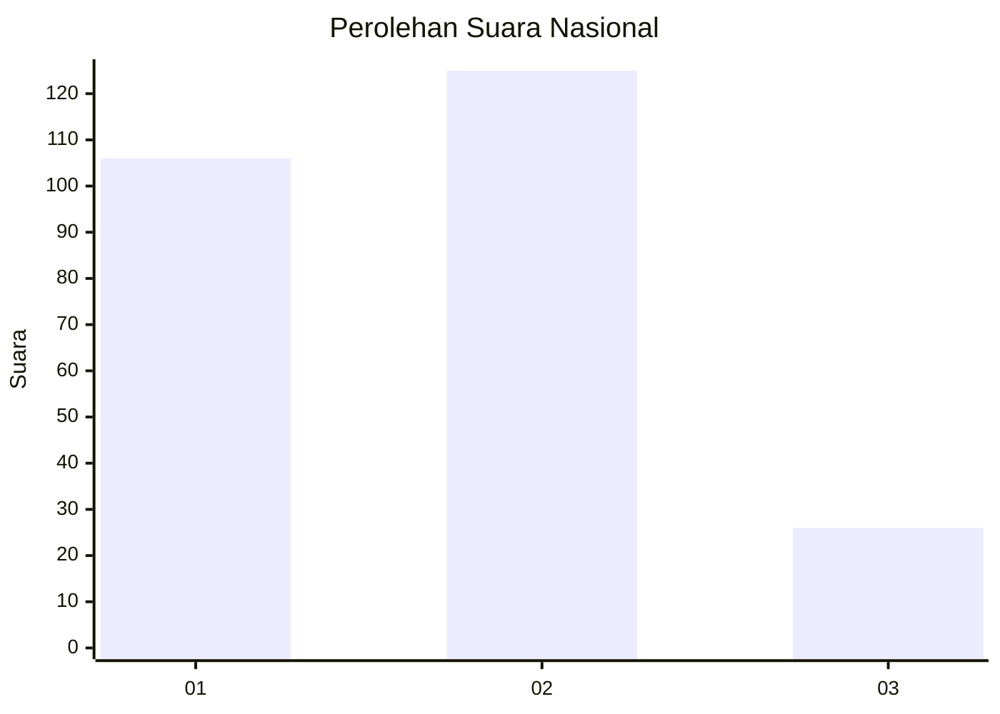
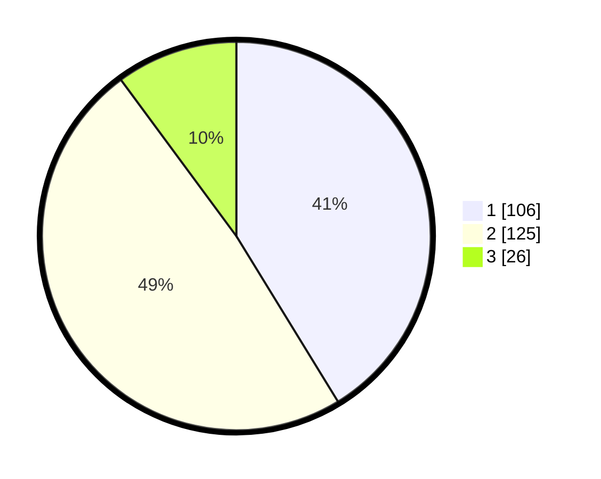

# Hasil

## Grafik

## Tabel

| No. | Nama Paslon    | Suara | Suara (raw) | Persentase |
|:--- |:-------------- | -----:| -----------:| ----------:|
| 1   | ANIES MUHAIMIN | 106   | [106][p-1]  | 41,25      |
| 2   | PRABOWO GIBRAN | 125   | [125][p-2]  | 48,64      |
| 3   | GANJAR MAHFUD  | 26    | [26][p-3]   | 10,12      |

[p-1]: https://github.com/gigit-pemilu/pemilu-2024/blob/main/pilpres/hitung-suara/sub/73-sulawesi-selatan/sub/06-gowa/sub/06-bontomarannu/sub/1001-borongloe/sub/018-tps/sub/paslon-1.txt
[p-2]: https://github.com/gigit-pemilu/pemilu-2024/blob/main/pilpres/hitung-suara/sub/73-sulawesi-selatan/sub/06-gowa/sub/06-bontomarannu/sub/1001-borongloe/sub/018-tps/sub/paslon-2.txt
[p-3]: https://github.com/gigit-pemilu/pemilu-2024/blob/main/pilpres/hitung-suara/sub/73-sulawesi-selatan/sub/06-gowa/sub/06-bontomarannu/sub/1001-borongloe/sub/018-tps/sub/paslon-3.txt

## Foto C Plano

https://sirekap-obj-formc.kpu.go.id/12df/pemilu/ppwp/73/06/06/10/01/7306061001018-20240215-044410--eb03abc5-ddd7-4ae8-8cc7-e79909279f7a.jpg

https://sirekap-obj-formc.kpu.go.id/12df/pemilu/ppwp/73/06/06/10/01/7306061001018-20240214-213828--a3c0df66-e700-44d5-800c-e7022966991d.jpg

https://sirekap-obj-formc.kpu.go.id/12df/pemilu/ppwp/73/06/06/10/01/7306061001018-20240214-214117--127b90e0-0310-4734-98d2-41dbb78a38d5.jpg

## Metadata

| Key        | Value               |
| ---------- | ------------------- |
| Time Stamp | 2024-02-16 06:00:27 |

